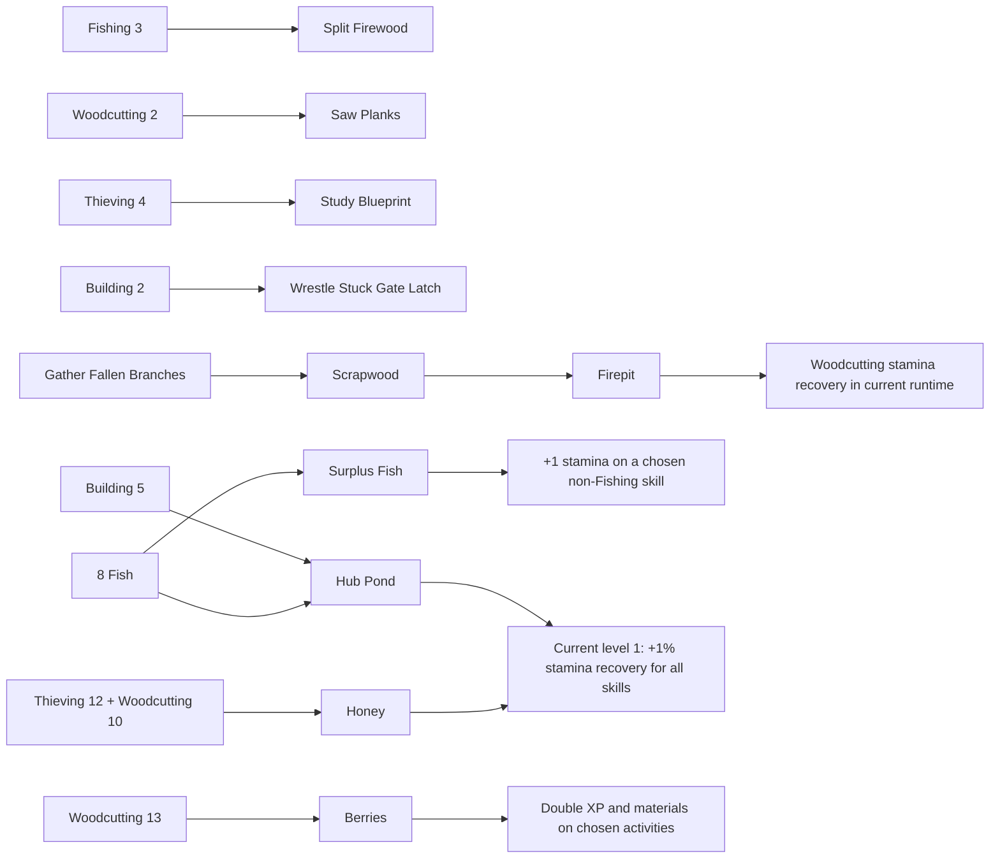

# Early-Game Skill Relationships and Treats

Updated: 2026-08-10

Status: active product plan. This document proposes player-facing changes. It does not change `docs/activity-database.json` or runtime behavior by itself.

## Decision

The largest early-game problem is not a lack of progression systems. It is rotation without intention: the player is rewarded for leaving a tired skill, but is not given a clear reason to choose the next skill because of what it will do for another.

The current build has cross-skill requirements, split XP rewards, edible Fish, per-skill Fish auto-eat toggles, Scrapwood, Firepit, buildable modules, recovery modules, the Hub Pond, Berries, Honey, mastery buffs, and missions. Most of those relationships are discovered inside individual activity cards or arrive after the first-session window. The first four combo activities award only 1 secondary XP, Firepit currently disagrees with its database target and fuel rate, and Berry Prep can multiply its own Berry source. Fishing completions also bypass the current Berry consumption path. The first five skills therefore read as parallel XP ladders before they read as parts of one economy.

The 100-seed first-hour model identifies the highest-leverage throughput bridge: let the player deliberately use Fish to sustain the current relationship skill. With current authored combo values, the relationship-powered Pond, and ordered Berries held constant, turning that Fish bridge off produces a 1:35 median longest stall and passes the 60-second target in 1% of runs. Protected sustained use reduces the median to 0:24 and passes in 96%. Protecting the eight-Fish Pond cost is the allocation and trust guard, not the source of the speed improvement. This is the first interaction to validate.

A rational Pond-rush policy exposes the structural version of the same problem: it restores Pond at 8:48 with only Building and Fishing at level 2 or higher, zero completed two-skill actions, no Firepit, and two pre-Pond switches. The selected Pond payoff therefore keeps Building 5 and 8 Fish as the only costs but lets each of the four existing early combo actions raise the Pond's early permanent regeneration floor by one percentage point. The guided route reaches +5% at 14:53; a rusher receives the current +1% and can raise it before or after construction. This makes all five skills affect the shared outcome without adding a gate.

The first-hour design should establish this sequence:

1. See a desired shared outcome.
2. Learn which skill can advance it.
3. Complete that skill's next meaningful action.
4. Receive visible feedback at both the source and destination.
5. Allocate caught Fish between the protected Pond cost and stamina for the current skill.
6. Leave the session with one specific next relationship visible.

## Scope

- Early game means the first 60 cumulative minutes of active play on a new save. The sequence may span several short sessions.
- Treat or consumable means the existing Fish, Berries, or Honey and its gameplay use.
- The first-hour shared outcome is restoring the existing Hub Pond.
- The plan uses existing activity IDs, resources, Hub systems, unlock ceremonies, mastery, and achievements wherever possible.
- No new general inventory, currency, crafting screen, skill tree, or full-screen relationship graph is included.
- Any future activity-data change must begin in `docs/activity-database.json` and follow `docs/activity-database-contract.md`.

## Current Evidence

### Five-minute baseline

Current `scripts/simulate-first-five-minutes.ps1` results at 300 seconds:

| Strategy | Switches | Leveled skills | Result |
| --- | ---: | ---: | --- |
| StayFight | 0 | 1 | Fighting reaches level 3; four skills remain untouched. |
| RotateLowStamina | 4 | 5 | All five skills reach level 2. |
| BalancedTour | 134 | 5 | Broad progress, but the simulated switching rate is not plausible player behavior. |
| ChaseNewestUnlock | 0 | 1 | Fishing reaches level 3; four skills remain untouched. |

At 30 minutes, `RotateLowStamina` reaches approximately Fighting 7, Thieving 5, Building 5, Woodcutting 4, and Fishing 4. This is the useful window for an initial all-skill payoff.

That older simulator remains useful for a quick rotation baseline, but it cannot validate the full relationship loop.

### First-hour seeded simulator

`scripts/simulate-first-hour-relationships.py` now models multi-skill requirements, immediate manual unlocks, runtime stamina behavior, Bare Hands Fishing success, the first seven guaranteed successes, fifth-repeat XP, random materials, build costs and one-time state, recovery, Firepit, Pond, milestone Berries, use-gated third-award order, split-XP Berry rewards, Fishing Berry parity, Honey, Bronze mastery, and the first global medal buff.

The table uses 100 seeds per scenario, seed 41010 through 41109, a 0.5-second step, and 60 active minutes. Times are medians.

| Scenario | All skills 2 | Firepit | First combo | Pond | Longest pre-Pond stall | Runs at or below 60 seconds | Switches before Pond |
| --- | ---: | ---: | ---: | ---: | ---: | ---: | ---: |
| Guided current mechanics | 2:25 | 1:27 | 3:10 | 17:24 | 1:25 | 0% | 10 |
| Candidate combos, Berries, Firepit, and Pond; no Fish bridge | 2:25 | 1:27 | 3:10 | 17:16 | 1:16 | 11% | 10 |
| Same candidate with level 6-8 recovery targets changed from `self` to `lowest`; no Fish bridge | 2:25 | 1:27 | 3:10 | 17:16 | 1:16 | 11% | 10 |
| Selected structure with current combo data; no Fish bridge | 2:25 | 1:27 | 3:10 | 17:22 | 1:35 | 1% | 10 |
| Fish bridge with current +1% Pond | 2:25 | 1:27 | 3:10 | 14:52 | 0:24 | 94% | 10 |
| Fish bridge with flat +5% Pond sensitivity | 2:25 | 1:27 | 3:10 | 14:52 | 0:24 | 94% | 10 |
| Selected guided route: current combos, linked +5% floor, use-gated Berry, +5 refill | 2:25 | 1:27 | 3:10 | 14:53 | 0:24 | 96% | 10 |
| Same Fish bridge without Pond protection | 2:25 | 1:27 | 3:10 | 14:59 | 0:22 | 97% | 11 |
| Selected route while hoarding the first two Berries | 2:25 | 1:27 | 3:10 | 15:02 | 0:24 | 93% | 10 |

The Fish bridge scenario trains Fishing to level 3 before the longer Building and Woodcutting stretches, reserves eight Fish until Pond construction is funded, and allows the current guided skill's existing auto-eat behavior to spend only whole surplus Fish. It uses a median of 23 Fish before Pond completion. This is a behavioral hypothesis, not current reserve behavior.

Without protection, the same route spends a median of 31 Fish by Pond, makes 11 median pre-Pond switches instead of 10, and returns to Fishing near the end to replace the eight Fish eaten from the project budget. It restores Pond only seven automated seconds later because Shallows catches are fast in the model and passes the continuity limit in 97% of runs. Protection is selected because it keeps visible project progress true and removes the replenishment detour; observed testing must measure whether players notice and trust that distinction.

Fish-spend sensitivity, using the selected current-combo, relationship-powered Pond, use-gated Berry, and capped-refill scenario:

| Surplus Fish cap | Pond | Longest pre-Pond stall | Runs at or below 60 seconds |
| ---: | ---: | ---: | ---: |
| 0, represented by no Fish bridge | 17:22 | 1:35 | 1% |
| 12 | 15:48 | 1:23 | 23% |
| 18 | 15:18 | 0:42 | 79% |
| 21 | 15:03 | 0:24 | 94% |
| 22 | 14:59 | 0:23 | 96% |
| Unrestricted; median 23 used by Pond | 14:53 | 0:24 | 96% |

The first tested cap to meet the 90% continuity target is 21 Fish. Do not implement that number as another allocation rule. It shows that the bridge must be taught as sustained support for the selected Building and Woodcutting stretches, not as one emergency snack. Player opt-in, skill choice, and turning auto-eat off remain the controls.

Fish-value sensitivity:

| Fish effect and spending rule | Fish eaten by Pond | Pond | Longest pre-Pond stall | Runs at or below 60 seconds | Fish remaining after Pond in seed 41010 |
| --- | ---: | ---: | ---: | ---: | ---: |
| Current +1 stamina, unrestricted surplus | 23 | 14:52 | 0:24 | 94% | 0 |
| Candidate +2 stamina, unrestricted surplus | 23 | 13:16 | 0:36 | 86% | 0 |
| Candidate +2 stamina, 12-Fish cap | 12 | 14:50 | 0:24 | 94% | 11 |
| Candidate +2 stamina, 15-Fish cap | 15 | 14:19 | 0:22 | 96% | 8 |

Doubling the effect does not by itself reduce spending. The route consumes the full surplus earlier, moves faster, then creates a more variable final tired interval. A cap makes the stronger effect competitive, but it introduces a second budget whose 12- or 15-Fish value has no player-facing meaning. Keep the current +1 effect and aggregate repeated receipts in the first slice. Test stronger Fish only after comprehension sessions show that the unit value, rather than hidden repetition, is the problem; any later test needs an explicit player-selected budget instead of a hidden simulator cap.

First-Berry target sensitivity, using the protected Fish bridge, guided +5% relationship floor, and capped refill:

| First prepared target | First Berry use | First combo | Pond | Longest pre-Pond stall | Runs at or below 60 seconds | Median switches, first 15 minutes / before Pond / maximum in 30 seconds |
| --- | ---: | ---: | ---: | ---: | ---: | ---: |
| Wrestle Stuck Gate Latch | 3:10 | 3:10 | 14:53 | 0:24 | 96% | 11 / 10 / 2 |
| Hammer Nails | 2:27 | 3:11 | 14:55 | 0:18 | 94% | 12 / 11 / 3 |
| Shallows | 2:30 | 3:14 | 14:53 | 0:24 | 96% | 12 / 11 / 3 |

All three targets preserve the continuity threshold and resolve the first Berry within five automated minutes. Latch remains the default recommendation because it combines treat consumption, the first Pond support point, and the first cross-skill receipt while producing the least switching. Shallows matches its Pond and continuity result but adds one switch; Hammer Nails resolves earlier but is two seconds slower to Pond and passes in 94%. Keep both as immediate-use choices labeled with their Building/Hub or bonus-Fish outcomes.

The model also produced these constraints:

- Increasing Pond level 1 from +1% to +5% moves the next modeled major milestone by about 13 seconds. Percentage tuning alone is not a visible first completion payoff.
- Adding the +5 refill moves that milestone by only another four seconds, but creates an immediate event. In all 100 guided runs it restored exactly 15 total stamina across three depleted gauges; the other two gauges were already full.
- Under the selected use gate, hoarding ends with two carried Berries, zero pending applications, and the Pond Berry visibly ready at `use 0/2`. No earned reward is lost and the third is not granted out of sequence.
- Honey was not acquired within the modeled first hour. It remains a later teaching phase.
- Combo tuning and milestone Berries are useful for comprehension and choice, but they are not the main continuity lever.
- Retargeting the existing level 6-8 recovery actions from `self` to `lowest` changes no first-hour route metric. The first recovery action unlocks at a 38:24 median in the no-Fish route, after the pre-Pond continuity problem, and the guided policy never uses one. Retargeting those actions cannot replace the Fish bridge.

Firepit contract sensitivity, holding the protected Fish bridge, Berry route, Pond candidate, and refill constant:

| Firepit target and fuel rate | Pond | Duel Fence Post | Longest pre-Pond stall | Runs at or below 60 seconds | Median pre-Pond dead time |
| --- | ---: | ---: | ---: | ---: | ---: |
| Current runtime: Woodcutting only, 2 Scrapwood/minute | 14:49 | 21:40 | 1:12 | 31% | 4:24 |
| Database-aligned candidate: four non-Woodcutting skills, 1/minute | 14:53 | 21:43 | 0:24 | 96% | 4:29 |
| All skills, 1/minute | 14:35 | 21:26 | 0:16 | 98% | 4:00 |

The current self-only target helps a Woodcutting bottleneck enough to lower median Pond time but leaves other tired skills in long uninterrupted stalls. Cross-skill targeting is therefore part of the continuity result, not presentation alone. The all-skill candidate is mechanically strongest, but it lets Woodcutting improve its own fuel gathering and makes Firepit, Pond, and Honey all read as global stamina effects. Start with the database-aligned non-Woodcutting target for a distinct source-to-destination lesson. If fewer than 70% of observed players can identify the four affected skills or explain why Woodcutting is excluded, compare the all-skill target without changing rate, Fish, or Pond in the same test.

Route-policy sensitivity with the relationship-powered Pond floor:

| Policy | Pond | Skills at level 2+ when built | Two-skill actions complete when built | Firepit before Pond | Pond bonus when built | Pond bonus at 60 minutes |
| --- | ---: | ---: | ---: | ---: | ---: | ---: |
| Guided relationship route | 14:53 | 5/5 | 4/4 | Yes | +5% | +5% |
| Rational Building/Fishing rush | 8:48 | 2/5 | 0/4 | No | +1% | +4% |

The rush is a valid fast route and must remain available. The difference is now truthful: the player can restore the structure with its real costs, while the four unique first combo successes improve its permanent early value before or after construction. Do not delay construction, reduce already-earned support, or require the combos as hidden inputs.

Pond completion-refill sensitivity, holding the guided +5% relationship floor constant:

| Refill per depleted gauge | Total restored in the guided route | Gauges changed | Duel Fence Post |
| ---: | ---: | ---: | ---: |
| 0 | 0 | 0 | 21:52 |
| 3 | 9 | 3 | 21:48 |
| 5 | 15 | 3 | 21:48 |
| 10 | 30 | 3 | 21:48 |

Any tested nonzero refill removes the same small post-Pond delay; values above three do not improve the next modeled milestone. Keep +5 as the middle visual hypothesis, not as a throughput claim. Compare raw real-game gauge states at +3 and +5 during implementation. If +5 is not noticed, improve the exact-gauge receipt before testing a larger value; +10 adds power without automated route value.

Milestone-Berry count sensitivity:

| Guaranteed Berry awards | Pond | Duel Fence Post | Longest pre-Pond stall | Runs at or below 60 seconds | Median Berry uses |
| ---: | ---: | ---: | ---: | ---: | ---: |
| 1: all skills level 2 | 15:02 | 21:58 | 0:24 | 95% | 1 |
| 2: add first two-skill completion | 14:53 | 21:50 | 0:24 | 96% | 2 |
| 3: add use-gated Pond reward | 14:53 | 21:43 | 0:24 | 96% | 3 |

One Berry already passes the automated continuity target. The second changes Pond by nine seconds and continuity by one percentage point, so it is a repetition and next-handoff lesson rather than a throughput requirement. The third changes no pre-Pond metric and advances Fence by seven seconds. Keep the second only if two observed uses improve target/effect comprehension over one; keep the third only if at least 60% of first-time players earn it, assign it, and start the named next relationship within two minutes without losing Pond-effect comprehension.

The automated times are lower bounds, not first-time-player timing predictions. The model funds Pond construction immediately when Building 5 and eight Fish are available and excludes navigation, reading, the build tap, unlock-ceremony interaction, onboarding gates, and decision time. Use a 12-20 minute automated Pond target and retain the 20-35 minute first-time-player observation target until real sessions establish the interaction-time gap.

A 20-seed selected-scenario step-size check at 0.25 seconds moved median Pond time from 14:53 to 14:38 and median longest pre-Pond stall from 0:24 to 0:15. The selected conclusion is not sensitive to the 0.5-second reporting step.

Repository drift found during modeling: `docs/activity-database.json` declares `7 + ceil(base_seconds * 1.5)` mastery XP on success, while `scripts/progression/mastery_state.gd` currently returns 1 mastery per attempt and the failure path prevents a failed attempt from crossing a medal. The simulator follows runtime. Resolve that contract separately before using mastery pacing as balance evidence.

A 100-seed `--mastery-contract database` sensitivity on the selected scenario produced the same 2:25 all-skills milestone, 3:10 first combo, 21:43 Duel Fence Post, 0:24 longest stall, and 96% continuity pass rate; Pond moved from 14:53 to 14:52. The drift must still be resolved for mastery pacing and feedback, but it does not overturn the selected Fish interaction.

### Current early relationships



### Current relationship gaps

| System | Earliest access | Current value | Early-game gap |
| --- | ---: | --- | --- |
| Cross-skill action requirements | Levels 2-5 | Unlock a specific activity and usually grant a small amount of secondary-skill XP. The destination card already has colored requirement locks and a separate secondary-XP value. | The source skill does not consistently show what it will enable. On Wrestle Stuck Gate Latch, the `+1` Building reward is visually subordinate to the main `+4 XP` value, and there is no source-to-destination receipt. Each of the first four combo activities currently awards only 1 secondary XP. |
| Fish stamina use | First successful catch | Tapping a non-Fishing stamina gauge spends 1 Fish for 1 stamina. A per-skill auto-eat toggle becomes available after Fish has been earned and defaults off. The current toggle communicates state by icon color and the desktop-style tooltip `Auto eat fish`. Activity queue and offline progress do not auto-eat. | The same Fish total funds the Pond and stamina, but the UI does not protect or distinguish the Pond cost. The mobile control does not literally name on/off state, target skill, spendable amount, or live-only scope. Auto-eat can consume planned Pond Fish, while a player who never discovers the gauge interaction misses Fishing's strongest early outgoing relationship. |
| Firepit | Woodcutting 2 | Consumes Scrapwood, awards Woodcutting XP, and currently improves Woodcutting stamina recovery. | `passive.buff_targets` says `non_woodcutting_activities`, while runtime and `test-woodcutting-firepit.ps1` restrict the bonus to Woodcutting. Database fuel rate is 1 Scrapwood per minute, while runtime and the focused test use 1 every 30 seconds. It is not currently a stable cross-skill contract. |
| Hub | Building 3 | Holds permanent account upgrades. | It appears before the player has a guided, affordable first project. |
| Hub Pond | Building 5 and 8 Fish | Current level 1 grants +1% stamina recovery across all skills. | The route from the five skill pages is not explicit, and +1% is unlikely to be perceptible as the first 20-35 minute shared payoff. |
| Duel Fence Post | Fighting 6 and 3 Scrapwood | Demonstrates a material-built Fighting module. | The Woodcutting-to-Fighting relationship ends at the built action instead of communicating a wider account benefit. |
| Honey | Thieving 12 and Woodcutting 10 | Automatically doubles stamina regeneration in ten-second units. | It arrives after the first-session loop and is consumed without an explicit player choice. |
| Berries | Woodcutting 13 | A marked ordinary activity consumes one Berry and doubles XP and material rewards in the standard live completion path. | The first intentional treat choice arrives too late. Before Woodcutting 13, there is no Berry material module from which to enter Berry Mode. The mode blocks bottom navigation, so it does not support comparing targets across skills. Prune Orchard Row can prepare and multiply itself, split-XP bonuses are redirected to the owning skill, and Fishing completions bypass Berry consumption and bonuses. Offline standard completions can consume Berries for owner-only XP but do not award the action's random materials, so they cannot honor the same preview. |

### Firepit direction

Resolve both Firepit data/runtime mismatches before using it as the first relationship lesson.

Selected baseline: make runtime honor the database's `non_woodcutting_activities` target and `rate_per_minute: 1`. Firepit should remain a temporary Scrapwood sink and Woodcutting XP source, while its stamina-recovery bonus applies to Fighting, Thieving, Building, and Fishing. The later Hub Pond remains the permanent all-skill recovery upgrade.

This target is selected for role clarity, not because it has the best automated time. The 100-seed all-skill sensitivity passes continuity in 98% of runs versus 96% for non-Woodcutting, while current Woodcutting-only runtime passes 31%. Test the database-aligned target first. Promote all-skill only if observed target comprehension fails; do not compensate by changing fuel rate or tier strength at the same time.

Ignition is a separate one-Scrapwood spend before the ongoing burn. The first lesson must therefore show `1 to light + 1 per minute` and guide toward at least 2 Scrapwood; showing only the burn rate creates a fire that can end immediately after ignition.

Add a contract check that fails when Firepit target metadata, ignition cost, fuel rate metadata, runtime behavior, UI copy, and the focused test disagree. Record the current Woodcutting-only, 2-Scrapwood-per-minute behavior as the simulator baseline and compare it with the selected non-Woodcutting, 1-Scrapwood-per-minute behavior before tuning drop rate, XP per fuel, or bonus size.

The current runtime also hard-codes +4 percentage points per 60-second heat tier, a 15-tier maximum, 2 Woodcutting XP per whole Scrapwood, cooling loss of 1 percentage point per 5 seconds, and a direct `start_firepit` path that does not spend the normal ignition cost. Before implementation, add proposed Firepit metadata to `docs/activity-database.json` for ignition cost, XP per whole fuel unit, heat-tier seconds, bonus per tier, maximum tier, and cooling rate. Then make every start path consume the same ignition cost and read the same data; do not keep a cheaper direct entry point.

Initial contract hypothesis:

| Field | Value |
| --- | ---: |
| Ignition cost | 1 Scrapwood |
| Ongoing fuel | 1 Scrapwood per minute |
| Woodcutting XP | 2 per whole Scrapwood spent, including ignition |
| Heat tier | 60 uninterrupted seconds |
| Recovery bonus | +4 percentage points per tier |
| Maximum heat | 15 tiers |
| Cooling | -1 percentage point per 5 seconds |
| Targets | Fighting, Thieving, Building, and Fishing |

Keep these values as the first simulator and playtest candidate, not approved activity data. The first lesson tests only ignition, one minute of fuel, target comprehension, and visible gauge movement; it does not require teaching all 15 heat tiers.

## Selected First-Hour Structure

### Shared outcome: restore the Hub Pond

The existing Pond is the first shared objective because it has a concrete input from Fishing, an unlock from Building, and an output that benefits every skill. It should be guidance, not a new hard gate.

The Pond must be previewable before the Hub unlocks at Building 3. After the initial tutorial releases navigation, the locked Hub interaction or Building header should show the real first project requirements, `Building 5` and `8 Fish`, and the candidate all-skill payoff. At Building 3, the same progress state moves into the existing Hub Pond panel; it must not reset or become a second objective.

The actual Pond requirements remain Building 5 and 8 Fish. Fighting, Thieving, and Woodcutting are supporting relationship steps, not hidden Pond costs. Each first successful completion of Wrestle Stuck Gate Latch, Saw Planks, Split Firewood, and Study Blueprint contributes one Pond support point. A point raises the early Pond regeneration floor by one percentage point, up to four support points and a +5% floor. It never reduces cost or unlock requirements.

The Pond panel should distinguish its required inputs from a short supporting route through current progression:

| Route step | Existing system used | Relationship taught |
| --- | --- | --- |
| Reach Building 2 | Building ladder | Building enables a Fighting action. |
| Complete Wrestle Stuck Gate Latch | Fighting 3 and Building 2 | The action advances Building toward level 5 and contributes the first +1 percentage point of Pond support. |
| Light Firepit after target reconciliation | Woodcutting 2 and Scrapwood | A Woodcutting resource improves four other skills. |
| Reach Fishing 3 and protect 8 Fish | Fishing ladder and existing Fish stamina use | Fishing funds the Pond and creates a surplus stamina budget for the current non-Fishing target. |
| Enable auto-eat on the current guided skill | Existing per-skill Fish toggle with a new Pond reserve floor | Surplus Fish sustains one intentional handoff without spending the future Pond cost. |
| Complete Saw Planks | Building 4 and Woodcutting 2 | Woodcutting enables a Building action; the action pays Woodcutting XP and adds one Pond support point. |
| Complete Split Firewood | Woodcutting 4 and Fishing 3 | One action advances two skills, produces Firepit fuel, and adds one Pond support point. |
| Reach Thieving 4 | Thieving ladder | Thieving prepares Study Blueprint, which also requires Building 5. This is a parallel relationship, not a Pond input. |
| Complete Study Blueprint before or after Pond | Building 5 and Thieving 4 | A Thieving requirement opens a Building activity, pays Thieving XP, and adds one Pond support point. |
| Required: reach Building 5 and supply 8 Fish | Hub Pond | Building and Fishing restore the base permanent all-skill benefit; completed support points set its early floor. |

The supporting steps must not prevent the player from restoring the Pond when the current Building and Fish requirements are met. Their labels name both the normal split reward and `Pond support +1%`; they never claim to reduce the Pond cost. If the Pond is restored first, show `Pond restored` and `Support: N/4`, not an incomplete-construction state. Later first successes raise the active floor immediately when the floor exceeds the current base Pond bonus.

The Fish reserve is an allocation guard, not a second currency. While the Pond objective is active, derive the reserved amount from its unpaid Fish cost. Auto-eat may spend only `floor(total Fish - reserved Fish)`. Manual spending below the reserve requires the player to turn the reserve off; it must never happen because a background toggle silently consumed the project budget.

Do not show the supporting route as a long checklist. Show one current handoff, one following handoff, and compact `Support: N/4`. The Pond panel keeps Building and Fish under `Required` and support under `Improves bonus`.

### Pond payoff requirement

The current Pond bonus array is 0%, 1%, 3%, 6%, and 10% for levels 0-4. Preserve it as the base upgrade progression.

The selected candidate for testing is:

- On construction completion, restore 5 stamina to each skill below maximum, capped at that skill's maximum.
- Give each of the four early combo actions one unique Pond support point on its first successful completion.
- While Pond level is at least 1, calculate its total bonus as `max(base bonus for Pond level, 1% + support points)`, capped at four support points. A guided level-1 Pond with all four relationships is +5%; a rushed Pond with none is the current +1%.
- Before construction, show the projected level-1 bonus from already completed support. After construction, a newly completed point updates the active bonus immediately if the relationship floor exceeds the current base.
- In the current guided simulation, three gauges gain 5 stamina and two are already full. Animate only real increases, mark full gauges as full, and identify the permanent all-five-skill effect from the same completion event.
- Keep later Pond levels monotonic without retuning their base values. The relationship floor is absorbed when the existing 6% and 10% Pond levels exceed it.

The guided linked-Pond scenario is mechanically identical to the flat +5% candidate because all four relationships are complete before construction. The rush scenario proves the distinction: Pond starts at +1% with zero relationships and reaches +4% after three unique relationships by 60 minutes. Keep the refill candidate for a visual first-time-player test. Require at least 70% of players to identify both the current percentage and the next support action ten seconds after the relevant receipt.

Add `relationship_rewards.pond_support_points: 1` to the four action records in `docs/activity-database.json` before runtime implementation. The loader and relationship index must reject nonpositive values, unknown Hub targets, duplicate point claims, or more than four configured first-hour support actions. Runtime must derive the support set from this data rather than hard-code the action IDs a second time.

Persist claimed support by stable action ID. Only the first successful live, queued, or reward-parity offline completion claims a point; unlock, preparation, start, failure, mastery progress, and later successes do not. Apply the claim and its reward in the same save transaction. A pre-Pond claim updates projected bonus; a post-Pond claim updates active bonus and reports before/after values. If the existing base level already meets or exceeds the new floor, report support progress without claiming a regeneration increase.

For migrated saves, do not infer successful combo completions from mastery because current mastery advances on attempts. Pond levels 0-2 begin with no inferred support claims and can earn them on the next successful completion of each action. Pond levels 3-4 already exceed the maximum +5% support floor; seed all four claims as seen without replaying receipts or changing their bonus.

Apply the one-time refill only when `complete_ready_builds()` transitions Pond from level 0 to level 1. Persist a dedicated completion-reward claim in the same save transaction as the level change. It must work on the Hub screen, off-screen, and on resume; a repeated sync or crash recovery cannot award it twice. Existing saves that already have Pond level 1 or higher are migrated as claimed without a retroactive refill.

The completion receipt reports only actual stamina gained by each skill. If every gauge is full when the build resolves, award zero refill, state `All stamina full`, and still show the permanent all-skill recovery change. Do not bank missing refill for later or delay the permanent upgrade.

### Cross-skill reward tuning

The first four combo activities currently award 1 secondary XP each. That is too small to carry the relationship by itself.

For the first-hour combo set:

- Keep the existing destination-side requirement locks and split-XP stat. Do not add a second chip that repeats the same number.
- Add the missing source-side promise and show the destination skill icon, exact secondary XP, and destination bar movement at resolution.
- Make the secondary reward move at least 3% of the destination skill's current level interval in the intended first-use state.
- Keep both total expected XP per minute and total expected XP per point of owning-skill stamina within 150% of the best eligible single-skill activity unless a larger value is explicitly approved as a one-time onboarding bonus.
- Tune `xp_rewards`, stamina, and duration together in `docs/activity-database.json`; do not add a runtime-only multiplier.

Initial data hypotheses, calculated from the current skill XP curve and the 3% destination-interval floor:

| Activity | Current split XP | First test split XP | First test duration | First test stamina |
| --- | --- | --- | ---: | ---: |
| Wrestle Stuck Gate Latch | 4 Fighting + 1 Building | 4 Fighting + 3 Building | At least 2.4 seconds | 2 |
| Saw Planks | 4 Building + 1 Woodcutting | 4 Building + 3 Woodcutting | At least 2.2 seconds | 2 |
| Split Firewood | 4 Woodcutting + 1 Fishing | 4 Woodcutting + 4 Fishing | At least 2.8 seconds | 2 |
| Study Blueprint | 5 Building + 1 Thieving | 5 Building + 6 Thieving | At least 3.3 seconds | 2 |

The duration floors keep simple expected total XP per minute within approximately 150% of the best current eligible single-skill action at each unlock. Stamina 2 protects the same limit per owning-skill stamina. These are deferred simulator inputs, not approved activity-data values.

With the selected Fish, Berry, Firepit, and Pond systems fixed, current authored combo values reach Pond at 14:53, Duel Fence Post at 21:43, and pass the continuity limit in 96% of runs. The larger-secondary-XP candidates reach Pond at 14:52, Fence at 21:48, and pass in 94%. The tuning does not improve first-hour pacing or continuity. Keep current combo data for the first implementation slice. Test source promises, exact split-reward receipts, destination movement, and the first-combo Berry before changing reward size. Reopen one combo value only if fewer than 70% of observed players identify the secondary skill or judge the destination movement useful after seeing the complete receipt.

If a candidate is approved, update `stamina` and `costs.stamina` together, keep owning-skill `xp`, `rewards.xp`, and its `xp_rewards` entry consistent, and change secondary entries only in `xp_rewards`. Run the activity contracts after the database edit and do not patch a runtime multiplier around inconsistent fields.

### First-hour timing targets

Automated lower-bound targets:

| Event | Seeded target |
| --- | ---: |
| All five skills reach level 2 | 2-4 minutes |
| First Firepit activation | 1-4 minutes |
| First two-skill completion | 3-6 minutes |
| Pond restoration | 12-20 minutes in at least 80% of runs |
| Longest selected-skill tired interval before Pond | At most 60 seconds in at least 90% of runs |
| Deliberate switches before Pond | 8-12, with at most 3 in any 30 seconds |

The selected Fish-bridge candidate currently meets all six lower-bound targets across 100 seeds: Pond is restored in the automated window in 100% of runs, the tired-interval target passes in 96%, and the median route makes 10 pre-Pond switches.

First-time-player observation targets:

| Time | Required player experience |
| ---: | --- |
| 0-1 minute | Start the first activity and see that the account contains five skills. |
| 1-3 minutes | See one destination that names another skill requirement and its payoff. |
| 3-6 minutes | Reach level 2 in all five skills when following the relationship guidance. |
| 2-6 minutes | Collect at least 2 Scrapwood, light Firepit, and see another skill's stamina recovery change. |
| 3-8 minutes | Receive the first guaranteed Berry, reserve it for a target, and see the protected Pond Fish count. |
| 4-10 minutes | Complete the first two-skill activity and see both skills advance. |
| 5-12 minutes | Use at least one surplus Fish on the current guided skill without reducing the protected Pond amount. |
| 20-35 minutes | Restore the Hub Pond after seeing a useful role for all five skills; three depleted gauges should visibly refill in the current route, full gauges should say they are full, and the permanent all-skill recovery change should be identifiable. Building and Fish remain the required inputs. |
| 35-60 minutes | Use at least one more Berry, compare the permanent Pond benefit with Firepit, and see Honey as a later cross-skill target. |

The observational ranges are hypotheses, not promises. Do not add artificial waiting to make automated output match human reading and navigation time.

### Action-to-action cadence

Before Pond restoration, the player should always have one visible relationship target that can be advanced within about 90 seconds of active play. Completing it should reveal or emphasize the next target without forcing an immediate screen change.

The intended cadence is:

1. Run an activity for several completions.
2. Reach a level, resource, or relationship threshold.
3. Receive one receipt naming what changed elsewhere.
4. If the current skill is tired, choose whether surplus Fish should sustain it or whether to follow the destination.
5. See the protected Pond amount and the next short target before leaving the screen.

The plan should produce deliberate handoffs, not rapid tab cycling. The automated route targets 8-12 switches before Pond. In first-time playtests, target 6-12 intentional skill changes during the first 15 minutes and no more than three changes in any 30-second interval. Surplus Fish should prolong a chosen handoff; it should not remove the need to change skills for requirements and resources.

### Return continuity

The first-hour route may span several sessions. Save the Pond preview state, support claims, Fish-reserve preference, existing per-skill auto-eat choices, current and following handoff, milestone Berry condition and award IDs, qualifying-use count, carried Berries, and prepared target.

On return, the offline summary may show one relationship line after its normal reward totals, for example `Pond: Building 4/5, Fish 6/8`. If offline progress completed a relationship threshold, show its source-to-destination receipt before the next target. Do not expire a Berry, remove a prepared target, or reset Pond guidance while the player is away.

## Skill Motivation Matrix

Each starting skill needs at least two explicit reasons to train it for another skill or for the shared account.

| Skill | Reason 1 | Reason 2 | Required player-facing signal |
| --- | --- | --- | --- |
| Fighting | Wrestle Stuck Gate Latch pays Building XP after Building 2 and advances Building toward the Pond requirement. | Its first success adds one Pond support point; the same guided completion awards the second milestone Berry. | Show Building movement, `Pond support +1%`, and the milestone reward before completion. |
| Thieving | Reaching Thieving 2 completes one fifth of the first shared Berry milestone. | Thieving 4 enables Study Blueprint, whose first success pays split XP and adds one Pond support point; Loot Beehive later creates Honey. | Show shared Berry progress first, Study Blueprint and Pond support second, and Honey only as the later horizon. |
| Building | Building 3 opens the Hub and Building 5 allows the real Pond construction cost to be paid. | Building owns Latch, Saw Planks, and Study Blueprint destinations that contribute Pond support and reward their partner skills. | Show the next Hub state, required cost, support count, and affected partner skill. |
| Woodcutting | Scrapwood fuels Firepit for four other skills and builds Duel Fence Post. | Saw Planks and Split Firewood connect Woodcutting to Building and Fishing and each add one Pond support point; later Woodcutting supplies Berries. | Show active Scrapwood sinks, the partner-skill rewards, and `Pond support +1%`. |
| Fishing | Eight Fish pay for the base Pond, while protected reservation prevents accidental auto-eat spending. | Surplus Fish restores stamina on a chosen non-Fishing skill; Fishing 3 enables Split Firewood, whose first success adds Pond support. | Show `Pond: X/8 protected`, spendable surplus, the consuming skill, and Split Firewood's support payoff. |

### Recovery-action boundary

The current first recovery unlocks are Thieving 6, Fighting 7, Woodcutting 7, and Building 8. All four use `recovery.target: self`. Fishing has no authored recovery action. Runtime supports `target: lowest`, but the first database actions that use it are Building 58, Fighting 56, Thieving 52, and Woodcutting 55.

Keep the level 6-8 recovery actions as self-recovery in the first implementation slice. They are emergency continuity within a skill, not evidence that one skill helps another. Do not add relationship chips to them, count them toward the two-reason requirement, recommend them as Pond steps, or allow milestone Berries to target them.

Changing those four actions to an implicit lowest-gauge target is rejected as a pre-Pond solution: the 100-seed sensitivity is identical to the no-Fish candidate because the first recovery unlock arrives at a 38:24 median, after Pond. It also removes the player's target choice and would compete with the explicit Fish lesson. If a later post-Pond test changes a recovery target, its card must name the receiving skill before start and its receipt must report the actual restored amount; an unseen `lowest` selection is not a relationship payoff.

## Relationship Feedback

Every relationship needs four visible states:

1. **Promise:** the source skill shows what another skill or shared project will receive.
2. **Requirement:** the destination shows the exact level, action, or resource still needed.
3. **Receipt:** satisfying the relationship names both sides of the change.
4. **Payoff:** the destination visibly changes without requiring the player to remember where it was.

Activity cards may show at most two relationship chips. Existing requirement locks and XP stats remain the primary destination-side display. Use a chip only when it adds a relationship the existing card does not state, with literal labels such as:

- `Unlocks Fighting action`
- `Advances Building 5`
- `Supplies Pond: 3/8 Fish`
- `Pond: 3/8 protected`
- `5 Fish available for stamina`
- `Fuels Firepit`
- `Unlocks Study Blueprint`
- `Improves all stamina`
- `Pond support +1%`
- `Pond support: 2/4`

Do not add a full-screen graph. A tap on a relationship chip may open one short explanation and one jump action to the related skill, activity, or Hub module.

When a requirement is satisfied, show one relationship receipt, for example `Building 2 unlocked Wrestle Stuck Gate Latch`. The source-skill feedback and destination reveal should be part of the same event.

### Relationship index and receipt order

Derive level and split-reward relationships from `docs/activity-database.json` instead of maintaining a second hand-written graph in runtime:

- Reverse-index every action requirement as a source-skill-to-destination-action edge.
- Index every positive non-owner `xp_rewards` entry as a destination-action-to-reward-skill edge.
- Index positive `relationship_rewards.pond_support_points` entries as action-to-Hub edges and validate their configured maximum.
- Register other material sinks, Hub upgrades, mastery buffs, and milestone rewards through a small explicit adapter because those relationships do not live in action data.
- Give each edge a stable receipt ID so save/load does not replay old unlock feedback.
- Rebuild the index when activity data loads and fail validation if an indexed action, skill, or material target is missing.

On a level or resource transition, attach the highest-priority new relationship to the existing level-up, unlock, or collection feedback. Do not open a second ceremony. If several edges become ready together, show one named destination and a literal count for the rest; the destination list remains available from the source skill. Prioritize the tracked Pond handoff, then a prepared Berry target, then the lowest-level newly satisfied requirement.

For migrated saves, seed already-satisfied edge receipt IDs as seen without replaying a backlog of ceremonies. The current source and destination states remain visible, and the next newly satisfied edge produces normal feedback.

Promise state may show an upcoming unsatisfied edge, requirement state uses the destination's existing lock, receipt state occurs once on the transition, and payoff state points to the changed destination. The same index supplies source-page signals and destination jumps so their names and requirements cannot disagree.

## Treat Interaction Contract

### Fish: first consumable allocation

Fish is already the earliest shared consumable. A successful catch adds Fish currency; tapping a non-Fishing stamina gauge spends one Fish for one stamina; the per-skill auto-eat toggle is available after Fish has been earned and defaults off. The first-hour problem is presentation and budget protection, not a missing effect.

When the player follows the Pond objective, divide the existing total in presentation only:

- `Pond: X/8 protected` shows how many caught Fish currently count toward the unpaid requirement.
- `Stamina: N available` is `max(0, floor(total Fish - 8))` while the full Pond cost remains unpaid and may be eaten.
- Funding Pond construction consumes the protected amount and clears that reservation.
- Turning off Pond reservation makes the full Fish total spendable. Do not silently override the player's allocation.

The first guided use occurs after Fishing 3 and before the longer Building and Woodcutting targets. When the selected non-Fishing skill cannot afford its next action, offer its existing auto-eat toggle. Enabling it may spend only surplus Fish, in the minimum whole amount needed to afford the next cycle. The toggle remains per skill and opt-in.

| Stage | Required behavior |
| --- | --- |
| Acquisition | The first successful catch shows the Fish total, Pond reservation, and spendable surplus. |
| Choice | The player chooses whether to protect the Pond cost and whether the current skill may auto-eat surplus Fish. |
| Effect | Each Fish restores exactly 1 stamina to the chosen non-Fishing skill, using current runtime behavior. |
| Feedback | Show Fish moving to that skill's gauge, the restored amount, remaining surplus, and unchanged Pond reservation. |
| No surplus | Keep the reserve intact, stop auto-eating, and leave normal tired training or a skill handoff available. |
| Return and offline | Persist the Pond-reserve preference and per-skill auto-eat choices. Keep current queue and offline behavior: neither auto-spends Fish. When auto-eat is enabled, the return summary states that no Fish were auto-eaten while away. |

This interaction must not become a background drain the player cannot explain. A first-time player should be able to identify which skill ate Fish, how much stamina it restored, how many Fish remain protected, and how to stop automatic use. The current 100-seed candidate spends a median of 23 Fish before Pond completion and protects all eight Pond Fish until construction begins.

The first automatic use on a skill gets the full Fish-to-gauge explanation. Consecutive uses on that skill use one compact gauge pulse and an accumulating session count instead of a toast or ceremony for every Fish. When the player switches skills, summarize the live-session Fish spent and stamina restored by the previous skill. When surplus reaches zero, show the protected Pond state once and do not repeat it on every attempted cycle.

The stamina gauge needs a literal mobile-readable state in addition to the current icon color: `Auto Fish: On` or `Auto Fish: Off`, the current skill, and the spendable surplus. Tapping a gauge when caught Fish exist but none are spendable must show `Pond Fish protected: X/8` rather than the current generic `need fish!` failure. Turning protection off must name the resulting Pond progress before it releases those Fish.

### Fish reserve implementation boundary

Use one spendable-Fish calculation for manual gauge eating, live action auto-eat, temporary-event auto-eat, the delayed post-spend check, and every corresponding affordability preview. While Pond protection is active and its eight-Fish cost is unpaid, the spendable whole-Fish count is `max(0, floor(total Fish) - 8)`. The protected display is `min(floor(total Fish), 8)/8`. Construction payment clears the reservation before any later stamina spend.

Do not make the activity queue or offline progress consume Fish in this slice. Their current no-auto-spend behavior remains, and their checks must not claim that protected Fish are available. A later offline-spending option requires a separate explicit permission and return-summary test.

For new saves, enable protection when the player first tracks the Pond objective and show the state change. Allow opt-out from the same Pond progress surface. For migrated saves, preserve existing Fish-spending behavior by defaulting the new protection setting off until the player enables it; do not silently stop an existing auto-eat setup. Save the explicit preference after it is shown or changed.

### Berries: first-hour choice sequence

The first guaranteed Berry should be awarded when all five skills reach level 2. The recurring source remains Prune Orchard Row at Woodcutting 13 until playtesting supports an earlier repeatable source.

Before the milestone resolves, the Skills menu header should show `Berry: all skills level 2` with a five-skill completion count and the next lowest qualifying skill. Tapping it shows the five current levels and previews that the Berry can be reserved for the first two-skill action. This makes the first rotation an explicit optional reward target rather than only a response to low stamina.

Use two guaranteed awards and one use-gated Pond award so the player learns through repetition without an inventory cap:

1. One Berry when all five skills reach level 2.
2. One Berry when the first two-skill activity is completed.
3. One Berry after the Hub Pond is restored and two one-shot milestone Berries have been successfully used.

These are milestone rewards, not random drops. They do not add another repeatable material source.

The first award is the mechanical minimum; the second is the selected repetition lesson. Pond restoration may occur before either earlier condition; in that case mark the third reward ready but do not award it out of sequence. Show `Pond Berry: use X/2` until two successful one-shot milestone uses have resolved. If the two uses occur first, award the third immediately when Pond restoration completes. Remove the second and third sequence if two uses do not improve comprehension over one. Otherwise keep the Pond award only if at least 60% of observed first-time players assign it and start its named next relationship within two minutes while at least 70% still identify the Pond's own immediate and permanent effects.

The two-skill milestone qualifies on the first successful completion of an activity whose authored `xp_rewards` contains at least two positive skill entries. Unlocking, preparing, starting, or failing the activity does not qualify.

These material awards are new behavior; current achievement milestones provide stat rewards and do not safely track one-time material claims. Persist condition-ready IDs, awarded IDs, one-shot milestone-use count, and the prepared target so save/load and offline resolution cannot award a Berry twice. On migration, existing skill levels can prove the all-skills-level-2 condition and Hub Pond level can prove Pond readiness. Do not infer the first-combo condition or either use from mastery because current mastery advances on attempts. Unless reliable success and milestone-use records exist, wait for the next qualifying successes; do not grant the third Berry merely because Pond already exists.

### Berry access before Woodcutting 13

The milestone reward must remain usable before the normal Berry source is unlocked.

- The reward presentation includes one action that opens the target-selection flow immediately.
- If the player dismisses it, a compact Berry control remains in the existing Skills menu header. The Shop is locked behind five Bronze medals and the Settings page contains settings, so neither is a reliable first-hour entry point.
- Tapping that control reopens target selection and shows the current prepared activity.
- When Prune Orchard Row is later unlocked, its existing Berry material module remains another entry point.
- Do not add a separate inventory or treat screen.

For the first milestone Berry, show at most three recommended targets from different skills. One recommendation may be a near-term locked relationship action so the player can reserve the Berry before finishing its final requirement:

| Target | Base outcome before other bonuses | Relationship reason |
| --- | --- | --- |
| Wrestle Stuck Gate Latch | Current 4 Fighting + 1 Building, plus 4 Fighting + 1 Building from the Berry | Reserves the treat for the first two-skill payoff; requires Fighting 3 and Building 2. |
| Hammer Nails | 3 Building XP, plus 3 Berry XP | Advances Building 3 and the Hub. |
| Shallows | 3 Fishing XP and 1 Fish, plus 3 bonus Fishing XP and 1 bonus Fish | Advances the 8-Fish Pond requirement. |

Mark Latch `Recommended` and `Use after Fighting 3`. Mark Hammer Nails `Use now: Building 3 / Hub` and Shallows `Use now: +1 bonus Fish for Pond`. If one option is already complete, replace it with the next incomplete Pond-route action. A locked reservation must show its exact remaining requirement and must not consume the Berry until the action is unlocked and succeeds. The chooser must compare targets across skills in one view. Do not require the player to enter the current full-screen Berry Mode and then discover that bottom navigation is blocked.

The primary guided handoff is:

1. The all-skills-level-2 Berry is reserved for Wrestle Stuck Gate Latch.
2. The prepared state points back to Fighting 3 while preserving Building 2 as satisfied.
3. The first successful latch completion consumes the Berry and doubles both authored skill rewards.
4. The same completion awards the first-two-skill milestone Berry.
5. The next chooser recommends the closest incomplete Saw Planks, Split Firewood, or Study Blueprint relationship.

This sequence turns one treat use into the reason to finish the first relationship and immediately supplies the next choice. Hammer Nails and Shallows remain valid alternatives; the player is not required to follow the guided reservation.

After the use-gated Pond Berry is awarded, recommend the closest unfinished Pond support relationship first. If all four support actions are complete, use it to advance the next shared threshold in this order: Fighting 6 for Duel Fence Post, 3 Scrapwood for its build cost, Woodcutting 10 for Honey, then Thieving 12 for Honey. State that destination in the recommendation; do not present an ordinary action as valuable without naming what it advances.

The first-use flow must include:

| Stage | Required behavior |
| --- | --- |
| Acquisition | Show the Berry entering the material total and provide an immediate target-selection action. |
| Choice | Offer at most three recommended activities across skills, including no more than one near-term locked relationship action, prioritize incomplete Pond checkpoints, and show the exact projected XP and consumable-reward bonus before selection. |
| Prepared state | Mark the selected activity at its XP stat without hiding its normal or locked state. Show a reserved target from the source skill and the destination card. |
| Consumption | Consume one Berry only on a successful completion, then clear this one-shot milestone target before awarding or selecting the next Berry. |
| Feedback | Separate base XP/materials from Berry bonus, decrement the Berry total, and update the related skill or project destination. |
| Empty state | Keep the prepared target but show that another Berry is required. Do not silently remove the player's selection. |

For the first-use teaching flow, prepare one one-shot target. Failure keeps it; the first live or queued success consumes one Berry and clears it atomically. The first-two-skill milestone award is processed after that clear, so its chooser cannot silently reuse the just-completed action. Offline completion keeps the milestone Berry and target intact in this slice.

Keep this state separate from the current persistent `berry_prep.targets` save map. Migrated persistent targets remain compatible and the normal repeatable-source Berry Mode can keep its existing multi-target behavior, but the milestone teaching flow neither creates nor expands that set.

### Berry eligibility and Fishing parity

Use one shared eligibility function for the chooser, prepared badge, live consumption, queued consumption, offline retention, save restore, and reward preview. The first-hour eligible set is successful, repeatable, player-started activities with positive authored XP, including Fishing methods and the level 3-5 combo activities.

For an eligible Fishing completion, Berry Prep adds one copy of each effective pre-crit XP entry and one copy of the Fish or food currency actually awarded by that completion. It does not double mastery, achievement rewards, Hub build state, milestone rewards, or tool progression.

Passive modules, buildable modules, recovery modules, boss actions, convergence actions, temporary events, and Berry-producing actions remain ineligible until each reward path is reviewed. An ineligible target must not be selectable, must not consume a Berry, and must state one literal reason. Tests must prove that the same action cannot appear eligible in the chooser and ineligible at completion.

Do not consume any Berry during offline progress in this slice. Current offline standard completions do not award random action materials and collapse split rewards to the owning skill, so they cannot deliver the selected Berry contract. Keep prepared state intact and state `Prepared Berry retained` in the offline summary when relevant. If offline progress completed the named relationship reason, clear that stale target without spending, return its funding to the carried wallet, and reopen recommendations on return. Add offline consumption only after base offline XP maps, materials, Fishing currency, batching, and summary feedback pass the same reward tests.

Save restore must filter prepared targets through the same eligibility function, not only check that the action still exists. If an update makes a saved target ineligible, remove that target without spending a Berry and show one literal migration receipt.

### Berry non-recursion rule

A treat must not multiply its own source.

- An activity that can award Berries is not an eligible Berry Prep target.
- Berry reward entries are never multiplied by a Berry bonus, including dynamically added or event rewards.
- The Berry source module may still open the target-selection flow, but its own activity card must remain ineligible and state the reason with the literal label `Produces Berries`.
- Apply the same eligibility rule to live, queued, offline, temporary-event, and migrated-save paths. Offline remains a no-consumption path until its base rewards reach parity.
- Add focused tests proving that no Berry-producing action can consume a Berry for bonus XP or produce more Berries through Berry Prep.

### Berry split-reward rule

Berry Prep must preserve the authored `xp_rewards` relationship. Add one copy of each positive entry in the effective reward map before random completion multipliers instead of summing the map and assigning the whole bonus to the owning skill.

Example:

```text
Base: 4 Fighting XP + 1 Building XP
Berry: +4 Fighting XP + 1 Building XP
Total: 8 Fighting XP + 2 Building XP
```

The preparation preview and completion feedback must show the bonus for each affected skill. Apply the same rule to live and queued completion paths. Offline keeps the target and Berry until base offline rewards support the same map. Add a focused test using one of the level 3-5 combo activities.

### Berry stacking order

The Berry bonus is deterministic once the target is chosen. First calculate the effective per-skill XP map with normal account, mission, and activity modifiers but before the random fifth-repeat, critical, or mega-critical multiplier. Copy that map once for Berry. Apply the random completion multiplier only to the normal reward, then add the Berry copy entry by entry.

For the current Wrestle Stuck Gate Latch reward map:

| Completion | Normal reward | Berry reward | Total |
| --- | --- | --- | --- |
| Normal | 4 Fighting + 1 Building | +4 Fighting + 1 Building | 8 Fighting + 2 Building |
| Fifth repeat | 8 Fighting + 2 Building | +4 Fighting + 1 Building | 12 Fighting + 3 Building |
| Critical | 12 Fighting + 3 Building | +4 Fighting + 1 Building | 16 Fighting + 4 Building |

Do not multiply the Berry copy again on a critical result. For eligible materials and Fish, copy the amount actually awarded; do not make a second random roll. Preview the deterministic Berry copy and show random completion bonuses separately.

### Berry anti-hoarding rule

The current doubling rule makes later activities more valuable targets, so saving every early Berry is rational. Do not add a carry cap or convert an earned reward into forced pending application. Make the third reward conditional on using the first two one-shot milestone Berries.

- Pond restoration sets the third condition ready but does not add a Berry until the one-shot milestone-use count reaches two.
- Only successful resolution of a target funded by one of the first two milestone awards increments the count. Failure, target selection, ordinary wallet use, migrated Berries, and offline retention do not.
- Show `Pond Berry: use X/2` and the current prepared target in the Skills menu header. Do not show `Berries: 2/2` because there is no temporary capacity.
- A player who saves both Berries keeps both. The third remains unearned and visible; no reward is deleted, converted, or auto-assigned.
- When the second qualifying use resolves, clear that target and save the use count before awarding and routing the Pond Berry. This preserves reward order and prevents the new chooser from reusing the completed action.
- Prune Orchard Row later uses the normal wallet and does not alter the milestone-use record.
- Never truncate or reclassify a migrated Berry wallet. Migrated ordinary Berry uses do not satisfy the new two-use lesson without a reliable one-shot funding record.

The 100-seed use-gated hoarding scenario ends with two carried Berries, zero pending applications, and one visible deferred Pond condition in every run. The guided and rush use scenarios both resolve all three awards with no deferred condition. This replaces the earlier capacity/pending-overflow candidate.

### Honey: second teaching phase

Do not teach Honey in the same first-session sequence as Berry Prep. Preview Honey from Thieving, then introduce it after the Pond relationship is understood.

Honey should teach timing, not another skill target. The current rule automatically consumes Honey whenever at least one eligible gauge is below maximum and can chain through multiple units during a long regen span. The selected later-phase candidate makes the first use explicit:

| Stage | Required behavior |
| --- | --- |
| Acquisition | Loot Beehive requires Thieving 12 and Woodcutting 10; its first Honey receipt names both requirements and the global stamina use. |
| Choice | Offer `Use 1 Honey` when at least one eligible gauge is below maximum. Do not ask for a target skill. |
| Effect | One Honey doubles stamina regeneration for ten active regen seconds across every eligible non-full skill, preserving current stacking with Pond, Firepit, and gauge-hold modifiers. |
| Feedback | Decrement Honey once, show a ten-second Honey state, color only the affected regen rings, and state how many gauges are benefiting. |
| Full state | Disable use when every eligible gauge is full and state `All stamina full`. |
| Return and offline | Save any already-active remainder. Do not start another Honey while away in the first candidate; report the active Honey seconds actually applied. |

After the first explicit use is understood, test an optional live `Auto Honey` setting that defaults off. Do not enable it merely because Honey exists, and do not let it start new units during offline progress without a separate permission and return-summary test.

A first-time Honey test passes when at least 70% of players can identify when one Honey was consumed, that it affected all eligible non-full gauges, how long the state lasted, and whether automatic use is enabled.

The guided simulator reaches Woodcutting 10 but not the Thieving 12 plus Woodcutting 10 Honey requirement within 60 minutes. Do not accelerate Honey solely to place it inside the first-hour sequence.

## Iterations Considered

### Iteration 1: add more cross-skill locks

Rejected as the primary solution. More requirements would connect the database but would make the player wait without making the payoff clearer. Requirements should support a visible goal, not replace one.

### Iteration 2: make Pond restoration a mandatory five-skill gate

Rejected. A mandatory checklist would teach the graph but could block players who want to favor one skill. The selected version is a guided project with normal activities still available.

### Iteration 3: add a new early food currency

Rejected. Fish already restores stamina and is earned in the first minutes. A Cookie or snack currency would duplicate an undiscovered existing relationship.

### Iteration 4: solve continuity with combo XP and a larger Pond percentage

Rejected as the primary solution. Candidate combo values and Berries without the Fish bridge improve median Pond time by eight seconds, and +5% Pond regen improves the next major milestone by about 13 seconds. Both can improve comprehension or payoff, but neither prevents pre-Pond tired stalls.

### Iteration 5: retarget early recovery actions to the lowest gauge

Rejected as a first-hour continuity solution. The authored level 6-8 recovery actions unlock at a 38:24 median in the no-Fish guided route, after the 17:16 Pond median and after the longest pre-Pond stall has already occurred. A 100-seed sensitivity that changes their target from `self` to `lowest` produces the same Pond timing, stall duration, and switch counts and records zero guided recovery uses. Moving a recovery unlock earlier would be a separate activity-data redesign and would duplicate the selected Fish target choice.

### Iteration 6: require the first Berry to be used immediately

Rejected. Preparing Hammer Nails or Shallows spends the Berry about 40 seconds earlier than Latch but adds one median switch. Shallows matches Latch's 14:53 Pond and 96% pass result; Hammer reaches Pond at 14:55 and passes in 94%. Keep the immediate options, recommend Latch for the combined first support/relationship lesson, and let the player choose the short-term destination.

### Iteration 7: make each Fish restore two stamina

Rejected for the first slice. Unrestricted +2 Fish still consumes the same median 23 Fish, reaches Pond at 13:16, and lowers the continuity pass rate to 86% because the surplus is exhausted earlier. A 12-Fish cap restores the current 94% pass rate and a 15-Fish cap reaches 96%, but either adds a second arbitrary budget on top of Pond protection. Preserve the shipped +1 effect and solve repeated feedback through aggregation before changing value or adding another allocation control.

### Iteration 8: make Firepit affect all five skills

Held as the first fallback rather than selected initially. At one Scrapwood per minute, all-skill Firepit reaches Pond at 14:35 and passes continuity in 98% of runs, compared with 14:53 and 96% for the database-aligned four-skill target. It is mechanically stronger and easier to summarize, but it lets Woodcutting improve its own fuel supply and overlaps the permanent Pond and later Honey promises. Test non-Woodcutting first; test all-skill as a one-variable replacement only if target comprehension is below 70%.

### Iteration 9: increase the Pond completion refill to ten

Rejected. Refill values of +3, +5, and +10 all reach Duel Fence Post at 21:48; they differ only in restoring 9, 15, or 30 total stamina across the same three gauges. Keep +5 as the visual test candidate and compare it with +3 in the real game. Do not increase power when the unresolved question is whether the receipt and gauge changes are noticed.

### Iteration 10: increase all four early secondary-XP rewards

Deferred unless receipt testing fails. Current combo values with the selected systems pass continuity in 96% of runs and reach Fence at 21:43; the larger split-reward candidates pass in 94% and reach Fence at 21:48. The candidate numbers make a more visible receipt but do not improve the route. Keep the current database values, implement the relationship presentation and first-combo Berry, then change one reward only if players still cannot identify or value the destination skill.

### Iteration 11: use only one or two milestone Berries

One remains a valid fallback: it passes continuity in 95% of runs and reaches Pond at 15:02. Two reach 14:53 and 96%, but their main purpose is repeated treat comprehension and a second handoff. The third is a use-gated post-Pond behavioral test and changes no pre-Pond metric. Remove the second and third sequence if two observed uses do not improve comprehension; otherwise remove only the third if fewer than 60% earn it, assign it, and start the next relationship within two minutes.

### Iteration 12: allow a two-skill Pond rush without shared support

Rejected as the final structure, while preserving the rush itself. A rational Building/Fishing route restores Pond at 8:48 with two skills at level 2 or higher, zero completed combo actions, no Firepit, and two pre-Pond switches. Making all five skills mandatory would replace motivation with a gate. The selected relationship floor keeps the fast construction route, starts it at the current +1%, and lets the same four combo actions raise the early floor to +5% before or after construction.

### Selected iteration: protected Fish bridge, relationship-powered Pond, and milestone Berries

This version combines a visible shared target, the existing Fish stamina sink, four data-authored first-success Pond support rewards, the existing Hub bonus array, and three staged Berry choices. It keeps the fast Building/Fishing construction route, makes the optional relationships permanently useful, and does not require a new general economy.

## Iteration Loop

Record a local playtest funnel before adding production analytics:

| Event | Required fields | Question answered |
| --- | --- | --- |
| `relationship_promise_shown` | active seconds, source, destination, edge ID | Was the reason to train presented? |
| `relationship_target_started` | active seconds, skill, action, edge ID | Did the promise change the next action? |
| `relationship_receipt_shown` | active seconds, edge ID, source, destination | Was the cross-skill result presented? |
| `relationship_destination_opened` | active seconds, edge ID, seconds since receipt | Did the receipt lead anywhere? |
| `fish_allocation_changed` | protected on/off, protected count, spendable count, skill | Did the player make and understand an allocation? |
| `fish_live_session_summary` | skill, Fish spent, stamina restored | Was sustained use concentrated on the intended target? |
| `berry_milestone_awarded` | milestone ID, carried count, qualifying-use count | Did acquisition occur once and in order? |
| `berry_target_selected` | action, destination reason, funding type | Did the treat create a next action? |
| `berry_target_resolved` | action, per-skill XP copy, material copy | Did the selected payoff resolve as previewed? |
| `pond_build_started` and `pond_completed` | active seconds, Building level, Fish spent, gauges changed | Did the shared project close the loop? |
| `pond_support_claimed` | action ID, before/after support, before/after bonus, Pond level | Did a unique relationship produce the promised shared payoff? |

Do not emit one analytics event per automatic Fish. Aggregate by skill when the player switches or the live session ends. Use stable IDs and numeric values, not rendered copy. A first-pass session report should identify the earliest missing transition among promise, target start, receipt, destination open, treat selection, and Pond completion.

Interpret the first failed threshold literally:

| Observed failure | Next variable to test |
| --- | --- |
| Fish offer shown but fewer than 70% enable it | Toggle wording, location, and first-use demonstration. |
| Fish enabled but players cannot name the consuming skill or protected amount | Allocation state and aggregated receipt. |
| Fish understood but seeded or observed tired intervals still exceed the target | Catch supply, action stamina, or route order; do not add more explanation. |
| Relationship receipt shown but fewer than 60% open or advance its destination | Receipt priority and jump action. |
| Berry awarded but fewer than 70% choose a target in two minutes | Recommendation set, projected reward, and persistent entry point. |
| Berry selected but players cannot report the resolved bonus | Stacking preview and completion breakdown. |
| Pond completed but the permanent effect is not identified | Immediate payoff state and permanent-bonus presentation, not a larger percentage by default. |
| Pond support shown but players believe it is a construction cost | Separate `Required` from `Improves bonus`; do not add another gate or tutorial page. |
| Rusher completes Pond but cannot name a way to improve it | Post-completion support count, next action, and relationship receipt priority. |

After each simulator or first-time-player run:

1. Record the first point where the player cannot name a useful next skill.
2. Identify whether the failure is promise, requirement, receipt, payoff, timing, or reward size.
3. Change one relationship or treat variable.
4. Re-run the seeded baseline and the same player task.
5. Keep the change only if it improves the target metric without increasing tab thrashing, dead time, or unclear rewards.
6. Update this document's evidence, decision, rejected alternatives, and next test.

Do not add a new system while a presentation, timing, or reward-value change to an existing relationship remains an untested explanation.

## Validation Requirements

### First-hour simulator

Run the 100-seed matrix with:

```powershell
python .\scripts\simulate-first-hour-relationships.py --scenario all --runs 100 --duration 3600 --check-determinism
```

Use `--trace` with one scenario to print every recorded switch, level, relationship unlock, resource spend, treat use, and Pond event. The simulator now models:

- Multi-skill requirements and manual unlock state.
- Random material and Fish rewards, protected Pond Fish, and surplus Fish auto-eat.
- Build costs and one-time build state.
- Both the current Woodcutting-only, 2-Scrapwood-per-minute Firepit baseline and the selected non-Woodcutting, 1-Scrapwood-per-minute effect.
- Recovery actions and negative stamina costs.
- Hub unlocks, Pond cost, the current base bonus array, relationship-powered +1% to +5% early floor, guided and rush policies, and the capped one-time refill.
- Two guaranteed first-hour Berry awards, the use-gated Pond award, source-action ineligibility, non-recursive rewards, proportional split-XP rewards, Fishing reward parity, prepared target, and consumption.
- Honey as a later target; the guided route does not reach it during the modeled hour.
- Mastery and the first global medal buff.
- Player strategies that follow a relationship target instead of only newest unlock or stamina.

The output includes:

- Time of every skill switch, level, relationship unlock, resource spend, treat use, and Pond completion.
- Pre-Pond time spent running the selected relationship target without enough stamina and the longest continuous interval.
- Unused stamina by skill at the end of the run.
- Berry inventory and prepared-target state at the end of the run.
- Fish eaten by Pond completion and an optional `--fish-spend-cap` sensitivity override.
- Skill levels, unique relationship completions, and active Pond bonus at construction and at the end of the run.
- A `--mastery-contract database` sensitivity override for the documented success formula; runtime remains the default.
- Aggregate medians, P10-P90 ranges, and target pass rates for at least 100 seeded runs.

The simulator is planning evidence, not UI proof. It does not model reading, navigation, unlock-ceremony time, onboarding gates, crits, ads, tool acquisition, bosses, action-opportunity clicks, later mastery tiers, missions, or offline progress.

### Seeded acceptance targets

- Use at least 100 deterministic seeds at a 0.5-second step.
- All five skills reach level 2 in 2-4 automated minutes.
- Firepit first activates in 1-4 automated minutes.
- The first two-skill activity completes in 3-6 automated minutes.
- Pond restoration occurs in 12-20 automated minutes in at least 80% of runs.
- At least 90% of runs have no continuous pre-Pond tired interval longer than 60 seconds.
- The median guided route makes 8-12 switches before Pond and no run exceeds three switches in any 30-second interval.
- The Fish reserve never falls below the unpaid Pond cost because of auto-eat.
- A use-gated hoarding run ends with two carried Berries, zero pending applications, and one deferred Pond condition; no earned Berry is discarded.
- A capped Pond refill reports only gauges that actually increased. In the current route, the expected state is 15 stamina across three gauges and two full gauges.

### First-time-player acceptance targets

- A guided player sees the first cross-skill promise within 90 seconds.
- A guided player reaches all five skills at level 2 and receives the first Berry within 3-6 minutes.
- The first Firepit activation occurs within 2-6 minutes.
- The first two-skill activity completes within 4-10 minutes.
- Pond restoration occurs within 20-35 minutes in at least 80% of observed first-time sessions; do not use automated timing as a substitute for this measurement.
- At least 70% of first-time playtesters notice the Pond's immediate change on each depleted gauge, recognize full gauges as full, and identify the permanent all-skill effect ten seconds after construction.
- At least 70% can identify the current Pond support count, its exact percentage, and one unfinished action that can raise it. A rusher must understand that Pond is complete at +1%, not broken or blocked.
- At least 70% enable Fish use on one guided skill, can identify the skill that ate it, and preserve all eight protected Pond Fish.
- At least 70% can explain the difference between protected Pond Fish and spendable stamina Fish without opening help.
- Every skill has at least two player-visible cross-skill or shared-account motivations in the first-hour plan.
- At least 80% of first-time playtesters can identify one current skill relationship and the Pond payoff without opening a help screen.
- At least 70% of first-time playtesters prepare the guaranteed Berry within two minutes and consume it within five minutes or on their first eligible two-skill completion.
- At least 70% can identify the prepared activity and the resulting bonus after it resolves.
- At least 70% can explain why each of the three first-Berry recommendations advances a different relationship target.
- At least 60% follow a relationship receipt to its destination or begin another action that advances the same shared goal within 30 seconds.
- First-time players make 6-12 intentional skill changes in the first 15 minutes, with no more than three changes in any 30-second interval.
- At least 80% of returning first-hour players can identify the next Pond or prepared-Berry action within ten seconds of closing the offline summary.

### Implementation validation

Fish reserve cases:

| Path | Setup | Required result |
| --- | --- | --- |
| Manual gauge tap | Pond protection on; 8 total Fish | Spend 0, keep 8, and show `Pond Fish protected: 8/8`. |
| Manual gauge tap | Pond protection on; 9 total Fish | Spend 1, restore 1 stamina, and keep 8. |
| Live action and delayed check | Auto Fish on; action short by 2 stamina; 10 total Fish | Both affordability and spend use the same 2 surplus Fish; keep 8. |
| Temporary event | Auto Fish on; no surplus | Do not spend protected Fish and use the event's normal insufficient-stamina result. |
| Activity queue | Auto Fish on; queued action lacks stamina | Preserve current behavior: skip or train tired according to queue rules and spend 0 Fish. Keep the existing queue regression test. |
| Offline active action | Auto Fish on before closing | Spend 0 Fish while away and state that result on return when relevant. |
| Pond construction | Building 5 and at least 8 Fish | Spend the eight-Fish cost, clear its reservation, and let later live actions see only the remaining total. |
| Migrated save | Existing save has a per-skill auto-eat toggle on | Preserve old spending behavior with Pond protection off until the player enables it. |

Berry cases:

| Path | Setup | Required result |
| --- | --- | --- |
| Source eligibility | Prune Orchard Row is unlocked and awards Berries | Chooser, badge, live, queue, offline, and restored-save checks all reject it with `Produces Berries`; spend 0 and award only its normal Berries. |
| One-shot failure | Milestone Berry targets Wrestle Stuck Gate Latch; completion fails | Spend 0 and keep the same one-shot target. |
| One-shot success and milestone order | The targeted Latch completion succeeds and qualifies for the two-skill milestone | Spend 1, clear Latch first, then award and route the next Berry; a repeated Latch completion cannot consume it without a new selection. |
| Split XP | Latch resolves normally with current 4 Fighting + 1 Building map | Berry adds 4 Fighting + 1 Building; total is 8 Fighting + 2 Building. |
| Random multiplier | The same prepared Latch resolves on a fifth repeat or critical | Multiply only the normal reward, then add the deterministic 4 Fighting + 1 Building Berry copy. |
| Fishing parity | An eligible Fishing success awards XP and Fish | Add one copy of each effective pre-crit XP entry and the actual Fish award; do not add mastery or tool progress. |
| Queue one-shot | A milestone target completes repeatedly through the activity queue | The first success consumes and clears once; later completions spend 0 milestone Berries. |
| Offline one-shot | A milestone target completes while the app is away | Spend 0 and retain the Berry. Keep a still-useful target; if its named relationship reason completed, clear it, return its funding, and offer the next recommendation. |
| Pond before Berry lessons | Pond is restored with zero qualifying milestone uses | Mark the Pond condition ready, award 0, and show `Pond Berry: use 0/2`. |
| Second qualifying use after Pond | The second one-shot milestone target succeeds while Pond is ready | Clear and save the target plus use count first, then award the Pond Berry once and route a new target. |
| Two uses before Pond | Both qualifying uses are recorded before construction completes | Award the Pond Berry once when Pond completes. |
| Hoarding | Both first awards are carried and Pond is restored | Keep both, create no pending application, and leave the third unearned at `use 0/2`. |
| Normal source unlock | Prune Orchard Row first unlocks | Preserve the normal wallet and milestone-use record; add no cap-release or conversion step. |
| Migrated save | Wallet exceeds two or persistent targets already exist | Truncate and convert nothing, filter targets through eligibility, and do not count ordinary historical uses without a reliable milestone-funding record. |
| Migrated combo milestone | A combo has mastery but no stored success record | Do not infer completion; award once on the next successful qualifying two-skill completion. |

Pond completion cases:

| Path | Setup | Required result |
| --- | --- | --- |
| Live completion | Three gauges are at least 5 below maximum and two are full | Add 5 to the three depleted gauges, report 15 total across three, mark the full two as full, and save the claim once. |
| Partial cap | A gauge is 2 below maximum | Add and report 2 for that gauge, not 5. |
| All full | Every gauge is full | Add 0, state `All stamina full`, and identify the permanent bonus. |
| Off-screen or resume | The 15-second wall-clock build finishes outside the Hub or while the app is away | Resolve once on the next build sync, show the global receipt, and save level plus claim atomically. |
| Repeated sync | Pond level 1 reward is already claimed | Add 0 and show no duplicate completion receipt. |
| Migrated save | Pond is already level 1 or higher with no new claim key | Seed the claim as complete and grant no retroactive refill. |

Pond support cases:

| Path | Setup | Required result |
| --- | --- | --- |
| Pre-Pond first success | Latch succeeds for the first time before construction | Claim its stable action ID once and change projected level-1 Pond bonus from +1% to +2%. |
| Post-Pond first success | Pond level 1 is active at +1%; Latch succeeds | Claim once, change active bonus to +2%, and show before/after values. |
| Repeat success | The same support action succeeds again | Add 0 points, change no bonus, and show no duplicate support receipt. |
| Failure or start | A support action starts or fails | Add 0 points and preserve eligibility for its first success. |
| Queue success | A queued support action succeeds | Claim once with the same reward order and save transaction as live completion. |
| Offline success with reward parity | A support action successfully completes offline after base reward parity exists | Claim once and include the support before/after state in the return summary. Until parity exists, retain the unclaimed state. |
| Guided construction | Four support actions are claimed when level 1 completes | Activate +5% from `max(1% base, 5% support floor)` and report `Support: 4/4`. |
| Rush construction | No support actions are claimed when level 1 completes | Activate the current +1%, report `Support: 0/4`, and leave every support action available after construction. |
| Later Pond level | Base bonus is 6% or 10% | Use the higher base value; do not add support on top or claim an increase that did not occur. |
| Migrated level 0-2 | No reliable success records exist | Infer no claims; allow the next success of each configured action to claim once. |
| Migrated level 3-4 | Base bonus already exceeds the +5% support floor | Seed all support IDs as seen, replay no receipts, and change no bonus. |

Firepit cases:

| Path | Setup | Required result |
| --- | --- | --- |
| Ignition | At least 2 Scrapwood; Firepit is out | Every player and internal start path spends exactly 1, grants the declared ignition XP, starts tier 1, and leaves ongoing fuel. |
| Insufficient ignition | Less than 1 Scrapwood | Do not start, spend, or grant XP. |
| One-minute burn | Firepit remains active for 60 seconds with fuel | Consume exactly 1 additional Scrapwood, grant the declared burn XP, and advance to tier 2. |
| Target set | Firepit is active at tier 1 | Fighting, Thieving, Building, and Fishing receive +4 percentage points; Woodcutting receives none. |
| Fuel exhaustion | Ongoing fuel reaches zero | Stop once, preserve the current heat as cooling state, and begin the declared decay. |
| Offline burn | Firepit was active before a bounded offline interval | Consume and reward by the same rate, stop at available fuel, and produce the same target bonus and cooling state as elapsed live time. |
| Contract drift | Data, runtime constants, UI text, or focused test differs | Fail the Firepit contract check. |

For activity-data changes:

```powershell
.\scripts\check-activity-database-contracts.ps1
.\scripts\audit-activity-database.ps1
```

For runtime changes:

```powershell
.\scripts\check-project.ps1
```

Player-visible implementation changes also require real-game phone-size captures following `AGENTS.md`. The proof must show the exact relationship chip, project state, or treat state being judged.

## Build Order

1. Keep the first-hour simulator deterministic and record its matrix when a relationship variable changes.
2. Add one protected-surplus calculation for manual and live/event auto-eat paths, the Pond Fish reservation, surplus count, literal per-skill state, and Fish-to-skill receipt without creating a second currency. Preserve queue and offline no-auto-spend behavior.
3. Add source, requirement, receipt, and payoff relationship states without duplicating existing lock or XP visuals.
4. Reconcile Firepit metadata, ignition cost, runtime targeting, UI copy, and focused tests.
5. Add Pond restoration guidance, data-authored support points, first-success claim state, relationship-floor calculation, migration, and truthful capped-refill feedback without changing normal activity availability.
6. Centralize Berry eligibility, prevent self-recursion, add Fishing reward parity, and retain Berries during offline progress until base offline rewards reach parity.
7. Make Berry bonuses copy every effective pre-random split-XP entry, keep crit and streak multipliers off the Berry copy, and copy actual eligible materials without a second roll.
8. Add the first two Berry awards, use-gated Pond condition, one-shot target state, three-target chooser, Skills menu fallback, ordered claim/use state, and non-destructive migration without a temporary capacity or pending overflow.
9. Test relationship and Pond-support comprehension before changing combo data, the base Pond array, or later percentages.
10. Run first-time-player tests, revise one variable per pass, and evaluate Honey only after the Fish, Berry, and Pond loop meets its acceptance targets.
