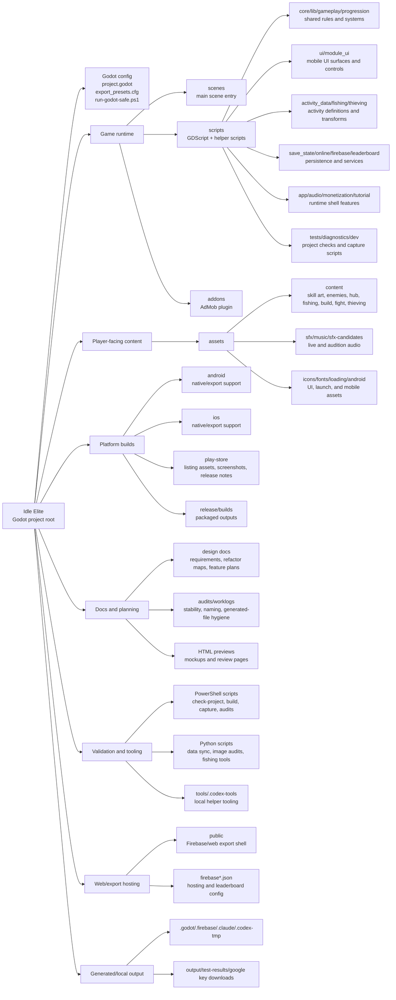

# Idle Elite File Structure Flowchart

Grouped by what each folder does. Dense asset and generated folders are collapsed so the map stays readable.

```mermaid
flowchart LR
  root["Idle Elite<br/>Godot project root"]

  root --> godot["Godot config<br/>project.godot<br/>export_presets.cfg<br/>run-godot-safe.ps1"]
  root --> game["Game runtime"]
  root --> content["Player-facing content"]
  root --> platform["Platform builds"]
  root --> docs["Docs and planning"]
  root --> validation["Validation and tooling"]
  root --> web["Web/export hosting"]
  root --> generated["Generated/local output"]

  game --> scenes["scenes<br/>main scene entry"]
  game --> scripts["scripts<br/>GDScript + helper scripts"]
  game --> addons["addons<br/>AdMob plugin"]

  scripts --> core["core/lib/gameplay/progression<br/>shared rules and systems"]
  scripts --> ui["ui/module_ui<br/>mobile UI surfaces and controls"]
  scripts --> data["activity_data/fishing/thieving<br/>activity definitions and transforms"]
  scripts --> state["save_state/online/firebase/leaderboard<br/>persistence and services"]
  scripts --> app["app/audio/monetization/tutorial<br/>runtime shell features"]
  scripts --> checks["tests/diagnostics/dev<br/>project checks and capture scripts"]

  content --> assets["assets"]
  assets --> art["content<br/>skill art, enemies, hub, fishing, build, fight, thieving"]
  assets --> sound["sfx/music/sfx-candidates<br/>live and audition audio"]
  assets --> ui_assets["icons/fonts/loading/android<br/>UI, launch, and mobile assets"]

  platform --> android["android<br/>native/export support"]
  platform --> ios["ios<br/>native/export support"]
  platform --> store["play-store<br/>listing assets, screenshots, release notes"]
  platform --> release["release/builds<br/>packaged outputs"]

  docs --> design["design docs<br/>requirements, refactor maps, feature plans"]
  docs --> audits["audits/worklogs<br/>stability, naming, generated-file hygiene"]
  docs --> previews["HTML previews<br/>mockups and review pages"]

  validation --> ps1["PowerShell scripts<br/>check-project, build, capture, audits"]
  validation --> py["Python scripts<br/>data sync, image audits, fishing tools"]
  validation --> tools["tools/.codex-tools<br/>local helper tooling"]

  web --> public["public<br/>Firebase/web export shell"]
  web --> firebase["firebase*.json<br/>hosting and leaderboard config"]

  generated --> godot_cache[".godot/.firebase/.claude/.codex-tmp"]
  generated --> output["output/test-results/google key downloads"]
```
