# Fishing Module Art Suite

Generated as cartoony replacement candidates for the fishing region modules.

Style target: chunky Idle Elite fishing art, thick outlines, low-texture cartoon fills, bright readable colors, simple phone-readable compositions, no baked UI or text.

## Style-Lock Approved Anchors

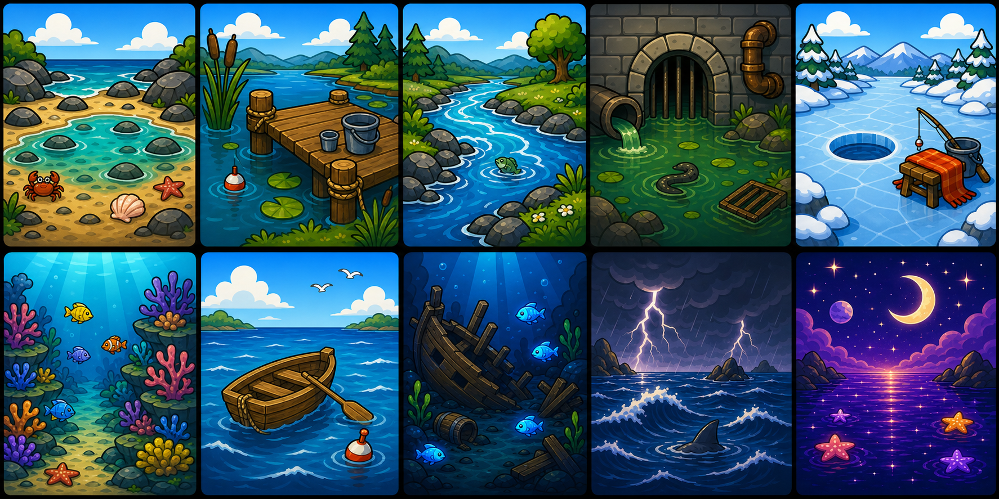

This pass uses the `$idle-elite-style-lock` approved anchors as the style source of truth. Fishing backgrounds are treated only as subject/context references.

| Module | Candidate art | Notes |
| --- | --- | --- |
| Beach | 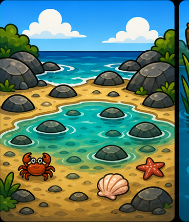 | Toy-like tide pool plate with heavy outlines and simple prop details. |
| Pier | 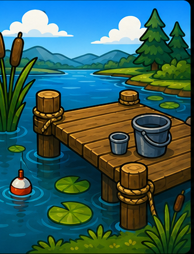 | Dock, reeds, lily pads, bucket, and bobber in approved-anchor shape language. |
| River | 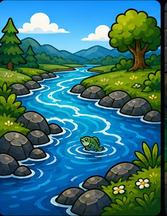 | Chunky river/rocks/trees with stronger black outlines. |
| Sewers | 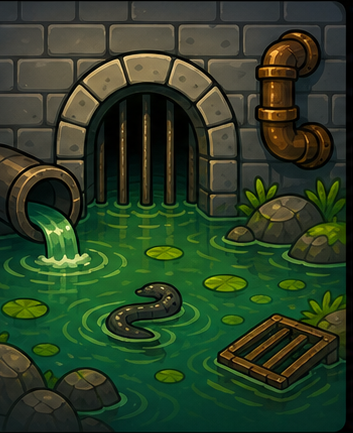 | Sewer plate translated into simple outlined prop language. |
| Winter Lake | 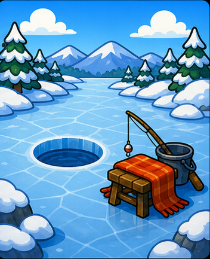 | Ice fishing plate with simplified props and thick outlines. |
| Reef | 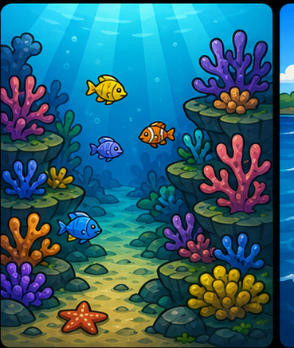 | Reef module with simplified coral props and small fish. |
| Sea | 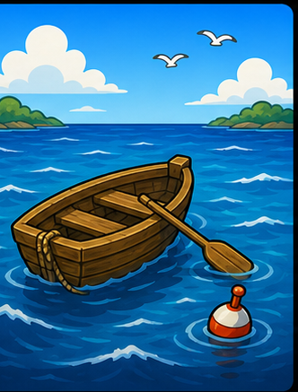 | Rowboat and buoy as bold toy-like props. |
| Deep Sea | 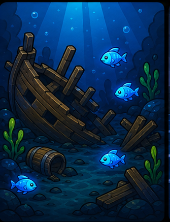 | Wreck/rocks/fish with stronger silhouette read. |
| Stormy Sea | 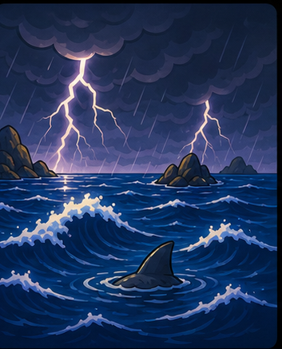 | Storm waves and ray detail with heavier outline treatment. |
| Space Fishing | 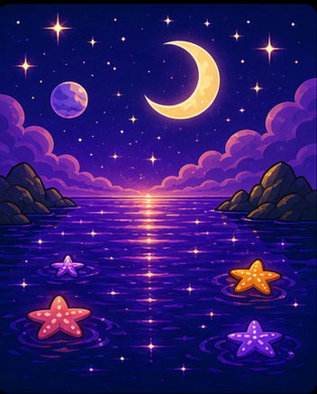 | Cosmic water/starfish scene in the same bold plate format. |

## Skill-Guided Regeneration

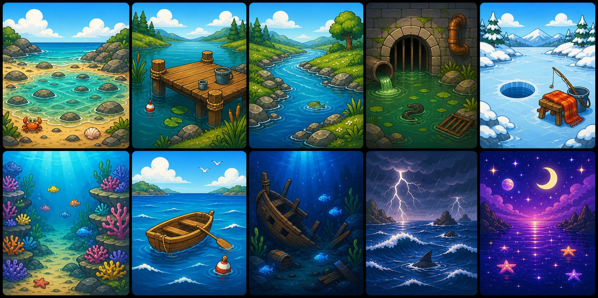

This pass used task-local fishing backgrounds incorrectly as style anchors. Kept for comparison, but superseded by v8.

## Environmental Low-Texture Pass

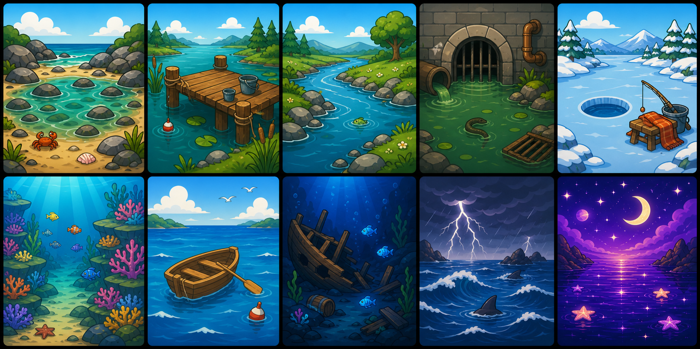

This pass combines the preferred wide environmental framing with reduced surface texture: cleaner rocks, water, snow, wood, and sky while avoiding the close-up mascot feel.

| Module | Candidate art | Notes |
| --- | --- | --- |
| Beach | 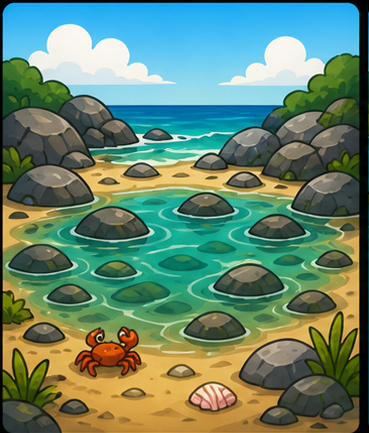 | Wide low-texture tide pool shallows with rocks, shell, crab. |
| Pier | 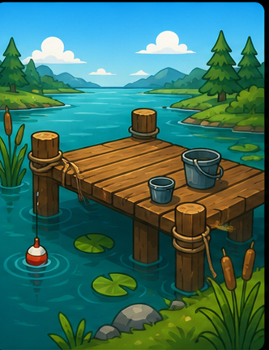 | Clean dock and pond edge with bucket, reeds, bobber. |
| River | 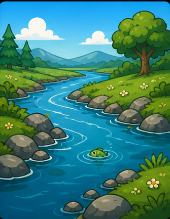 | Smooth river bend with banks, stones, fish ripple. |
| Sewers | 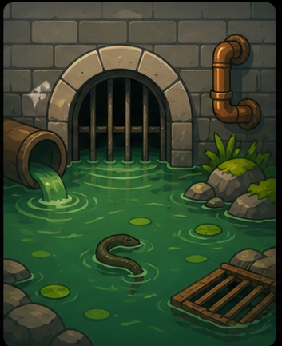 | Simplified sewer spot with arch, pipe, pool, eel detail. |
| Winter Lake | 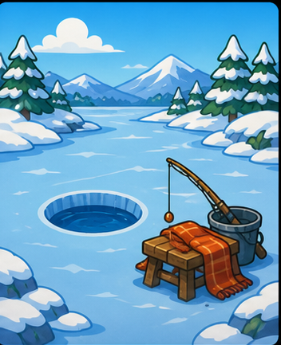 | Clean frozen lake with ice hole, stool, rod. |
| Reef | 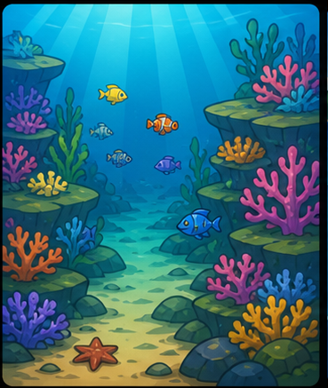 | Underwater reef landscape with smoother coral shelves. |
| Sea | 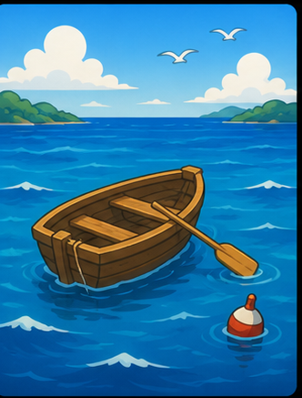 | Smooth offshore rowboat scene with buoy and horizon. |
| Deep Sea | 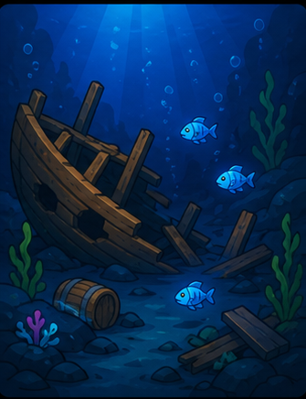 | Low-texture abyss wreck with small glowing fish. |
| Stormy Sea | 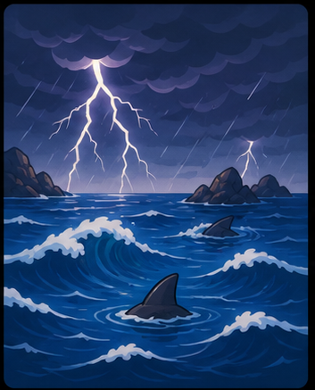 | Cleaner storm waves, lightning, ray fin. |
| Space Fishing | 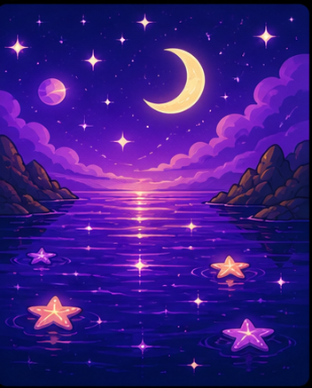 | Smooth cosmic sea with moon, stars, starfish glints. |

## Environmental Pass

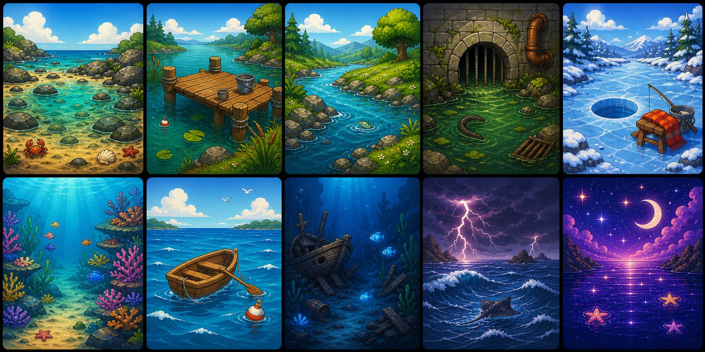

This pass bounces back toward the original game-background feel: wider framing, environmental depth, small creature details instead of face-forward mascot art, and cleaner texture than the first painterly pass.

| Module | Candidate art | Notes |
| --- | --- | --- |
| Beach | 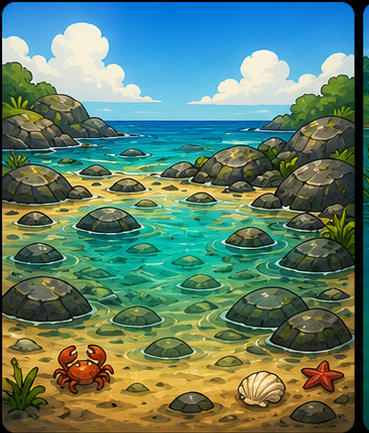 | Wide tide pool shallows with rocks, shell, crab, horizon. |
| Pier | 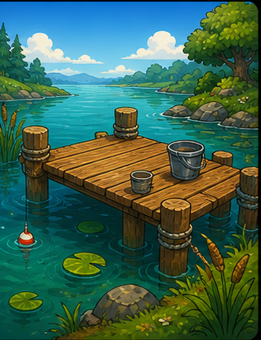 | Scenic dock and pond edge with bucket, reeds, bobber. |
| River | 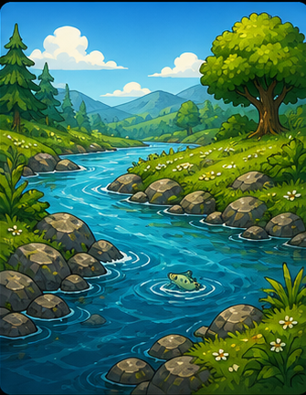 | River bend with trees, banks, stones, fish ripple. |
| Sewers | 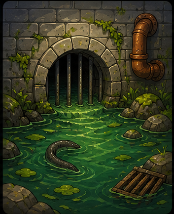 | Sewer fishing spot with arch, pipe, green pool, eel detail. |
| Winter Lake | 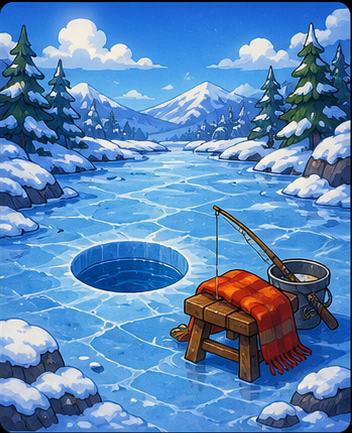 | Wide frozen lake scene with hole, stool, rod. |
| Reef | 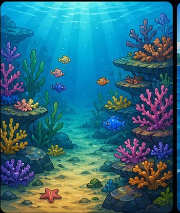 | Underwater reef landscape with coral shelves and small fish. |
| Sea | 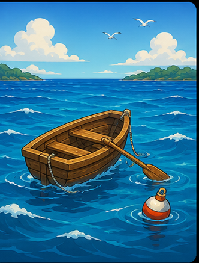 | Offshore rowboat scene with buoy and horizon. |
| Deep Sea | 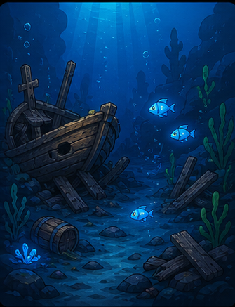 | Deep abyss wreck with glowing fish and rocks. |
| Stormy Sea | 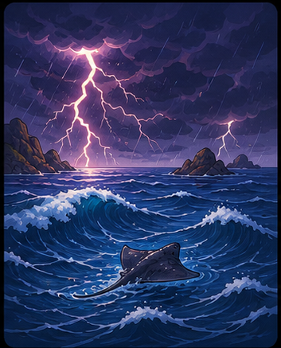 | Storm ocean environment with lightning, waves, ray detail. |
| Space Fishing | 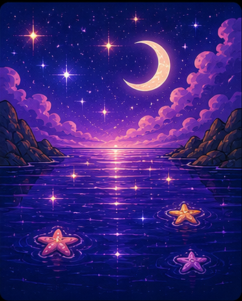 | Cosmic dream sea landscape with moon, stars, starfish glints. |

## Low-Texture Experiment

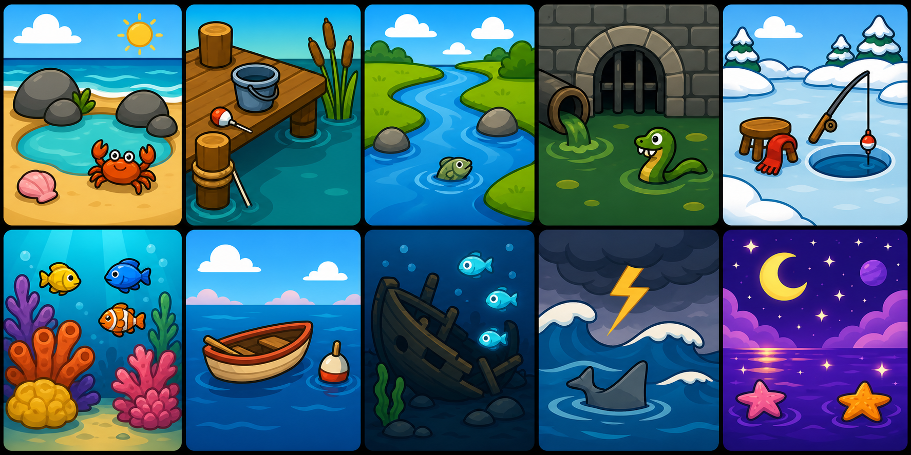

This is the cleaner cartoon pass: smooth fills, less brush texture, fewer gritty details, and simple shadow bands. It reads more zoomed-in and mascot-like than the preferred environmental direction.

| Module | Candidate art | Notes |
| --- | --- | --- |
| Beach | 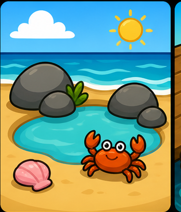 | Smooth tide pool, chunky rocks, shell, crab. |
| Pier | 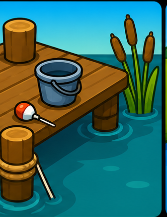 | Low-texture dock corner, pilings, bucket, bobber, reeds. |
| River | 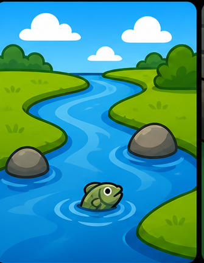 | Clean S-curve river with simple banks and fish ripple. |
| Sewers | 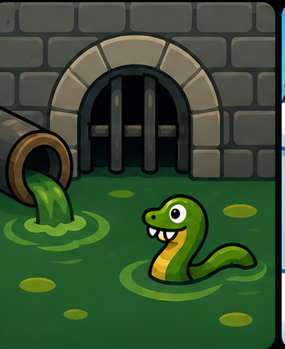 | Smooth sewer arch, pipe, green pool, silly eel. |
| Winter Lake | 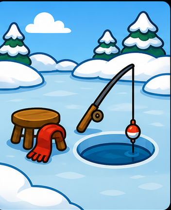 | Flat icy lake, ice hole, stool, scarf, rod. |
| Reef | 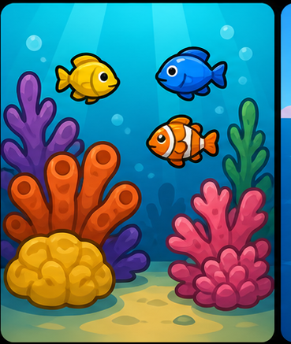 | Smooth coral blobs and cute fish. |
| Sea | 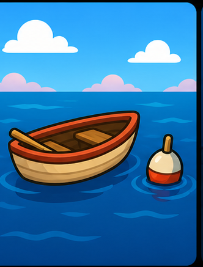 | Clean rowboat, calm water, buoy, horizon. |
| Deep Sea | 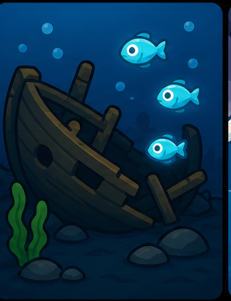 | Simple wreck shape and glowing fish. |
| Stormy Sea | 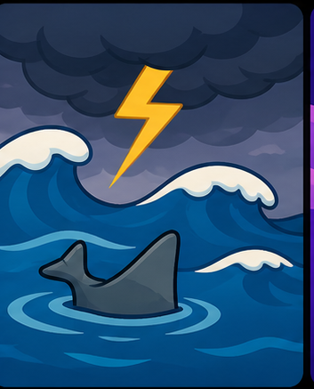 | Smooth waves, lightning, ray fin. |
| Space Fishing | 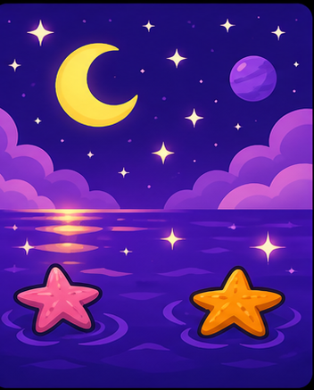 | Smooth purple star sea, crescent moon, starfish. |

## Earlier Simple Pass

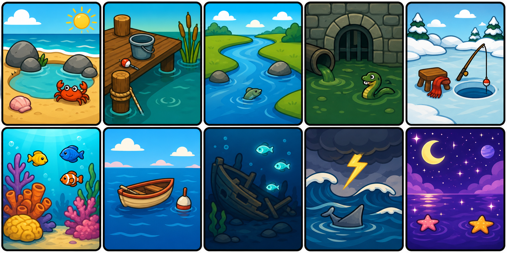

This is the simpler, more cartoony pass: bigger shapes, less texture than v1, fewer objects, faster mobile readability.

| Module | Candidate art | Notes |
| --- | --- | --- |
| Beach | 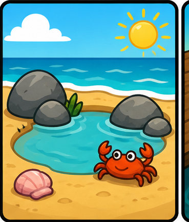 | Simple tide pool, chunky rocks, shell, crab. |
| Pier | 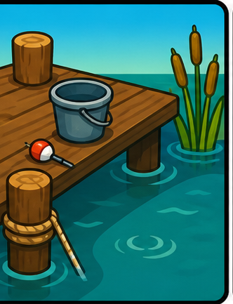 | Dock corner, pilings, bucket, bobber, reeds. |
| River | 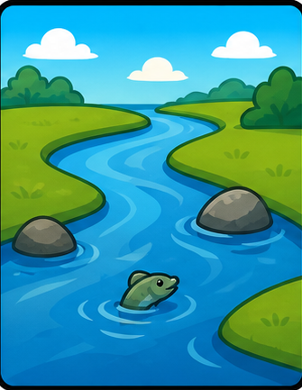 | Clear river curve with big banks and fish ripple. |
| Sewers | 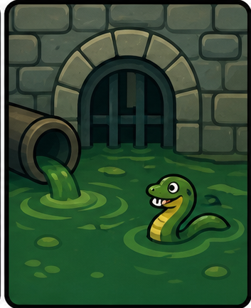 | Playful sewer arch, pipe, green pool, silly eel. |
| Winter Lake |  | Ice hole, stool, scarf, rod, snow banks. |
| Reef |  | Big coral blobs and cute fish. |
| Sea |  | Tiny rowboat, calm water, buoy, horizon. |
| Deep Sea |  | Chunky wreck and glowing fish. |
| Stormy Sea |  | Chunky waves, lightning, ray fin. |
| Space Fishing |  | Purple star sea, crescent moon, starfish. |

## Earlier Painterly Pass


## Module Candidates

| Module | Candidate art | Notes |
| --- | --- | --- |
| Beach |  | Sunny tide pool shallows, rocks, shell, crab. |
| Pier |  | Wooden dock edge, cup, bucket, reeds, pilings. |
| River |  | Curving river bend with stones and grassy banks. |
| Sewers |  | Rounded drain gate, green pool, pipe, eel silhouette. |
| Winter Lake |  | Frozen lake, ice hole, stool, scarf, rod. |
| Reef |  | Bright underwater coral and readable fish shapes. |
| Sea |  | Calm offshore rowboat, buoy, horizon. |
| Deep Sea |  | Abyssal wreck fragments and glowing fish. |
| Stormy Sea |  | Chunky storm waves, lightning, ray ripple. |
| Space Fishing |  | Cosmic reflective water, crescent moon, starfish glints. |

## Generation Prompt

### v8 Style-Lock Approved Anchor Prompt

```text
Use case: stylized-concept
Asset type: Idle Elite fishing module art contact sheet
Primary request: Generate one coherent 5-column by 2-row contact sheet containing 10 square fishing module art fills for Idle Elite.

IMPORTANT STYLE LOCK:
Match ONLY the approved $idle-elite-style-lock style anchors shown in this conversation: the blue stick-figure bamboo rod action, hub tree sheet, hub decor sheet, hay bale action, market stall action, and shop icon. Treat fishing backgrounds only as subject/context, not as style.

Approved style target:
- Thick near-black outlines around every object and major shape.
- Simple rounded toy-like silhouettes, like the hub tree/decor sheets.
- Clean gradient fills with minimal interior texture.
- Sparse detail: a few simple highlight patches and shadow bands, not painterly scene rendering.
- Asset-pack/sprite clarity: every rock, reed, dock plank, wave, tree, and prop should feel built from the same simple Idle Elite shape language.
- Slightly goofy farm-idle charm, but not cute mascot close-ups.
- Bright saturated colors, clean readable silhouettes, mobile readability.
- Full square plates are allowed, but they should be composed from bold simple prop/background shapes, not realistic landscape painting.

Subject/context only:
The 10 modules are fishing region fills. Use fishing subject matter, but render it with the approved style-lock anchors above.

Composition:
One contact sheet, 5 columns by 2 rows, 10 square tiles in exact reading order. Each tile is a simple square module plate with a black rounded border. No labels, no text, no UI buttons. Keep camera/framing simple and readable, like a staged Idle Elite action/card scene or asset diorama rather than a panoramic painting.

Tiles in exact reading order:
1 Beach: simplified tide pool shallows: sand shape, turquoise pool shapes, rounded gray rock props, shell prop, tiny crab prop, simple blue sky/cloud.
2 Pier: simple pond dock: wooden plank platform, two pilings, bucket prop, bobber, reeds, lily pads, blue water.
3 River: simple river bend/rapids: blue winding water shape with white stroke ripples, rounded gray rocks, green bank shapes, pine/tree shapes.
4 Sewers: sewer module: rounded stone arch, simple block wall, pipe, green pool shape, grate prop, small eel detail.
5 Winter Lake: ice fishing module: pale blue ice plane, round ice hole, stool, rod, scarf/blanket prop, snow mounds, pine props.
6 Reef: underwater reef: cyan water, chunky coral props, rounded rock props, small simple fish details.
7 Sea: offshore rowboat: small wooden boat prop, buoy, blue water bands, simple horizon/cloud.
8 Deep Sea: abyss: dark blue water field, chunky wreck prop, rounded rocks, three glowing fish shapes, simple light rays.
9 Stormy Sea: storm: chunky wave shapes, dark cloud shapes, lightning bolt, small ray fin/ripple, readable and bold.
10 Space Fishing: cosmic sea: purple water bands, crescent moon, simple stars, two starfish props, cloud shapes.

Avoid:
Do not render like the previous generic fishing background sheets. No polished AI landscape look, no scenic oil-painting detail, no realistic boulders, no gritty rock speckles, no heavy brush texture, no cinematic lighting, no close-up icon crops, no face-forward mascot animals, no creepy cute faces, no photorealism, no glossy 3D, no anime, no flat vector clipart, no pixel art, no text, no numbers, no labels, no watermark.
```

### v6 Idle Skill Prompt

```text
Regenerate a full Idle Elite fishing module art contact sheet as one coherent 10-tile suite. Use case: stylized-concept. Asset type: game module art preview sheet. Purpose: replacement candidate art fills for fishing region modules in Idle Elite. Style anchors: existing Idle Elite fishing backgrounds: tide-pool shallows, pond dock, river bend, frozen lake, coral reef, rowboat offshore, deep sea abyss, storm ocean, cosmic dream sea. Direction: keep the WIDE ENVIRONMENTAL FRAMING and cozy idle-game background-plate feel of the best prior pass, with reduced texture and clean surfaces. Style: chunky hand-painted 2D mobile game environmental art, thick confident dark outlines, rounded readable shapes, warm bright colors, soft clean shading, smooth flat-to-soft gradient fills, minimal surface grain, no gritty detail, no close-up icon crops. It should feel like polished Idle Elite game art, not generic clipart and not preschool illustration. Composition: 5 columns by 2 rows, each tile is a square module background plate with visible foreground/midground/background depth, generous environment space, consistent lighting and scale, thin dark rounded border between tiles, no UI buttons. IMPORTANT: no text, no letters, no labels, no numbers, no watermark anywhere.

Tiles in exact reading order:
1 Beach: wide tide-pool shallows with sand, rounded rocks, shell, small crab as a minor detail, turquoise shallow water, distant ocean horizon, smooth rocks with little/no speckle.
2 Pier: wide wooden dock and pond edge with pilings, reeds, bucket, bobber, teal water around it, simple wood planks with restrained grain.
3 River: scenic river bend with grassy banks, stones, distant trees and hills, curving water path, one subtle fish ripple, clean smooth grass and water.
4 Sewers: playful but not cute sewer fishing spot, stone arch drain, pipe, green water pool, small eel as a minor detail, simplified stone blocks, not gross and not character-focused.
5 Winter Lake: snowy frozen lake landscape, one ice hole and small stool/rod, pine trees, wide icy surface, smooth snow and ice.
6 Reef: underwater reef landscape with coral shelves, open water, small fish as details, clean coral shapes with minimal internal texture.
7 Sea: rowboat offshore in a wider calm ocean scene with buoy, horizon, gentle waves, smooth boat and water.
8 Deep Sea: deep underwater abyss scene with wreck fragment, rocks, glowing fish as small details, readable but moody, simplified wreck surfaces.
9 Stormy Sea: stormy ocean environment with chunky waves, lightning, dark clouds, ray fin as subtle detail, clean smooth wave shapes.
10 Space Fishing: cosmic dream sea as a wide landscape with crescent moon, stars, reflective water, small starfish glints, smooth magical water.

Constraints: no people, no generated text, no photorealism, no glossy 3D render, no anime, no preschool illustration, no creepy-cute faces, no oversized mascot animals, no face-forward character focus, no close-up icon crops, no heavy brush texture, no stippling, no hatching, no noisy grain, no gritty rock speckles, no tiny clutter. Each tile should feel like a usable low-texture environmental module background in a cozy idle game.
```

### v5 Environmental Low-Texture Prompt

```text
Create a low-texture environmental fishing module contact sheet for Idle Elite with 10 square game art tiles. Use case: stylized-concept. Asset type: game module art preview sheet. Direction: use the WIDE ENVIRONMENTAL FRAMING of a cozy hand-painted game background, but drop most surface texture. Style: chunky 2D mobile game environmental art, thick confident dark outlines, rounded readable shapes, warm daylight colors, smooth flat-to-soft gradient fills, clean simple shadow shapes, minimal brush texture, minimal surface grain, no gritty detail. Keep the scenic background-plate feel, NOT close-up icon art, NOT preschool cartoon, NOT cute face-forward character art. Composition: 5 columns by 2 rows, each tile is a square module background plate with wider scenic framing, visible foreground/midground/background depth, generous environment space, no UI buttons. IMPORTANT: no text, no letters, no labels, no numbers, no watermark. The 10 tiles, in reading order: 1 Beach: wide tide-pool shallows with sand, rounded rocks, shell, small crab as a minor detail, turquoise shallow water, horizon, smooth rocks with little/no speckle. 2 Pier: wide wooden dock and pond edge with pilings, reeds, bucket, bobber, water around it, smooth simple wood planks with almost no grain. 3 River: scenic river bend with grassy banks, stones, distant trees, water curve, one subtle fish ripple, clean smooth grass and water. 4 Sewers: playful but not cute sewer fishing spot, stone arch drain, pipe, green water pool, small eel as minor detail, simplified smooth stone blocks, not gross. 5 Winter Lake: snowy frozen lake landscape, one ice hole and small stool/rod, pine trees, wide icy surface, smooth snow and ice. 6 Reef: underwater reef landscape with coral shelves, open water, small fish as details, clean coral shapes with minimal internal texture. 7 Sea: rowboat offshore in a wider calm ocean scene with buoy, horizon, gentle waves, smooth boat and water. 8 Deep Sea: deep underwater abyss scene with wreck fragment, rocks, glowing fish as small details, readable but moody, simplified wreck surfaces. 9 Stormy Sea: stormy ocean environment with chunky waves, lightning, dark clouds, ray fin as subtle detail, clean smooth wave shapes. 10 Space Fishing: cosmic dream sea as a wide landscape with crescent moon, stars, reflective water, small starfish glints, smooth magical water. Constraints: no people, no generated text, no photorealism, no glossy 3D render, no anime, no preschool illustration, no creepy-cute faces, no oversized mascot animals, no close-up icon crops, no heavy brush texture, no stippling, no hatching, no noisy grain, no realistic wood grain, no gritty rock speckles, no tiny clutter. Each tile should feel like a usable low-texture environmental module background in a cozy idle game.
```

### v4 Environmental Prompt

```text
Create a polished fishing module contact sheet for Idle Elite with 10 square environmental game art tiles. Use case: stylized-concept. Asset type: game module art preview sheet. Direction: bounce back toward a cozy hand-painted game background style, not close-up icon art. Style: chunky 2D mobile game environmental art, thick confident dark outlines, rounded readable shapes, warm daylight colors, soft clean shading, moderate detail, restrained texture. Keep surfaces cleaner than painterly v1 but NOT flat preschool cartoon, NOT cute face-forward character art, NOT zoomed-in icons. Composition: 5 columns by 2 rows, each tile is a square module background plate with wider scenic framing, visible foreground/midground/background depth, generous environment space, no UI buttons. IMPORTANT: no text, no letters, no labels, no numbers, no watermark. The 10 tiles, in reading order: 1 Beach: wide tide-pool shallows with sand, rounded rocks, shell, small crab as a minor detail, turquoise shallow water, horizon. 2 Pier: wider wooden dock and pond edge with pilings, reeds, bucket, bobber, water around it, more environment than props. 3 River: scenic river bend with grassy banks, stones, distant trees, water curve, one subtle fish ripple. 4 Sewers: playful but not cute sewer fishing spot, stone arch drain, pipe, green water pool, small eel as minor detail, not gross and not character-focused. 5 Winter Lake: snowy frozen lake landscape, one ice hole and small stool/rod, pine trees, wide icy surface. 6 Reef: underwater reef landscape with coral shelves, open water, small fish as details, not close-up coral icons. 7 Sea: rowboat offshore in a wider calm ocean scene with buoy, horizon, gentle waves. 8 Deep Sea: deep underwater abyss scene with wreck fragment, rocks, glowing fish as small details, readable but moody. 9 Stormy Sea: stormy ocean environment with chunky waves, lightning, dark clouds, ray fin as subtle detail, dramatic game background. 10 Space Fishing: cosmic dream sea as a wide landscape with crescent moon, stars, reflective water, small starfish glints, magical but not cute. Constraints: no people, no generated text, no photorealism, no glossy 3D render, no anime, no preschool illustration, no creepy-cute faces, no oversized mascot animals, no close-up icon crops, no excessive brush grit, no dark blur, no tiny clutter. Each tile should feel like a usable replacement module background in a cozy idle game.
```

### v3 Low-Texture Prompt

```text
Create a clean low-texture contact sheet preview of 10 square game art tiles for Idle Elite fishing modules. Use case: stylized-concept. Asset type: game module art preview sheet. Style: clean cartoon 2D mobile game art with VERY LOW TEXTURE, smooth flat color fills, chunky thick dark outlines, rounded toy-like shapes, simple cel-shaded forms, only one or two soft shadow bands, bright earthy colors, readable at small phone size. Keep the cozy Idle Elite fishing vibe, but remove painterly brush texture, gritty surface detail, tiny strokes, realistic material grain, and busy background detail. Composition: 5 columns by 2 rows, each tile is a filled square illustration with consistent lighting and scale, thin dark rounded border between tiles, no UI buttons. IMPORTANT: no text, no letters, no labels, no numbers, no watermark. The 10 tiles, in reading order, should be: 1 Beach: sunny tide pool with smooth turquoise water, sand, three simple rounded rocks, one shell, one crab. 2 Pier: smooth wooden dock corner with two pilings, bucket, bobber, reeds, teal pond water. 3 River: smooth S-curve river with grassy banks, two rocks, one fish ripple, bright sky. 4 Sewers: playful sewer arch with grate, one pipe, flat green pool, one silly eel, simple block wall. 5 Winter Lake: smooth icy lake with one round ice hole, small stool, scarf, rod, soft snow banks. 6 Reef: bright underwater coral patch with large simple coral blobs and three cute fish, cyan water. 7 Sea: tiny rowboat on calm smooth blue water with one buoy and clean horizon. 8 Deep Sea: dark blue abyss with one simple wreck silhouette and three glowing fish, clean shapes, not too dark. 9 Stormy Sea: chunky smooth waves, one lightning bolt, dark cloud, one ray fin/ripple, colorful but clean. 10 Space Fishing: purple starry sea with crescent moon, two starfish, smooth reflections. Constraints: no people, no generated text, no photorealism, no glossy 3D render, no anime, no dark blur, no tiny clutter, no painterly texture, no stippling, no hatching, no realistic wood grain, no scratchy brushwork. Each tile should feel like a clean low-texture cartoony replacement art fill for a fishing region/module.
```

### v2 Simple Prompt

```text
Create a simplified cartoony contact sheet preview of 10 square game art tiles for Idle Elite fishing modules. Use case: stylized-concept. Asset type: game module art preview sheet. Style: VERY simple cozy cartoon 2D mobile game art, chunky thick dark outlines, big rounded toy-like shapes, clean flat color blocks with only soft minimal shading, bright earthy palette, extremely readable silhouettes at small phone size. Make it simpler and more cartoony than painterly art: fewer objects, less texture, less detail, more icon-like scene compositions. Composition: 5 columns by 2 rows, each tile is a filled square illustration with consistent lighting and scale, thin dark rounded border between tiles, no UI buttons. IMPORTANT: no text, no letters, no labels, no numbers, no watermark. The 10 tiles, in reading order, should be: 1 Beach: simple sunny tide pool with 3 rounded rocks, sand, one shell, one cute crab, turquoise water. 2 Pier: simple wooden dock corner with two pilings, bucket, bobber, reeds, green-blue water. 3 River: simple S-curve river with grassy banks, two rocks, one fish ripple, bright sky. 4 Sewers: playful not-scary sewer arch with grate, one pipe, green pool, one silly eel, minimal stone blocks. 5 Winter Lake: simple frozen lake with one round ice hole, small stool, scarf, rod, snow banks. 6 Reef: simple underwater coral patch with 4 chunky coral shapes and 3 cute fish, bright cyan water. 7 Sea: simple tiny rowboat on calm blue water with one buoy and horizon. 8 Deep Sea: simple dark blue abyss with one chunky wreck shape and 3 glowing fish, not too dark. 9 Stormy Sea: simple chunky waves, one lightning bolt, dark cloud, one ray fin/ripple, still colorful. 10 Space Fishing: simple purple starry sea with crescent moon, two starfish, reflective water. Constraints: no people, no generated text, no icons, no photorealism, no glossy 3D render, no anime, no dark blur, no tiny clutter, no realistic textures. Each tile should feel like a clean cartoony replacement art fill for a fishing region/module.
```

### v1 Painterly Prompt

```text
Create a polished contact sheet preview of 10 square game art tiles for Idle Elite fishing modules. Use case: stylized-concept. Asset type: game module art preview sheet. Style: cozy farm idle game asset, chunky hand-painted 2D game art, thick dark outlines, rounded toy-like shapes, soft painterly shading, bright earthy colors, clean readable silhouettes for a phone screen, matching cartoony fishing backgrounds. Composition: 5 columns by 2 rows, each tile is a filled square illustration with consistent lighting and scale, thin dark rounded border between tiles, no UI buttons. IMPORTANT: no text, no letters, no labels, no numbers, no watermark. The 10 tiles, in reading order, should be: 1 Beach: sunny tide pool shallows with sand, rounded rocks, shell, little crab, turquoise shallow water. 2 Pier: cozy wooden dock edge over pond water, cup/bucket and pilings, reeds, small ripples. 3 River: curved river bend with grassy banks, smooth stones, trout ripple, bright daylight. 4 Sewers: playful not-scary sewer drain pool, rounded stone tunnel, greenish water, rusty grate, silly eel silhouette, readable and not gross. 5 Winter Lake: frozen lake ice hole, snow mounds, little fishing stool, blue ice, warm scarf detail. 6 Reef: colorful coral reef shallows, chunky coral shapes, tiny fish, bright underwater shafts. 7 Sea: tiny rowboat offshore on blue water, simple horizon, buoy, calm waves. 8 Deep Sea: deep blue abyss, chunky shipwreck fragment, glowing lanternfish shapes, readable not too dark. 9 Stormy Sea: stylized storm ocean with chunky waves, lightning in clouds, storm ray ripple, dramatic but still colorful. 10 Space Fishing: cosmic dream sea under stars and crescent moon, reflective water, starfish glint, magical but not over-detailed. Constraints: no people, no generated text, no icons, no photorealism, no glossy 3D render, no anime, no dark blur, no tiny unreadable clutter. Each tile should feel like a usable replacement art fill for a fishing region/module.
```
