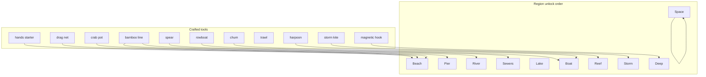

# Fishing — modules & locations plan

Planning doc for the **tool × location** rework. Companion specs: [fishing-tool-area-matrix.md](fishing-tool-area-matrix.md), [fishing-archetype-design.md](fishing-archetype-design.md), mock [fishing-rework-brainstorm.html](fishing-rework-brainstorm.html).

**Status:** design / authoring — not implemented in Godot JSON yet.

---

## Screen layout (what appears on Fishing detail)

| Block | Type | Scroll? |
|-------|------|---------|
| Skill header | Fishing Lv + title | — |
| **Gear wallet** | Fish count button → vertical tool splay | Sticky feel |
| **Region modules** | One card per biome (locations inside) | Main scroll |
| *(later)* **Passive collect** | Lobster cage, etc. | Between regions or pinned |

Region cards do **not** contain tools. Passive modules are **not** location tiles.

---

## Progression overview

**Three unlock tracks**

1. **Fishing level** — reveals region modules and location spots (padlock on tile).
2. **Crafting** — reveals tools in wallet splay (gray **craft** row until built).
3. **Soft affinity** — any owned tool at any unlocked spot; numbers say if it’s smart.

---

## Tools (target list)

Collapse today’s 23 **methods** into **~12 equippable tools** (+ 1–2 passive modules).

| Tool id | Display name | Archetype | Unlock | Replaces (legacy actions) |
|---------|--------------|-----------|--------|---------------------------|
| `hands` | Bare hands | novice | Starter | dip-a-tidepool-minnow |
| `net` | Drag net | volume | **Rocky discovery** (first net) | drag-net-through-creek |
| `line` | Bamboo line | steady | Craft ~10 | dangle-string, cast-bamboo-rod, fly-fish (one tool, ranks later) |
| `grab` | Sewer grab | chaos | Craft ~20 | hand-grab-muddy-catfish |
| `crab-pot` | Crab pot | steady | Craft ~40 | set-tiny-crab-pot — **see passive note** |
| `spear` | Gaff / spear | commit | Craft ~24 | spear-fish-in-shallows |
| `ice-auger` | Ice auger & line | steady | Craft ~26 | ice-fish-through-nervous-hole |
| `rowboat` | Rowboat rod | steady | Craft ~32 | cast-from-rowboat — also **keys Boat region** |
| `trawl` | Trawl net | volume | Craft ~38 | trawl-from-tiny-boat |
| `harpoon` | Harpoon | commit | Craft ~45 | harpoon-suspicious-ripple |
| `lantern-rig` | Lantern rig | steady | Craft ~48 | night-fish-with-lantern |
| `chum` | Chum bucket | risk | Craft ~45 | chum-open-water |
| `storm-kite` | Storm kite line | commit | Craft ~55 | cast-storm-kite-line |
| `pearl-dive` | Dive knife | commit | Craft ~55 | dive-for-pearl-oysters |
| `mag-hook` | Magnetic hook | steady | Craft ~68 | fish-with-magnetic-hook |
| `leviathan-bait` | Leviathan bait | commit | Craft ~75 | bait-a-tiny-leviathan |
| `mailbox-rig` | Mailbox trap | steady | Craft ~82 | open-deep-sea-mailbox-trap |
| `starlight-dip` | Starlight dip | steady | Craft ~88 | skim-a-starlight-minnow |
| `reflection-net` | Reflection net | volume | Craft ~92 | net-the-reflection-of-a-fish |

**v1 ship set (cut scope):** `hands`, `net`, `line`, `crab-pot` (passive), `spear`, `grab`, `harpoon`, `rowboat`, `trawl`, `chum`, `storm-kite`, `mag-hook`, `starlight-dip`, `reflection-net` — defer `ice-auger`, `lantern-rig`, `pearl-dive`, `leviathan-bait`, `mailbox-rig` to phase 2 if needed.

**Craft benches (TBD):** woodworking (net frame, rowboat), smithing (spear, harpoon, mag hook), cooking/alchemy (chum), fishing bench (pot, traps). Exact recipes live in a future `craft_recipes` block.

---

## Region modules & locations

Each region: `fluid`, default `background`, `unlock` = Fishing Lv when the **module first appears**, `locations[]` = 1–3 spots (max 3 tiles on card).

### 1. Beach — `beach` · water · module **Lv 1**

| Location id | Name | Spot unlock | Fish table | BG asset | Notes |
|-------------|------|-------------|------------|----------|-------|
| `shallows` | Shallows | **1** | minnow | 00-tide-pool-shallows | Tutorial: hands **ideal**, 1 fish |
| `rocky` | Rocks | **5** | crab | 03-crab-pier | **Special first visit** — see below; normal fishing after |
| `reef-edge` | Reef edge (teaser) | 12 | mixed | 05-coral-reef-shallows | Optional 3rd tile; preview bigger fish |

*Legacy mapping:* dip → shallows; drag-net on shallows; rocky = crab fantasy (not full Reef yet).

#### Rocks — first visit (“discarded net” tutorial)

**Trigger:** Player unlocks **Rocks** (Fishing Lv **5**) and taps the location to train **for the first time** (one-time flag in save: `fishing_rocky_net_found`).

**Do not** start a normal attempt loop on that first tap. Instead:

1. **Child module** inserts **directly below** the Beach region card — a **zoomed-in rocky beach** panel (same region, tighter crop / scale on `03-crab-pier` or rocky-specific art).
2. Scene shows an **old discarded net** (clickable prop, not a location tile).
3. Player **taps the net** → short collect animation: net **flies up** toward the **gear wallet** (fish + tool button).
4. **Toast / banner:** `Net collected!`
5. **`net` tool** unlocks in wallet splay (first gear upgrade — **not** a bench craft for this copy of the net).
6. Zoom module **dismisses** (or collapses); later Rocky visits behave like any other location (equipped tool × rocky, line ideal for crabs, etc.).

| State | UI |
|-------|-----|
| Before first Rocky tap | Only Beach card; net not in splay (or gray “find gear” teaser) |
| First Rocky tap | Zoom module visible under Beach |
| After net pickup | Net in splay; Rocky runs normal fishing |

**Crafted nets later:** Optional tier-2 net upgrades still use benches; this beat is only **“found net”** onboarding.

---

### 2. Pier — `pier` · water · module **Lv 7**

| Location id | Name | Spot unlock | Fish table | BG asset | Notes |
|-------------|------|-------------|------------|----------|-------|
| `dock-cup` | Dock edge | **7** | minnow | 01-pond-dock | scoop-pond fantasy; opens with module |
| `piling-line` | Piling line | 11 | panfish | 01-pond-dock | dangle-string fantasy |

---

### 3. River — `river` · water · module **Lv 14**

| Location id | Name | Spot unlock | Fish table | BG asset | Notes |
|-------------|------|-------------|------------|----------|-------|
| `bend` | River bend | **14** | trout | 02-river-bend | line / net |
| `undercut` | Undercut bank | 18 | trout | 02-river-bend | Slightly higher tier |

---

### 4. Sewers — `sewers` · sewer · module **Lv 20**

| Location id | Name | Spot unlock | Fish table | BG asset | Notes |
|-------------|------|-------------|------------|----------|-------|
| `muddy-run` | Muddy run | **20** | catfish | 03-mid | **grab** chaos ideal |
| `grate-pool` | Grate pool | 24 | catfish / eel | 03-mid | **spear** commit ideal |

---

### 5. Lake — `lake` · water · module **Lv 26**

| Location id | Name | Spot unlock | Fish table | BG asset | Notes |
|-------------|------|-------------|------------|----------|-------|
| `ice-hole` | Ice hole | **26** | cold fish | 04-frozen-lake | ice-auger or line awkward |
| `open-water` | Open water | 32 | pike | 04-frozen-lake | line good |

---

### 6. Boat — `boat` · water · module **Lv 32**

Requires **`rowboat`** crafted (region can show locked until craft).

| Location id | Name | Spot unlock | Fish table | BG asset | Notes |
|-------------|------|-------------|------------|----------|-------|
| `offshore-cast` | Offshore cast | **32** | sea bass | 07-rowboat-offshore | rowboat **ideal** |
| `trawl-lane` | Trawl lane | 38 | bulk fish | 08-trawler-deck | **trawl** volume ideal |
| `chum-lane` | Chum slick | 45 | shark mix | 07-rowboat-offshore | **chum** risk ideal |

---

### 7. Reef — `reef` · water · module **Lv 40**

| Location id | Name | Spot unlock | Fish table | BG asset | Notes |
|-------------|------|-------------|------------|----------|-------|
| `coral-shelf` | Coral shelf | **40** | reef fish | 05-coral-reef-shallows | line good |
| `night-lantern` | Night lantern | 48 | reef rare | 05-coral-reef-shallows | lantern-rig |
| `pearl-bed` | Pearl bed | 55 | oyster | 05-coral-reef-shallows | pearl-dive commit |

**Passive module (same region, not a location):**

| Module | Unlock | Pattern |
|--------|--------|---------|
| **Lobster cage** | 40 | Woodcutting-style **collect stack** — drop-lobster-cage legacy |

---

### 8. Storm — `storm` · water · module **Lv 55**

| Location id | Name | Spot unlock | Fish table | BG asset | Notes |
|-------------|------|-------------|------------|----------|-------|
| `surf-kite` | Storm surf | **55** | storm fish | 10-storm-ocean | **storm-kite** commit ideal |
| `wrack-line` | Wrack line | 62 | storm scrap | 10-storm-ocean | line awkward, high XP |

---

### 9. Deep Sea — `deep` · water · module **Lv 68**

| Location id | Name | Spot unlock | Fish table | BG asset | Notes |
|-------------|------|-------------|------------|----------|-------|
| `abyss-hook` | Abyss hook | **68** | deep oddities | 09-deep-sea-abyss | mag-hook |
| `leviathan-lure` | Leviathan lure | 75 | leviathan | 09-deep-sea-abyss | leviathan-bait commit |
| `mailbox-rig` | Mailbox rig | 82 | treasure fish | 09-deep-sea-abyss | mailbox-rig steady |

---

### 10. Space Fishing — `space` · water/cosmic · module **Lv 90**

Cap **2 locations** on card (finale — no third slot).

| Location id | Name | Spot unlock | Fish table | BG asset | Notes |
|-------------|------|-------------|------------|----------|-------|
| `starlight-pool` | Starlight pool | **90** | starlight minnow | 11-cosmic-dream-sea | Opens with module; starlight-dip steady |
| `mirror-surface` | Mirror surface | 95 | reflection | 11-cosmic-dream-sea | reflection-net volume; last spot |

---

## Region unlock summary

| Order | Region | Module appears | Spots (unlock Lvs) | Fluid |
|-------|--------|----------------|---------------------|-------|
| 1 | Beach | **1** | shallows **1**, rocky **5**, edge 12 | water |
| 2 | Pier | **7** | dock **7**, piling 11 | water |
| 3 | River | **14** | bend **14**, undercut 18 | water |
| 4 | Sewers | **20** | muddy **20**, grate 24 | sewer |
| 5 | Lake | **26** | ice **26**, open 32 | water |
| 6 | Boat | **32*** | offshore **32**, trawl 38, chum 45 | water |
| 7 | Reef | **40** | coral **40**, night 48, pearl 55 + cage **40** | water |
| 8 | Storm | **55** | surf **55**, wrack 62 | water |
| 9 | Deep | **68** | abyss **68**, leviathan 75, mailbox 82 | water |
| 10 | Space | **90** | starlight **90**, mirror **95** | water |

\*Boat module visible at 32; rowboat craft (~32) makes offshore sensible.

**Progression curve:** Early game is Beach Lv 1–5 and Pier at 7; midgame spreads River → Reef (14–55); lategame Storm → Deep (55–82); **Space finale at 90–95**.

**Teaser rule:** Only **one** locked location visible per skill (next unlock globally), same as today’s method teaser — applied to **location tiles**, not tools.

---

## Flagship affinity pairs (authoring seeds)

Sparse matrix — fill `awkward` everywhere else.

| Location | Ideal tool | Joke tool |
|----------|------------|-----------|
| beach.shallows | hands | harpoon |
| beach.rocky | line | net |
| pier.dock-cup | hands / net | trawl |
| river.bend | line | net |
| sewers.muddy-run | grab | line |
| sewers.grate-pool | spear | hands |
| lake.ice-hole | ice-auger | harpoon |
| boat.trawl-lane | trawl | hands |
| boat.chum-lane | chum | hands |
| reef.coral-shelf | line | grab |
| storm.surf-kite | storm-kite | net |
| deep.leviathan-lure | leviathan-bait | hands |
| space.starlight-pool | starlight-dip | trawl |
| space.mirror-surface | reflection-net | harpoon |

---

## Legacy action → new home (migration)

| Old action id | → Tool | → Location |
|---------------|--------|------------|
| dip-a-tidepool-minnow | hands | beach.shallows |
| drag-net-through-creek | net | beach.shallows / river.bend |
| scoop-pond-minnows | hands / net | pier.dock-cup |
| dangle-string-from-dock | line | pier.piling-line |
| cast-bamboo-rod | line | river.bend |
| hand-grab-muddy-catfish | grab | sewers.muddy-run |
| set-tiny-crab-pot | *(passive)* | reef lobster module |
| ice-fish-through-nervous-hole | ice-auger | lake.ice-hole |
| spear-fish-in-shallows | spear | sewers.grate-pool |
| fly-fish-at-river-bend | line | river.bend |
| cast-from-rowboat | rowboat | boat.offshore-cast |
| drop-lobster-cage | passive | reef |
| trawl-from-tiny-boat | trawl | boat.trawl-lane |
| night-fish-with-lantern | lantern-rig | reef.night-lantern |
| harpoon-suspicious-ripple | harpoon | reef / beach joke |
| chum-open-water | chum | boat.chum-lane |
| cast-storm-kite-line | storm-kite | storm.surf-kite |
| dive-for-pearl-oysters | pearl-dive | reef.pearl-bed |
| fish-with-magnetic-hook | mag-hook | deep.abyss-hook |
| bait-a-tiny-leviathan | leviathan-bait | deep.leviathan-lure |
| open-deep-sea-mailbox-trap | mailbox-rig | deep.mailbox-rig |
| skim-a-starlight-minnow | starlight-dip | space.starlight-pool |
| net-the-reflection-of-a-fish | reflection-net | space.mirror-surface |

---

## Implementation order (suggested)

| Phase | Deliverable |
|-------|-------------|
| **A** | JSON: `tools[]`, `areas[].locations[]`, starter affinity for Beach + Pier |
| **B** | Godot: gear wallet splay + location tiles on Beach/Pier only |
| **C** | Roll regions 3–7 (River → Lake) |
| **D** | Boat + Reef + lobster passive module |
| **E** | Storm, Deep, Space + endgame tools |
| **F** | Craft recipe hooks + gray craft rows in splay |

---

## Open decisions

1. **Crab pot** — equippable tool that “places” pot, or **only** passive collect module? Plan: **passive only** at Reef; rocky beach uses **line** for crabs after net tutorial.
2. **Line upgrades** — one `line` tool with mastery tiers vs separate bamboo / fly / lantern items?
3. **Boat region** — requires craft to enter, or enter with joke affinity until rowboat built?
4. **Lava / electronics** — still cut; no sonar location.
5. **Location id format** — `beach.shallows` vs `beach:shallows` (pick one in JSON).

---

## Related files

- Shipped areas (flat): `docs/activity-database.json` → `fishing.areas[]`
- Status: [fishing-rework-status.md](fishing-rework-status.md)
