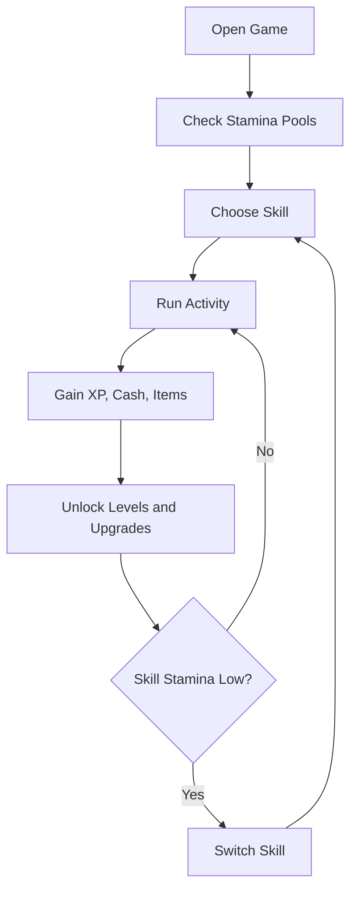

# Idle Elite Rebuild PRD

## Product Summary

`Idle Elite` is a mobile idle RPG about becoming an elite all-rounder by training many small activities instead of only optimizing one endless button. Every skill has its own stamina pool. Activities consume that skill's stamina, then reward XP, cash, items, and upgrade materials. Because each skill runs out of stamina independently, the player is nudged to rotate between activities often: fight until tired, go fish, chop wood, rob, build, claim upgrades, then come back stronger.

The game should preserve the simple charm of the 2012 Flash original while becoming polished enough for Google Play: readable portrait UI, satisfying progress bars, clear next activities, offline progress, rewarded ad boosts, and room for frequent content updates.

## Product Goals

- Rebuild the original `Fight`, `Thieving`, and `Build` structure in Godot.
- Add `Woodcutting` and `Fishing` as core starter skills.
- Make skill-specific stamina the main activity-switching mechanic.
- Give every skill a clear fantasy, activity ladder, upgrade path, and collectible rewards.
- Design for short mobile sessions of 30 seconds to 5 minutes.
- Support longer idle progression through offline rewards and automation upgrades.
- Prepare monetization with rewarded ads that feel helpful, not hostile.

## Player Fantasy

The player starts as a scrappy nobody shouting, `I MUST BECOME AN IDLE ELITIST!` They grow into a ridiculous multi-skilled legend by training practical, weird, and increasingly elite activities across town.

Tone: lightly funny, sincere, handmade, and progression-heavy.

## Target Audience

- Idle and incremental players who like checking in often.
- RuneScape-style skill progression fans.
- Mobile players who want satisfying upgrades without needing twitch skill.
- Players who enjoy collecting resources, unlocks, titles, and passive bonuses.

## Core Loop

1. Pick a skill.
2. Choose an unlocked activity.
3. Spend that skill's stamina.
4. Gain XP, cash, and possible resources.
5. Skill levels unlock better activities.
6. Resources and cash buy upgrades.
7. When stamina runs low, jump to another skill.
8. Return later after stamina regenerates or use a reward boost.



## Key Systems

### Skill Identity Rule

Every skill must have a mechanical identity, not only a different name and loot table. A player should be able to feel the difference between training Woodcutting and Fishing within a few taps.

Each skill needs at least three identity levers:

- Reward variance: steady, spiky, streak-based, jackpot-based, or choice-based.
- XP pattern: fixed XP, variable XP, combo XP, failure XP, discovery XP, or delayed XP.
- Stamina pattern: low-cost frequent actions, expensive bursts, stamina reservation, over-time commitments, or partial refunds.
- Loot pattern: predictable materials, rare drops, quality tiers, item sets, or consumables.
- Upgrade pattern: direct stat boosts, new sub-actions, automation, risk control, resource conversion, or better choices.
- Session behavior: quick dump, careful selection, come-back timer, rotating checklist, or collection hunt.

Design test: if two skills can swap their activity names and still play the same, at least one of them needs another mechanical rule.

### Global Level

Global level is the sum of all skill levels.

```text
global_level = fight_level + thieving_level + build_level + woodcutting_level + fishing_level
```

Global level unlocks account-wide features:

| Global Level | Unlock |
| ---: | --- |
| 5 | Activity log |
| 10 | Upgrade collection |
| 15 | Offline reward multiplier |
| 20 | Titles |
| 30 | Prestige preview |
| 50 | First prestige reset |

### Skill XP

Each skill levels independently. The original XP thresholds can seed the first balancing pass:

| Level | Total XP Required |
| ---: | ---: |
| 1 | 0 |
| 2 | 400 |
| 3 | 1,300 |
| 4 | 2,700 |
| 5 | 4,800 |
| 6 | 7,600 |
| 7 | 11,200 |
| 8 | 15,700 |
| 9 | 21,100 |
| 10 | 27,600 |

After level 10, use a scaling formula:

```text
next_level_xp = round(300 * level ^ 2.15)
```

### Skill Stamina

Each skill has its own stamina:

```text
max_stamina = 10 + skill_level * 5 + stamina_upgrades
```

Stamina regenerates independently over time.

Initial tuning:

| Value | Amount |
| --- | ---: |
| Base max stamina | 15 at skill level 1 |
| Regen interval | 1 stamina every 20 seconds |
| Offline regen | Yes |
| Activity action style | idle activities use `Start`; active activities use one clear verb |

### Activity Success

Activities have a success chance, improved by skill level and upgrades. The original game used about 67%. Use that as the early baseline.

```text
success_chance = activity_base_chance + skill_level_bonus + upgrade_bonus
```

Failing still grants small XP so stamina never feels fully wasted.

## Main Menu Design

### Bottom Navigation

Use a portrait-first layout with a persistent bottom tab bar.

```text
┌──────────────────────────────┐
│ IDLE ELITE        Lv 12  $450 │
├──────────────────────────────┤
│ Daily Goal: Train 3 skills    │
│ ███████░░░  2 / 3             │
├──────────────────────────────┤
│ FIGHT        12/20 stamina    │
│ THIEVING      3/18 stamina    │
│ BUILD        16/16 stamina    │
│ WOODCUTTING   9/15 stamina    │
│ FISHING      14/15 stamina    │
├──────────────────────────────┤
│ Active Skill Panel            │
│ Activity cards / rewards      │
│                              │
├──────────────────────────────┤
│ Jobs | Gear | Hero            │
└──────────────────────────────┘
```

Tabs:

- `Jobs`: skill list and activity cards.
- `Gear`: upgrades, tools, equipment, passive boosters.
- `Hero`: stats, titles, prestige, settings.

### Jobs Screen

```text
┌──────────────────────────────┐
│ Jobs                         │
├──────────────────────────────┤
│ Fight      Lv 3  7/25 stam   │
│ Thieving   Lv 2  0/20 stam   │
│ Build      Lv 4  18/30 stam  │
│ Woodcut    Lv 1  12/15 stam  │
│ Fishing    Lv 1  15/15 stam  │
├──────────────────────────────┤
│ FIGHT                         │
│ XP █████░░░  980 / 1300       │
│ Stamina ███░░  7 / 25         │
│                              │
│ [Spar With Dummy]             │
│ Cost 1 stam  +5 XP  +$100     │
│                              │
│ [Patrol Alley]                │
│ Cost 3 stam  +22 XP +$420     │
│                              │
│ [Start Patrol] [Reward Refill]│
└──────────────────────────────┘
```

### Gear Screen

```text
┌──────────────────────────────┐
│ Gear                         │
├──────────────────────────────┤
│ Tools                        │
│ Rusty Axe      Woodcut +5%    │
│ Bamboo Rod     Fishing +5%    │
│ Training Gloves Fight +5%     │
├──────────────────────────────┤
│ Upgrades                     │
│ [Sharper Tools]       $500    │
│ [Bigger Pockets]      $750    │
│ [Snack Bag]          $1200    │
└──────────────────────────────┘
```

### Hero Screen

```text
┌──────────────────────────────┐
│ Hero                         │
├──────────────────────────────┤
│ "Aspiring Idle Elitist"       │
│ Global Lv 12                  │
│ Total Cash $14,500            │
│ Best Skill: Build Lv 4        │
├──────────────────────────────┤
│ Titles                       │
│ Out-of-Breath Intern          │
│ Snack-Powered Worker          │
├──────────────────────────────┤
│ Prestige                     │
│ Elite Rank unlocks at Lv 50   │
└──────────────────────────────┘
```

## Skill Activity Lists

Activity tiers unlock by skill level. Exact numbers are first-pass design targets.

### Skill Identity Matrix

| Skill | Core Feel | XP Pattern | Loot Pattern | Stamina Pattern | Upgrade Focus |
| --- | --- | --- | --- | --- | --- |
| Fight | Risky bursts | streak and crit bonuses | trophies, gear shards, cash spikes | medium-cost bursts | crits, success, failure protection |
| Thieving | Sneaky jackpots | modest XP plus Heat control | cash ranges, keys, rare relics | risk rises after failures | Heat reduction, jackpots, stealth |
| Build | Permanent progress | steady predictable XP | project progress, town bonuses | planned multi-step spends | project speed, global passives |
| Woodcutting | Reliable gathering | consistent XP | predictable wood grades | multi-hit durability actions | yield, stamina preserve, chop speed |
| Fishing | Variable catches | catch-quality XP | fish quality tiers, food, trophies | patient casts and bait choices | rare catch, bait, stamina food |

### Fight

Fight is the high-variance, risk-and-reward skill. It pays well when it succeeds, gives bonus XP for streaks, and has more failure volatility than gathering skills. Fight should feel punchy: short bursts, visible crits, and big cash moments.

Mechanical identity:

- Higher cash per success than most skills.
- Chance for `crit wins` that double cash and add trophy progress.
- Failure still gives grit XP but no cash.
- Streak bonuses reward doing several Fight actions in a row before switching.
- Gear upgrades focus on success chance, crit chance, and reducing failure loss.

| Unlock Level | Activity | Stamina | Base Success | Rewards |
| ---: | --- | ---: | ---: | --- |
| 1 | Punch Training Dummy | 1 | 85% | XP, small cash |
| 2 | Spar With Local Rookie | 2 | 78% | XP, cash, bruised gloves |
| 4 | Patrol Sketchy Alley | 3 | 72% | XP, cash, street tokens |
| 7 | Clear Basement Rats | 4 | 68% | XP, cash, junk loot |
| 10 | Enter Amateur Arena | 6 | 62% | XP, cash, arena badges |
| 15 | Guard Merchant Caravan | 8 | 58% | XP, cash, trade crates |
| 22 | Duel Rival Elitist | 10 | 54% | XP, rare gear shard |
| 30 | Survive Elite Gauntlet | 15 | 48% | XP, premium trophy |

Upgrade ideas:

- `Training Gloves`: fight success chance.
- `Protein Snacks`: fight stamina max.
- `Combo Notebook`: extra XP from Fight.
- `Arena Pass`: better cash from arena activities.

### Thieving

Thieving is the jackpot and stealth-management skill. It has the most uneven loot: many small wins, occasional huge finds, and special keys/relics that unlock upgrade branches. It should feel sneaky and opportunistic.

Mechanical identity:

- Cash rewards have wide ranges instead of fixed values.
- Rare jackpot table on successful actions.
- `Heat` meter rises on failures and temporarily lowers success chance.
- Some upgrades reduce Heat or convert Heat into bonus XP.
- Best loot comes from riskier actions, not simply higher XP rates.

| Unlock Level | Activity | Stamina | Base Success | Rewards |
| ---: | --- | ---: | ---: | --- |
| 1 | Pick Up Loose Coins | 1 | 88% | tiny cash, XP |
| 2 | Distract Fruit Stand | 2 | 80% | cash, snacks |
| 4 | Pick Simple Lock | 3 | 72% | cash, lock scraps |
| 7 | Lift Noble's Purse | 4 | 65% | cash, gems |
| 10 | Rob Tiny Bank Desk | 6 | 58% | large cash, keys |
| 15 | Crack Warehouse Safe | 8 | 52% | cash, upgrade parts |
| 22 | Swipe Museum Relic | 10 | 46% | relics, high XP |
| 30 | Shadow Heist | 15 | 40% | major cash, elite relic |

Upgrade ideas:

- `Quiet Shoes`: thieving success chance.
- `Bigger Pockets`: more cash per success.
- `Lockpick Set`: unlocks special lock activities.
- `Fake Mustache`: reduces failure penalty.

### Build

Build is the planning and permanent-progress skill. It gives steadier XP than Thieving or Fight, but its most important rewards are projects that improve the rest of the game. Build should feel like investing in infrastructure.

Mechanical identity:

- Activities fill project progress bars instead of only dropping loot.
- Project completion grants permanent bonuses.
- XP is steady and predictable.
- Build consumes materials from Woodcutting and Fishing upgrades later.
- Some actions take multiple completions before the reward pays out.

| Unlock Level | Activity | Stamina | Base Success | Rewards |
| ---: | --- | ---: | ---: | --- |
| 1 | Stack Bricks | 1 | 86% | XP, cash |
| 2 | Patch Fence | 2 | 80% | XP, wood, cash |
| 4 | Repair Small Shack | 3 | 73% | XP, planks, cash |
| 7 | Build Market Stall | 4 | 68% | XP, passive cash bonus |
| 10 | Upgrade Training Yard | 6 | 62% | XP, fight bonus |
| 15 | Construct Fishing Pier | 8 | 58% | XP, fishing bonus |
| 22 | Raise Guild Hall | 10 | 52% | XP, global bonus |
| 30 | Build Elite Tower | 15 | 46% | XP, prestige resource |

Upgrade ideas:

- `Better Hammer`: build success chance.
- `Blueprint Shelf`: construction XP.
- `Worker Crew`: passive build stamina regen.
- `Town Permits`: unlock town structures.

### Woodcutting

Woodcutting is the consistent resource-production skill. It should be the reliable backbone for upgrades and building costs. Compared with Fishing, Woodcutting has less jackpot randomness, more predictable material output, and more visible tool efficiency.

Mechanical identity:

- Low reward variance: chopping almost always produces useful wood.
- Consistent XP per stamina, with small bonuses for tougher trees.
- `Tree durability` allows multi-hit activities where each action chips toward a guaranteed log bundle.
- Wood has grades, but drops are predictable by activity.
- Upgrades improve yield, chop speed, and chance to preserve stamina.

| Unlock Level | Activity | Stamina | Base Success | Rewards |
| ---: | --- | ---: | ---: | --- |
| 1 | Gather Fallen Branches | 1 | 90% | twigs, XP |
| 2 | Chop Softwood Tree | 2 | 82% | logs, cash |
| 4 | Split Firewood | 3 | 76% | logs, kindling |
| 7 | Fell Oak Tree | 4 | 68% | oak logs, cash |
| 10 | Clear Dense Grove | 6 | 62% | mixed lumber |
| 15 | Harvest Ironwood | 8 | 55% | ironwood, upgrade parts |
| 22 | Chop Ancient Tree | 10 | 48% | ancient bark |
| 30 | Clear Mystic Timberland | 15 | 42% | elite lumber, rare seed |

Upgrade ideas:

- `Sharper Axe`: woodcutting success chance.
- `Log Cart`: more wood per success.
- `Tree Map`: unlocks rare wood drops.
- `Campfire Kit`: converts wood into stamina snacks.

### Fishing

Fishing is the variable-quality and timing skill. It has more uncertainty than Woodcutting: catches can be common, rare, tiny, huge, or useful as stamina food. Fishing should feel like waiting for the right bite, then occasionally landing something memorable.

Mechanical identity:

- Variable loot quality: common, large, rare, trophy.
- XP depends on catch quality, not only stamina spent.
- Some failed casts return bait or give patience XP.
- Fish can be cooked into stamina recovery items.
- Upgrades improve rare catch chance, bait efficiency, and storage value.

| Unlock Level | Activity | Stamina | Base Success | Rewards |
| ---: | --- | ---: | ---: | --- |
| 1 | Scoop Pond Minnows | 1 | 90% | minnows, XP |
| 2 | Cast From Dock | 2 | 82% | fish, cash |
| 4 | Net River Fish | 3 | 76% | fish, scales |
| 7 | Catch Lake Bass | 4 | 69% | bass, cash |
| 10 | Deep Water Trip | 6 | 62% | rare fish, pearls |
| 15 | Night Fishing | 8 | 56% | glowfish, high XP |
| 22 | Hunt Giant Catfish | 10 | 50% | trophy fish |
| 30 | Sail to Elite Waters | 15 | 44% | elite fish, prestige item |

Upgrade ideas:

- `Bamboo Rod`: fishing success chance.
- `Better Bait`: rare fish chance.
- `Cooler Box`: more fish storage and value.
- `Fish Stew Recipe`: fish can refill small amounts of stamina.

## Cross-Skill Synergy

The game gets deeper when skills feed each other.

| Source Skill | Feeds Into | Example |
| --- | --- | --- |
| Woodcutting | Build | Logs reduce construction costs |
| Fishing | All skills | Cooked fish restores stamina |
| Fight | Thieving | Intimidation improves risky heists |
| Thieving | Gear | Stolen parts unlock odd upgrades |
| Build | All skills | Town structures boost regen and rewards |

## Upgrades

### Upgrade Types

- Skill tools: improve one skill.
- Utility gear: improves stamina, offline progress, or inventory.
- Town upgrades: permanent global bonuses.
- Collectibles: rare items from activities that complete sets.
- Titles: cosmetic and small passive bonuses.

### Example Early Upgrade List

| Upgrade | Cost | Effect |
| --- | ---: | --- |
| Better Gloves | $250 | Fight success +5% |
| Quiet Shoes | $250 | Thieving success +5% |
| Better Hammer | $250 | Build success +5% |
| Sharper Axe | $250 | Woodcutting success +5% |
| Bamboo Rod | $250 | Fishing success +5% |
| Snack Bag | $800 | All max stamina +5 |
| Stamina Watch | $1,200 | Stamina regen 10% faster |
| Ledger | $1,500 | Cash gains +10% |
| Tool Rack | 50 wood | Tool upgrades cost 5% less |
| Camp Kitchen | 30 fish, 40 wood | Unlock cooked stamina snacks |

## Rewarded Ads

Rewarded ads should support player agency.

Allowed rewarded ad placements:

- Double offline earnings.
- Refill one selected skill's stamina.
- Add a temporary `Elite Focus` buff: +10% success for 10 minutes.
- Refresh an optional activity suggestion once.

Avoid:

- Forced ads after every action.
- Ads that interrupt the player while rotating skills.
- Paywalling normal stamina recovery.

## MVP Scope

### Must Have

- Title screen using the `Idle Elite` identity.
- Jobs screen with five skills: Fight, Thieving, Build, Woodcutting, Fishing.
- Skill-specific stamina and regen.
- At least three activities per skill.
- Skill XP and leveling.
- Global level.
- Cash and earning upgrade.
- Save/load.
- Offline stamina regen and offline cash.
- Basic Gear screen.

### Should Have

- Activity result feed.
- Activity log.
- First pass polished mobile UI.
- Basic sound effects.
- Rewarded ad placeholder interface using test hooks.

### Later

- Prestige / Elite Rank.
- More skills.
- Collections and title bonuses.
- Cloud save.
- Live events.
- Real AdMob integration.

## Success Metrics

- First session reaches at least two skill level-ups.
- Player switches skills at least three times in the first five minutes.
- Day 1 retention target: 25% or better for early test build.
- Rewarded ad opt-in target: 20% or better once implemented.
- Average session length: 3-8 minutes.

## Implementation Notes

- Data should be table-driven: skills, activities, upgrades, and rewards should live in resources or config-like structures.
- The first Godot implementation should avoid hardcoding individual skill logic.
- Stamina, XP, and activity execution should be shared systems.
- UI should be built around reusable skill cards and activity cards.
- Keep the initial build playable before visual polish gets too deep.
