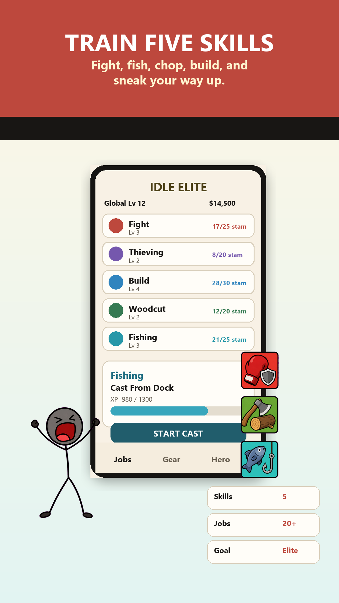
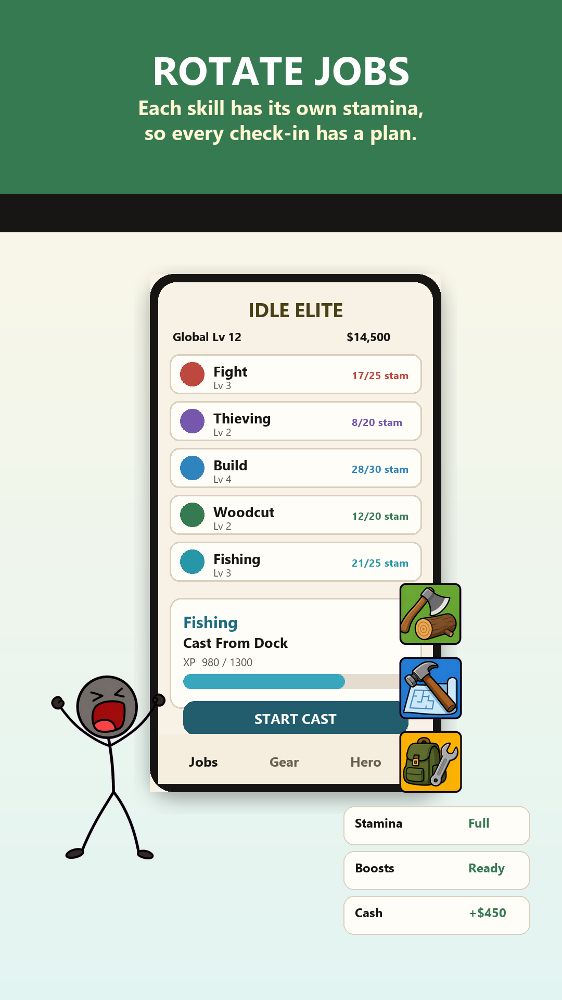
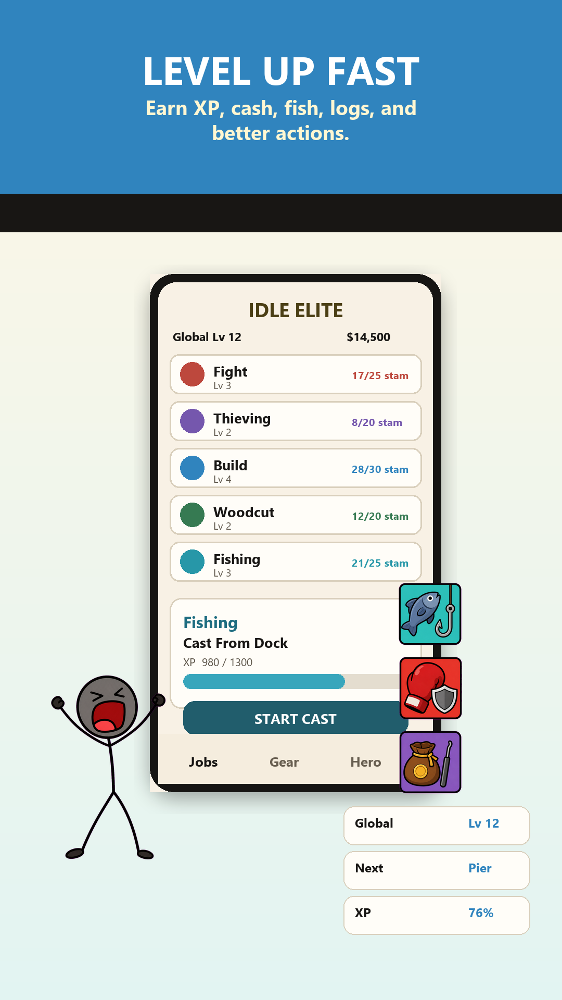
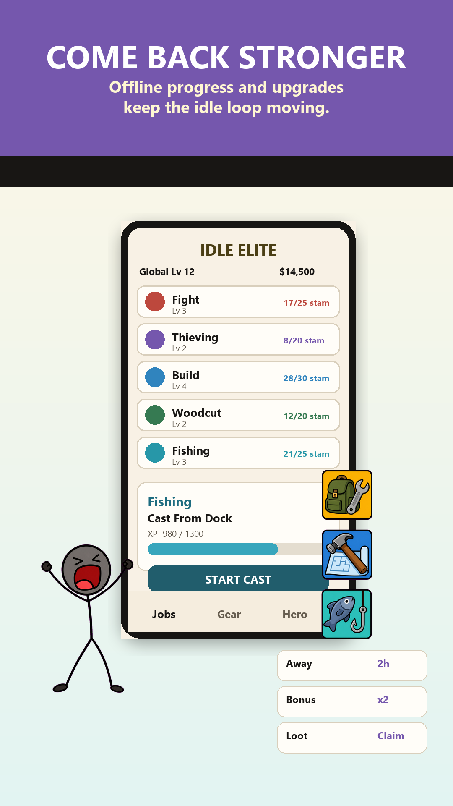
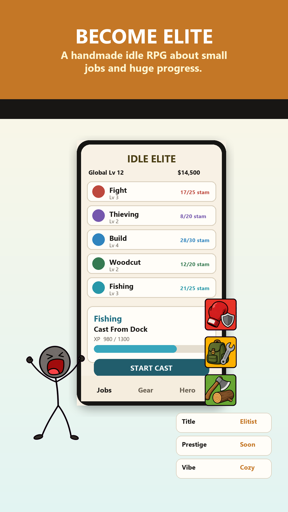
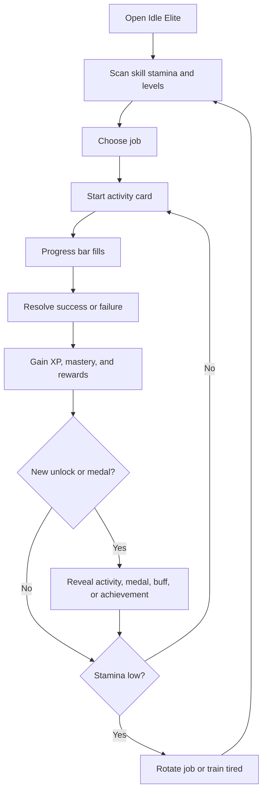

# Idle Elite Current Product Requirements

Updated: 2026-05-27

This PRD replaces the original rebuild plan. The game is no longer just a target concept: it already has a portrait mobile shell, five skills, a shared activity system, mastery medals, stamina rotation, offline progress, achievements, audio, rewarded-ad plumbing, and Play Store screenshot positioning. This document defines the product from the current build forward.

## Product Summary

`Idle Elite` is a handmade mobile idle RPG about becoming an elite all-rounder through small jobs and huge progress. The player trains five job skills, starts short activities, spends each skill's stamina, unlocks better activities, earns XP and mastery, and comes back later to collect offline progress.

The current product is not a generic cash-idler. Its strongest identity is:

- Five parallel job ladders.
- A rotate-when-tired stamina loop.
- Big illustrated activity cards.
- Medal mastery and global buffs.
- Cozy handmade mobile UI with intentionally silly job names.

The next product phase should sharpen those existing strengths instead of adding unrelated systems too early.

## Current Screenshot Evidence

These are the current Play Store screenshots and should guide the public-facing product promise.











### Screenshot Promises

| Screenshot | Promise | Product Meaning |
| --- | --- | --- |
| Train Five Skills | Fight, fish, chop, build, and sneak upward. | Five skills must stay visible, distinct, and easy to compare. |
| Rotate Jobs | Each skill has its own stamina. | The core session should naturally move players between jobs. |
| Level Up Fast | XP and better actions arrive quickly. | Early levels must unlock visible new activity cards fast enough to hook. |
| Come Back Stronger | Offline progress and upgrades continue the loop. | Returning after time away should produce a concrete reward summary. |
| Become Elite | Handmade idle RPG, small jobs, huge progress. | Tone should remain cozy, funny, readable, and progression-heavy. |

## Current Build Snapshot

### Content

- 5 skills: Fight, Thieving, Build, Woodcutting, Fishing.
- 126 actions loaded from `docs/activity-database.json`.
- 25 actions each for Fight, Thieving, Build, and Fishing.
- 26 Woodcutting actions, including the current passive log module.
- Unlocks currently run from level 1 through level 50, with Woodcutting extending to level 55.
- Activity art and background references validate with no missing files.

### Current Screens

- Jobs/home surface with global level, skill list, stamina, active activity, and bottom navigation.
- Skill detail surface with illustrated activity cards, progress bars, stat boxes, locked previews, chains, and padlocks.
- Gear/boost surface with rewarded bonus plumbing and current tester bypass behavior.
- Hero/achievement surface with total level, best activity, medal progress, global buffs, and achievement log.
- Settings surface with audio controls, offline progress toggle, Discord/crash/report utility, and reset-data flow.
- Offline summary modal for return-session feedback.

### Current Systems

- Table-driven skill/action loading from `docs/activity-database.json`.
- Per-skill XP and level progression.
- Global level as the sum of skill levels.
- Per-skill stamina with fractional regen banking.
- Action progress bars and success chance.
- Low-stamina tired training at reduced speed.
- Mastery XP per action.
- 20 mastery medal tiers.
- Activity medal bonuses for stamina, speed, success, and XP.
- Global medal buffs unlocked by first medal tier earned across the account.
- Manual activity unlocks through lock interaction once level requirements are met.
- Achievements, achievement toasts, and achievement reward bonuses.
- Woodcutting log passive module with collect, time, yield, capacity, and plank boost.
- Offline active-action progress, stamina regen, passive production, and offline summary.
- Rewarded ad boost plumbing for XP/speed bonus, with tester-disabled behavior in the current build.
- Music/SFX buses, layered music flow, activity SFX, chain/lock SFX, passive SFX, and audio settings.
- Persistent save/load in Godot `user://`.

## Redefined Product Pillars

### 1. Rotate, Do Not Camp Forever

The game should make switching jobs feel natural, not punitive. A player who rotates should see more progress across more bars than a player who camps one tired action forever.

Current issue to decide: tired training keeps activities moving at 20% speed when stamina is short. This is kind, but it weakens the rotation message unless tired rewards are clearly worse or UI messaging makes rotation feel smarter.

### 2. Every Tap Should Move Something

The player should always see at least one of these move after an action:

- Activity progress.
- Skill XP.
- Mastery medal progress.
- Stamina.
- Global level.
- Achievement progress.
- Passive log storage or upgrade progress.

Failure can happen, but it should still feel like the player learned, trained, or banked mastery.

### 3. Activities Are Collectible Objects

Activities are not just rows in a table. Each one has a name, art, background, unlock moment, mastery state, and medal history. The activity card is the heart of the game.

Requirements:

- Each unlocked action should feel like a new collectible card.
- Locked actions should tease what is coming without overwhelming the first session.
- Unlocking should remain tactile: lock, chain, reveal, sound, and scroll position should all support the moment.

### 4. Mastery Is The Long Tail

Skill levels unlock the ladder. Mastery medals make old activities worth revisiting.

Requirements:

- Medal progress must be readable on activity cards.
- Medal rewards must be understandable from stat popups.
- Global medal buffs should be visible in Hero/Achievements.
- The player should understand that mastering any activity can improve the whole account.

### 5. Come Back Stronger

The current offline system is a product pillar, not a side feature. When the player returns, the game should explain what happened while away and offer a clear next action.

Requirements:

- Offline summary must include time away, active activity progress, XP/mastery gains, unlocked actions, achievements, and passive production when relevant.
- Offline progress should respect the same stamina and tired-training rules as live play.
- The offline progress toggle must stay easy to understand and recover from.

## Target Audience

- Idle and incremental players who enjoy visible bars, unlock ladders, and long-term collection.
- Mobile players who want 30-second to 5-minute sessions.
- Players who enjoy RuneScape-like skill lists but want lighter touch.
- Players who respond to handmade charm, silly job names, and cozy progression.

The game should not chase players who want deep combat builds, heavy inventory management, or high-pressure gacha monetization.

## Core Loop

1. Open the game and scan five skills.
2. Pick the skill with available stamina, a desirable unlock, or a favorite activity.
3. Start an unlocked activity card.
4. Watch progress fill.
5. Resolve success/failure.
6. Gain XP, mastery, and possible resource/progression effects.
7. Spend or wait on stamina.
8. Unlock new actions with level and lock interaction.
9. Earn medals, achievements, and global buffs.
10. Return later to offline progress and passive production.



## Current Tuning Rules

These are current implementation rules, not old design targets.

| System | Current Rule |
| --- | --- |
| Base max stamina | 30 |
| Stamina regen | 1 stamina every 12 seconds |
| Max offline window | 8 hours |
| Skill XP requirement | `round(22 * pow(level - 1, 2.08))` |
| Max stamina growth | Base + floor(global level / 10) + global medal bonuses + achievement bonuses + skill medal bonuses |
| Action time | Database seconds value, modified by speed bonuses |
| Action success | Database success value + medal/global bonuses, clamped |
| Tired training | Action continues at 20% speed when stamina is short |
| Offline XP | Reduced multiplier for offline completion |
| Mastery cap | 20 medal levels per activity |

## Skill Requirements

The skills already exist. The next phase should make their play identities clearer using existing data and UI.

| Skill | Current Fantasy | Current Curve | Product Direction |
| --- | --- | --- | --- |
| Fight | Farm chores become personal confrontations. | 25 actions, Lv 1-50, success 95%-47%. | Make streaks and crits feel punchy and readable. |
| Thieving | Tiny sneaks escalate into absurd heists. | 25 actions, Lv 1-50, success 96%-48%. | Add stronger jackpot/stealth identity later; keep early actions fast. |
| Build | Fix, patch, build, and eventually construct ridiculous infrastructure. | 25 actions, Lv 1-50, success 86%-38%. | Tie Build to log/plank spending and permanent account improvement. |
| Woodcutting | Reliable gathering and passive log production. | 26 actions, Lv 1-55, success 90%-42%. | Keep it the resource backbone; expand passive module use. |
| Fishing | Pond catches grow into stranger waters. | 25 actions, Lv 1-50, XP scale higher than other skills. | Lean into variable catch quality once resources are deeper. |

## Resource And Economy Direction

The current code has a concrete Woodcutting log currency and plank boost. Screenshots and store copy also use cash as a familiar idle-game framing, but the live product should not promise a deep cash economy until it exists as a clear sink/source loop.

Near-term requirement:

- Treat XP, stamina, mastery, medals, achievements, logs, passive production, and ad boost time as the real current economies.
- Use cash language only where it is implemented or intentionally part of marketing art.
- If cash returns as a core resource, it must have visible sources, sinks, and a reason to rotate jobs.

## Screen Requirements

### Jobs

The Jobs surface must remain the default first impression.

Requirements:

- Show all five skills at once when possible.
- Show level and stamina for each skill.
- Highlight the active or selected skill.
- Surface the current/next activity without sending the player through a maze.
- Keep bottom navigation reachable on mobile.

### Activity Detail

The activity-detail screen is the primary gameplay surface.

Requirements:

- Activity art and background must be prominent.
- XP, stamina, time, and success stats must stay legible.
- Stat popups should explain bonuses without blocking normal play.
- Running activity progress must be visible both in the card and from the skill list when relevant.
- Locked activity previews must not cause scroll jumps or duplicated-card artifacts.

### Gear / Boosts

The current Gear direction is less about equipping items and more about bonuses, reward boosts, and resource interactions.

Requirements:

- Rewarded XP/speed boost must be clear, optional, and never interrupt an activity.
- Tester-disabled rewarded behavior must not look broken.
- Plank boost should explain that it consumes logs for Build XP.
- Future gear should modify existing stats first: XP, stamina, speed, success, passive yield, passive capacity.

### Hero / Achievements

Hero is the long-term identity and completion surface.

Requirements:

- Show global level.
- Show best or featured activity.
- Show mastery/achievement progress by skill.
- Show global buffs earned from medals.
- Show prestige as a future feature only if it has clear unlock rules.

### Settings

Settings should support launch readiness and tester support.

Requirements:

- Music and SFX controls.
- Offline progress toggle.
- Discord/community entry.
- Copy crash report.
- Reset data with confirmation.
- No destructive action without a confirmation affordance.

## Monetization Requirements

Rewarded ads should be helpful and opt-in.

Current implementation direction:

- Rewarded ad grants an XP/speed boost window.
- Tester flow can bypass ads with a free bonus message.
- Live ad IDs must only be used in policy-safe release testing.

Allowed future placements:

- Boost active progress speed/XP.
- Double or enhance offline summary rewards.
- Refill or accelerate one selected stamina pool.

Disallowed placements:

- Forced ads.
- Ads after every completion.
- Ads that trigger during an active progress bar.
- Ads that hide normal stamina recovery.

## Audio Requirements

Audio is now part of game feel and should be protected.

Requirements:

- New SFX start quieter than existing UI cues.
- Rare celebratory sounds must not stack at full volume.
- Chain/lock sounds should support tactile unlock interactions.
- Passive log sounds should stay soft and non-fatiguing.
- Music should respond to play flow without becoming harsh or constant.

## MVP Status

| Requirement | Status | Notes |
| --- | --- | --- |
| Five skills | Shipped | Fight, Thieving, Build, Woodcutting, Fishing. |
| Table-driven actions | Shipped | `docs/activity-database.json` is source of truth. |
| 20+ jobs/actions | Shipped | 126 total actions. |
| Skill XP/levels | Shipped | Formula implemented. |
| Per-skill stamina | Shipped | Regen and offline regen implemented. |
| Activity cards | Shipped | Art, background, progress, stats, lock/reveal. |
| Mastery medals | Shipped | 20 tiers per activity. |
| Global buffs | Shipped | Medal tiers grant account bonuses. |
| Achievements | Shipped | Includes toasts and achievement UI. |
| Offline progress | Shipped | Active action, stamina, passive, summary. |
| Passive production | Partial | Woodcutting log module exists; needs more modules. |
| Gear/economy | Partial | Boosts and plank/log use exist; broader economy needs definition. |
| Rewarded ads | Partial | Plumbing exists; tester behavior disabled/free. |
| Prestige | Future | Shown as aspiration only. |
| Cloud save | Future | Not current scope. |

## Near-Term Product Priorities

### P0: Align The Promise

- Update store copy, README, and PRD language so they do not overpromise cash/items that are not yet central.
- Keep screenshots aligned with the actual current UI and resource loop.
- Decide tired-training rules and make the UI explain them.
- Use simulator output to tune the first five minutes toward at least three natural job switches.
- Keep `docs/activity-database.json` and generated/shareable views in sync.

### P1: Deepen Existing Loops

- Add at least one more passive module using the Woodcutting module pattern.
- Make skill identities more mechanically distinct without rewriting the whole activity system.
- Expand Gear from ad boost/plank boost into a compact stat-upgrade surface.
- Improve offline summary readability and reward clarity.
- Add stronger achievement and mastery guidance in Hero.

### P2: Expand The Game

- Prestige/Elite Rank.
- More resource conversions.
- More passive modules.
- More skill-specific special rules.
- Cloud save.
- Events or rotating activity bonuses.

## Success Metrics

Design targets for testing:

- First session produces at least two level-ups.
- First five minutes produce at least three natural skill switches for a player following stamina prompts.
- Player understands within 60 seconds that each skill has its own stamina.
- Player unlocks or clearly sees the next locked activity in the first session.
- Offline return produces a summary that is understood without explanation.
- Rewarded-ad opt-in target remains 20% or better after real ad behavior is enabled.
- Average session target: 3-8 minutes.

Current simulator snapshot:

- `RotateLowStamina` reaches 3 switches in 5 minutes and levels 3 skills in the simple expected-value model.
- `StayFight` levels one skill faster but does not support the multi-skill fantasy.
- `BalancedTour` levels broadly but switches too often to represent realistic play.

## Validation And Tooling

Use the current local tools:

```powershell
.\scripts\audit-activity-database.ps1
.\scripts\simulate-first-five-minutes.ps1
.\scripts\check-project.ps1
```

The Godot validation command must always go through the safe wrapper path described in `AGENTS.md`.

## Non-Goals For The Next Pass

- Do not add a large inventory system before the current loop is tuned.
- Do not add forced ads.
- Do not add prestige until mastery, achievements, and offline progress have a clearer endgame arc.
- Do not split `scripts/main.gd` through broad refactors while gameplay behavior is still moving quickly; extract one low-risk section at a time.
- Do not use screenshots that imply systems the build cannot support.
