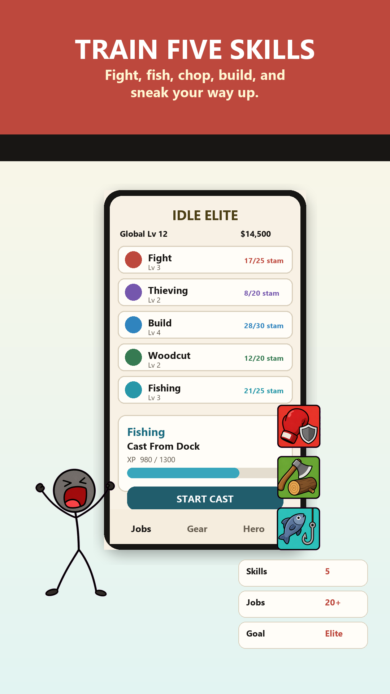
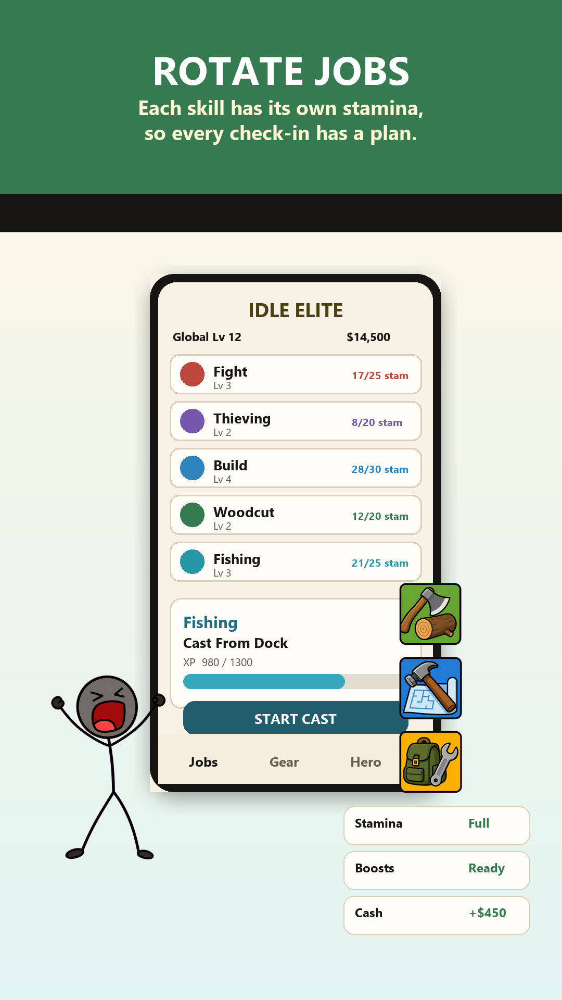
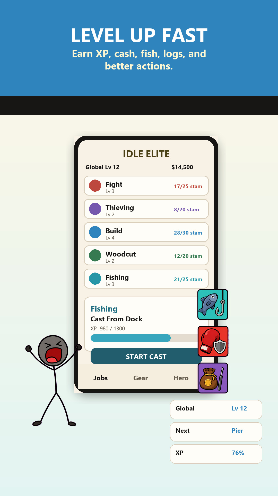
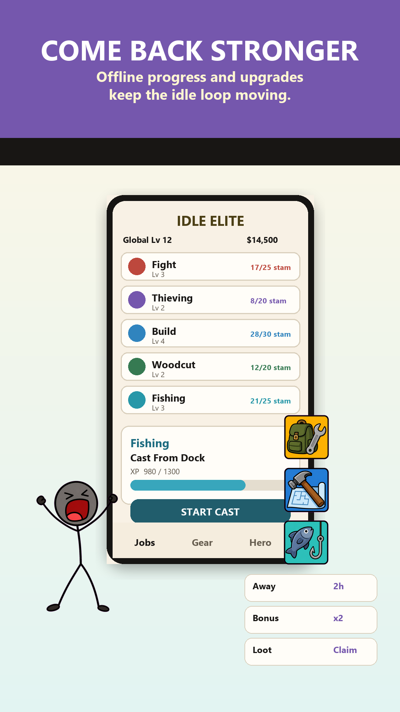
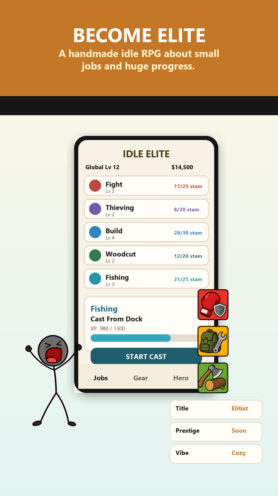
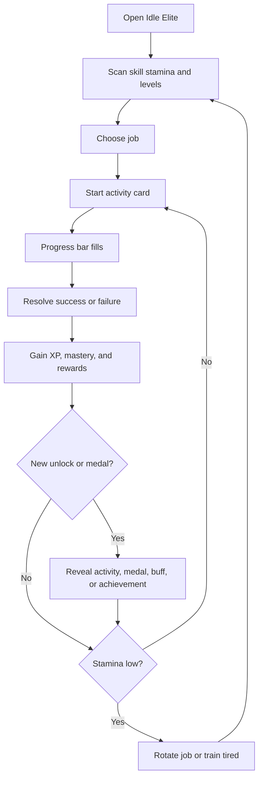

# Idle Elite Current Product Requirements

<!-- Idle Elite Godot docs: maintained for the Godot 4 mobile idle RPG. HTML references document current Godot systems, data, release work, and implementation plans. -->


Updated: 2026-08-10

This PRD replaces the original rebuild plan. The game is no longer just a target concept: it already has a portrait mobile shell, five skills, a shared activity system, cross-skill requirements, materials, Hub upgrades, mastery medals, stamina rotation, offline progress, achievements, audio, rewarded-ad plumbing, and Play Store screenshot positioning. This document defines the product from the current build forward.

## Product Summary

`Idle Elite` is a handmade mobile idle RPG about becoming an elite all-rounder through small jobs and huge progress. The player trains five job skills, starts short activities, spends each skill's stamina, unlocks better activities, earns XP and mastery, and comes back later to collect offline progress.

The current product is not a generic cash-idler. Its strongest identity is:

- Five parallel job ladders.
- A rotate-when-tired stamina loop.
- Big illustrated activity cards.
- Medal mastery and global buffs.
- Cozy handmade mobile UI with intentionally silly job names.

The next product phase should sharpen those existing strengths instead of adding unrelated systems too early.

## Current Screenshot Evidence

These are the current Play Store screenshots and should guide the public-facing product promise.











### Screenshot Promises

| Screenshot | Promise | Product Meaning |
| --- | --- | --- |
| Train Five Skills | Fight, fish, chop, build, and sneak upward. | Five skills must stay visible, distinct, and easy to compare. |
| Rotate Jobs | Each skill has its own stamina. | The core session should naturally move players between jobs. |
| Level Up Fast | XP and better actions arrive quickly. | Early levels must unlock visible new activity cards fast enough to hook. |
| Come Back Stronger | Offline progress and upgrades continue the loop. | Returning after time away should produce a concrete reward summary. |
| Become Elite | Handmade idle RPG, small jobs, huge progress. | Tone should remain cozy, funny, readable, and progression-heavy. |

## Current Build Snapshot

### Content

- 5 skills: Fighting, Thieving, Building, Woodcutting, Fishing.
- 171 skill-page actions and 5 temporary event modules loaded from `docs/activity-database.json`.
- 41 Fighting actions, 35 Thieving actions, 34 Building actions, 33 Woodcutting actions, and 28 Fishing actions.
- Skill-page unlocks currently run from level 1 through level 80 for Thieving, Building, and Woodcutting, level 95 for Fishing, and level 98 for Fighting.
- Activity art and background references validate with no missing files.

### Current Screens

- Jobs/home surface with global level, skill list, stamina, active activity, and bottom navigation.
- Skill detail surface with illustrated activity cards, progress bars, stat boxes, locked previews, chains, and padlocks.
- Hub surface with Barn, Garden, Fish Pond, Mission Sign, build costs, and permanent account bonuses.
- Shop surface with rewarded XP/time bonus plumbing, stack meter, and current tester bypass behavior.
- Hero/achievement surface with total level, best activity, medal progress, global buffs, and achievement log.
- Settings surface with audio controls, offline progress toggle, Discord/crash/report utility, and reset-data flow.
- Offline summary modal for return-session feedback.

### Current Systems

- Table-driven skill/action loading from `docs/activity-database.json`.
- Multi-skill activity requirements, split XP rewards, combo tags, and temporary event modules.
- Per-skill XP and level progression.
- Global level as the sum of skill levels.
- Per-skill stamina with fractional regen banking.
- Action progress bars and success chance.
- Low-stamina tired training at reduced speed.
- Mastery XP per action.
- 20 mastery medal tiers.
- Activity medal bonuses for stamina, speed, success, and XP.
- Global medal buffs unlocked by first medal tier earned across the account.
- Manual activity unlocks through lock interaction once level requirements are met.
- Achievements, achievement toasts, and achievement reward bonuses.
- Scrapwood, Softwood, Hardwood, Fish, Honey, and Berries resource behavior. Fish can be spent manually for 1 stamina on a non-Fishing skill, and opt-in auto-eat is saved per skill after the first Fish is earned.
- Woodcutting Firepit ignition, ongoing fuel, Woodcutting XP, and current Woodcutting stamina recovery bonus. Its database target and 1-Scrapwood-per-minute metadata currently disagree with runtime's Woodcutting-only, 1-per-30-seconds behavior and must be reconciled before it is treated as a cross-skill system.
- Buildable modules, recovery activities, Fighting arenas, and boss gates.
- Hub upgrades for failure support, offline capacity, stamina recovery, and missions.
- Berry Prep targeting that doubles XP and material rewards for marked standard activities. The current Berry source can prepare and multiply itself, split-XP bonuses are redirected to the owning skill instead of preserving the authored reward map, Fishing completions bypass Berry consumption and bonuses, and offline completion can spend Berries without awarding the action's random materials; these issues must be removed before expanding the treat loop.
- Automatic Honey stamina-regeneration boosts. Current consumption can chain through multiple Honey whenever eligible stamina is missing; the later interaction candidate starts with one explicit global use and no new offline auto-consumption.
- Offline active-action progress, stamina regen, passive production, and offline summary.
- Rewarded ad boost plumbing for XP/speed bonus, with tester-disabled behavior in the current build.
- Music/SFX buses, layered music flow, activity SFX, chain/lock SFX, passive SFX, and audio settings.
- Persistent save/load in Godot `user://`.

## Redefined Product Pillars

### 1. Rotate, Do Not Camp Forever

The game should make switching jobs feel natural, not punitive. A player who rotates should see more progress across more bars than a player who camps one tired action forever.

Tired training keeps activities moving at 20% speed when stamina is short. The 100-seed first-hour model shows the design tradeoff: a deliberate ten-switch route using current mechanics has a median 1:25 longest pre-Pond tired interval, while rapid availability-based switching becomes implausible. The selected current-combo, linked-Pond, use-gated-Berry route keeps intentional handoffs and uses Fish to sustain the chosen target; protected surplus produces a 0:24 median longest interval and 96% of runs stay at or below 60 seconds. Protection preserves the Pond budget; the earlier unprotected sensitivity is slightly faster between actions but consumes eight additional Fish and requires a replenishment detour.

### 2. Every Tap Should Move Something

The player should always see at least one of these move after an action:

- Activity progress.
- Skill XP.
- Mastery medal progress.
- Stamina.
- Global level.
- Achievement progress.
- Passive log storage or upgrade progress.

Failure can happen, but it should still feel like the player learned, trained, or banked mastery.

### 3. Activities Are Collectible Objects

Activities are not just rows in a table. Each one has a name, art, background, unlock moment, mastery state, and medal history. The activity card is the heart of the game.

Requirements:

- Each unlocked action should feel like a new collectible card.
- Locked actions should tease what is coming without overwhelming the first session.
- Unlocking should remain tactile: lock, chain, reveal, sound, and scroll position should all support the moment.

### 4. Mastery Is The Long Tail

Skill levels unlock the ladder. Mastery medals make old activities worth revisiting.

Requirements:

- Medal progress must be readable on activity cards.
- Medal rewards must be understandable from stat popups.
- Global medal buffs should be visible in Hero/Achievements.
- The player should understand that mastering any activity can improve the whole account.

### 5. Come Back Stronger

The current offline system is a product pillar, not a side feature. When the player returns, the game should explain what happened while away and offer a clear next action.

Requirements:

- Offline summary must include time away, active activity progress, XP/mastery gains, unlocked actions, achievements, and passive production when relevant.
- Offline progress should respect the same stamina and tired-training rules as live play.
- The offline progress toggle must stay easy to understand and recover from.

### 6. Skills Form A Visible Network

The player should train a skill because its next level, activity, material, or mastery result will change another skill or a shared account goal. Stamina rotation alone is not enough motivation.

Requirements:

- Show what a source skill will unlock, supply, or improve before the requirement is completed.
- Show the exact requirement and payoff at the destination.
- When a relationship completes, name both the source and destination in one feedback event.
- Derive action requirement and split-XP relationships from `docs/activity-database.json`; use explicit adapters only for non-action systems and attach receipts to existing ceremonies.
- Store the four early Pond support rewards in action data, award each only on first success, and derive their Hub edges from the same relationship index.
- Give every starting skill at least two visible cross-skill or shared-account reasons within the first-hour plan.
- Do not count self-recovery actions as cross-skill reasons. Any recovery that targets another skill must name the destination before start and report the actual restored amount.
- Use Hub Pond restoration as the first guided shared outcome without hard-gating normal activities.
- Protect the unpaid Pond Fish cost from automatic eating, show spendable surplus Fish, and identify the non-Fishing skill that consumes it.
- Preview the real Pond requirements before Building 3. Keep the current 1/3/6/10% base array and let the four unique early combo successes set a 1-5% relationship floor before or after construction. Test a capped one-time 5-stamina refill, animate only actual increases, and show full gauges as full.
- Introduce one guaranteed Berry after all five skills reach level 2; teach Honey later.
- Follow `early-game-relationships-and-treats.md` for the active first-hour sequence and validation targets.

## Target Audience

- Idle and incremental players who enjoy visible bars, unlock ladders, and long-term collection.
- Mobile players who want 30-second to 5-minute sessions.
- Players who enjoy RuneScape-like skill lists but want lighter touch.
- Players who respond to handmade charm, silly job names, and cozy progression.

The game should not chase players who want deep combat builds, heavy inventory management, or high-pressure gacha monetization.

## Core Loop

1. Open the game and scan five skills.
2. Pick the skill with available stamina, a desirable unlock, a relationship target, or a favorite activity.
3. Start an unlocked activity card.
4. Watch progress fill.
5. Resolve success/failure.
6. Gain XP, mastery, materials, and possible cross-skill or shared-project progress.
7. Spend or wait on stamina.
8. Unlock new actions with level and lock interaction.
9. Earn medals, achievements, global buffs, and permanent Hub improvements.
10. Return later to offline progress and passive production.


```mermaid
flowchart TD
    A["Open Idle Elite"] --> B["Scan skill stamina and levels"]
    B --> C["Choose job"]
    C --> D["Start activity card"]
    D --> E["Progress bar fills"]
    E --> F["Resolve success or failure"]
    F --> G["Gain XP, mastery, and rewards"]
    G --> H{"New unlock or medal?"}
    H -- "Yes" --> I["Reveal activity, medal, buff, or achievement"]
    H -- "No" --> J{"Stamina low?"}
    I --> J
    J -- "Yes" --> K["Rotate job or train tired"]
    J -- "No" --> D
    K --> B
```

## Current Tuning Rules

These are current implementation rules, not old design targets.

| System | Current Rule |
| --- | --- |
| Base max stamina | 30 |
| Stamina regen | 1 stamina every 12 seconds |
| Max offline window | 8 hours |
| Skill XP requirement | `round(22 * pow(level - 1, 2.08))` |
| Max stamina growth | Base + floor(global level / 10) + global medal bonuses + achievement bonuses + skill medal bonuses |
| Action time | Database seconds value, modified by speed bonuses |
| Action success | Database success value + medal/global bonuses, clamped |
| Tired training | Action continues at 20% speed when stamina is short |
| Offline XP | Reduced multiplier for offline completion |
| Mastery cap | 20 medal levels per activity |

## Skill Requirements

The skills already exist. The next phase should make their play identities clearer using existing data and UI.

| Skill | Current Fantasy | Current Curve | Product Direction |
| --- | --- | --- | --- |
| Fighting | Farm chores become personal confrontations. | 41 actions, Lv 1-98, including arenas and boss gates. | Give Fighting an early outgoing relationship through Pond restoration and keep combat feedback readable. |
| Thieving | Tiny sneaks escalate into absurd heists. | 35 actions, Lv 1-80, including heists and a Honey source. | Use early blueprint access and later Honey to connect Thieving to shared progress. |
| Building | Fix, patch, build, and eventually construct ridiculous infrastructure. | 34 actions, Lv 1-80, including buildable and recovery modules. | Make Building the route from skill inputs to permanent Hub improvements. |
| Woodcutting | Reliable gathering that supplies several material tiers. | 33 actions, Lv 1-80, including Firepit, recovery, and Berry sources. | Keep it the material backbone and make every early material show an active sink. |
| Fishing | Pond catches grow into stranger waters. | 28 actions, Lv 1-95, with fishing areas, tools, stamina food, and combat gates. | Make Fish visibly split between protected Hub funding and stamina for a selected non-Fishing skill, while Fishing levels enable early cross-skill actions. |

## Resource And Economy Direction

The current code has concrete Woodcutting materials and a Softwood-consuming plank boost. Screenshots and store copy also use cash as a familiar idle-game framing, but the live product should not promise a deep cash economy until it exists as a clear sink/source loop.

Current materials and sinks include Scrapwood for Firepit and an early Fighting build, Softwood and Hardwood for Hub upgrades, Fish for Hub upgrades or non-Fishing stamina, Berries for selected activity bonuses, and Honey for stamina regeneration.

Near-term requirement:

- Treat XP, stamina, mastery, medals, achievements, materials, passive production, and ad boost time as the real current economies.
- Use cash language only where it is implemented or intentionally part of marketing art.
- If cash returns as a core resource, it must have visible sources, sinks, and a reason to rotate jobs.
- Do not add another early food or treat resource before Fish allocation, Berry targeting, and Honey feedback are understood.
- Do not let automatic Fish consumption spend a protected shared-goal requirement.
- Do not allow a treat to multiply or fund its own source.
- Prevent early Berry hoarding without deleting or force-assigning rewards: award the Pond Berry only after Pond restoration and two successful one-shot milestone uses.

## Screen Requirements

### Jobs

The Jobs surface must remain the default first impression.

Requirements:

- Show all five skills at once when possible.
- Show level and stamina for each skill.
- Highlight the active or selected skill.
- Surface the current/next activity without sending the player through a maze.
- Before the first Berry, show the optional all-skills-level-2 milestone and five-skill completion count in the Skills menu header.
- After the first milestone Berry, show Berry count, prepared target, and `Pond Berry: use X/2` when that condition is relevant in the Skills menu header.
- Keep bottom navigation reachable on mobile.

### Activity Detail

The activity-detail screen is the primary gameplay surface.

Requirements:

- Activity art and background must be prominent.
- XP, stamina, time, and success stats must stay legible.
- Stat popups should explain bonuses without blocking normal play.
- Running activity progress must be visible both in the card and from the skill list when relevant.
- Locked activity previews must not cause scroll jumps or duplicated-card artifacts.

### Shop / Boosts

The current Shop contains the optional rewarded XP/time bonus and rating prompt. It unlocks after five Bronze medals, so it is not the first-hour fallback for Berries.

Requirements:

- Rewarded XP/speed boost must be clear, optional, and never interrupt an activity.
- Tester-disabled rewarded behavior must not look broken.
- The stack meter must state the active bonus and remaining duration.
- Berry and Honey access must not depend on the Shop unlock.
- Do not add stat-upgrade inventory to the Shop until the existing resource and relationship loop is validated.

### Hero / Achievements

Hero is the long-term identity and completion surface.

Requirements:

- Show global level.
- Show best or featured activity.
- Show mastery/achievement progress by skill.
- Show global buffs earned from medals.
- Show prestige as a future feature only if it has clear unlock rules.

### Settings

Settings should support launch readiness and tester support.

Requirements:

- Music and SFX controls.
- Offline progress toggle.
- Discord/community entry.
- Copy crash report.
- Reset data with confirmation.
- No destructive action without a confirmation affordance.

## Monetization Requirements

Rewarded ads should be helpful and opt-in.

Current implementation direction:

- Rewarded ad grants an XP/speed boost window.
- Tester flow can bypass ads with a free bonus message.
- Live ad IDs must only be used in policy-safe release testing.

Allowed future placements:

- Boost active progress speed/XP.
- Double or enhance offline summary rewards.
- Refill or accelerate one selected stamina pool.

Disallowed placements:

- Forced ads.
- Ads after every completion.
- Ads that trigger during an active progress bar.
- Ads that hide normal stamina recovery.

## Audio Requirements

Audio is now part of game feel and should be protected.

Requirements:

- New SFX start quieter than existing UI cues.
- Rare celebratory sounds must not stack at full volume.
- Chain/lock sounds should support tactile unlock interactions.
- Passive log sounds should stay soft and non-fatiguing.
- Music should respond to play flow without becoming harsh or constant.

## MVP Status

| Requirement | Status | Notes |
| --- | --- | --- |
| Five skills | Shipped | Fighting, Thieving, Building, Woodcutting, Fishing. |
| Table-driven actions | Shipped | `docs/activity-database.json` is source of truth. |
| 20+ jobs/actions | Shipped | 171 skill-page actions and 5 temporary event modules. |
| Skill XP/levels | Shipped | Formula implemented. |
| Per-skill stamina | Shipped | Regen and offline regen implemented. |
| Activity cards | Shipped | Art, background, progress, stats, lock/reveal. |
| Mastery medals | Shipped | 20 tiers per activity. |
| Global buffs | Shipped | Medal tiers grant account bonuses. |
| Achievements | Shipped | Includes toasts and achievement UI. |
| Offline progress | Shipped | Active action, stamina, passive, summary. |
| Passive module | Partial | Firepit burns Scrapwood for Woodcutting XP and a stamina-recovery effect; its target and fuel-rate metadata currently disagree with runtime. |
| Cross-skill requirements | Shipped | Multi-skill gates and split XP are data-driven; source-to-destination guidance is incomplete. |
| Hub upgrades | Shipped | Barn, Garden, Pond, and Mission Sign have resource costs and permanent bonuses. |
| Fish stamina allocation | Partial | Manual and per-skill auto-eat behavior exists; protected Pond reservation, surplus presentation, and source-to-skill receipts do not. |
| Berries and Honey | Partial | Runtime effects exist; early acquisition, intentional use, anti-hoarding, and relationship teaching need work. |
| Shop/economy | Partial | Rewarded boost, materials, plank boost, and Hub costs exist; broader economy needs definition. |
| Rewarded ads | Partial | Plumbing exists; tester behavior disabled/free. |
| Prestige | Future | Shown as aspiration only. |
| Cloud save | Future | Not current scope. |

## Near-Term Product Priorities

### P0: Align The Promise

- Update store copy, README, and PRD language so they do not overpromise cash/items that are not yet central.
- Keep screenshots aligned with the actual current UI and resource loop.
- Keep tired training available, make the UI explain it, and test surplus Fish as the opt-in way to sustain one intentional target.
- Keep `scripts/simulate-first-hour-relationships.py` deterministic and rerun its 100-seed matrix when a first-hour relationship variable changes.
- Protect the unpaid Pond Fish cost from auto-eat, show the spendable surplus, and name the skill that consumes Fish.
- Use one protected-surplus calculation for manual and live auto-eat affordability and spending. Keep the activity queue and offline progress from auto-spending Fish in this slice, matching current behavior.
- Make Firepit runtime, UI copy, test coverage, target, ignition, rate, XP per fuel, heat tiers, and cooling agree through activity metadata; the selected baseline is a non-Woodcutting stamina bonus at 1 Scrapwood per minute with no direct-start cost bypass.
- Prevent Berry-producing activities from being prepared and prevent Berry rewards from being multiplied by Berry Prep in every completion path.
- Use one Berry eligibility contract across the chooser, standard actions, Fishing, queue, offline retention, and save restore; eligible Fishing rewards include effective pre-random XP and Fish or food currency, not mastery.
- Do not consume Berries offline until base offline completion preserves split XP, awards eligible action materials and Fishing currency, batches consistently, and reports the bonus. Retain the target and Berry in the first slice.
- Add one copy of every positive effective pre-random `xp_rewards` entry when Berry Prep resolves; do not redirect the combined bonus to the owning skill or multiply the Berry copy again on a crit.
- Make first-hour milestone Berry targets one-shot: failure keeps the target, the first live or queued success consumes once and clears it before the next milestone award is routed, and offline progress retains the Berry while revalidating whether the named target reason is still incomplete.
- Use simulator output to protect deliberate handoffs from both long tired stalls and rapid tab cycling. The current candidate target is 8-12 switches before Pond and no more than three in any 30 seconds.
- Keep Pond construction at Building 5 + 8 Fish and add data-authored first-success support points to Latch, Saw Planks, Split Firewood, and Study Blueprint. Use `max(base Pond bonus, 1% + support points)` with no hidden gate.
- Keep the current level 6-8 recovery actions self-targeted and outside the first-hour relationship milestones; retargeting them to the lowest gauge does not affect pre-Pond continuity because they unlock after that window.
- Implement and validate the first-hour Pond restoration and Berry sequence in `early-game-relationships-and-treats.md`.
- Keep `docs/activity-database.json` aligned with the runtime loader and the HTTP-served activity docs.

### P1: Deepen Existing Loops

- Make current relationship sources, requirements, receipts, and payoffs visible before adding another passive module.
- Make skill identities more mechanically distinct without rewriting the whole activity system.
- Define any broader Shop role only after the current rewarded boost and resource interactions are understood.
- Improve offline summary readability and reward clarity.
- Add stronger achievement and mastery guidance in Hero.

### P2: Expand The Game

- Prestige/Elite Rank.
- More resource conversions.
- More passive modules.
- More skill-specific special rules.
- Cloud save.
- Events or rotating activity bonuses.

## Success Metrics

Design targets for testing:

- First session produces at least two level-ups.
- First five minutes produce at least three natural skill switches for a player following stamina prompts.
- A guided player sees the first cross-skill promise within 90 seconds.
- A guided player reaches all five skills at level 2 and receives the first Berry within 3-6 cumulative active minutes.
- Firepit is first activated within 2-6 observed minutes and visibly changes a non-Woodcutting stamina gauge after the target mismatch is resolved.
- The first two-skill activity is completed within 4-10 observed minutes.
- Pond restoration completes within 12-20 automated minutes in at least 80% of 100 seeded runs and within 20-35 cumulative active minutes in at least 80% of observed first-time sessions.
- At least 90% of seeded runs have no continuous pre-Pond tired interval longer than 60 seconds.
- At least 70% of first-time playtesters use surplus Fish on one guided non-Fishing skill, identify that skill, and preserve the protected eight-Fish Pond cost.
- At least 70% can explain protected Pond Fish versus spendable stamina Fish without opening help.
- At least 70% of first-time playtesters notice each real Pond refill, recognize full gauges as full, and identify the permanent all-skill effect ten seconds later.
- At least 70% can identify Pond support progress, the current percentage, and one unfinished action that raises it; a fast-route player must understand that a +1% Pond is complete.
- At least 70% of first-time playtesters prepare the guaranteed Berry within two minutes, consume it within five minutes or on their first eligible two-skill completion, and identify its target and resolved bonus.
- At least 70% can explain how the first Berry's Fighting, Building, and Fishing recommendations advance different relationship targets.
- First-time players make 6-12 intentional skill changes in the first 15 minutes, with no more than three changes in any 30-second interval.
- At least 80% of returning first-hour players identify the next Pond or prepared-Berry action within ten seconds of closing the offline summary.
- Player understands within 60 seconds that each skill has its own stamina.
- Player unlocks or clearly sees the next locked activity in the first session.
- Offline return produces a summary that is understood without explanation.
- Rewarded-ad opt-in target remains 20% or better after real ad behavior is enabled.
- Average session target: 3-8 minutes.

Current simulator evidence:

- `RotateLowStamina` reaches 4 switches and levels all 5 skills to level 2.
- `StayFight` reaches Fighting level 3 with 0 switches.
- `ChaseNewestUnlock` reaches Fishing level 3 with 0 switches.
- `BalancedTour` levels broadly but produces 134 switches and does not represent plausible play.
- In the 100-seed first-hour model, guided current mechanics restore Pond at a 17:24 median but every run exceeds a 60-second pre-Pond tired interval; the median longest interval is 1:25.
- Candidate combos, Berries, Firepit, and Pond without the Fish bridge restore Pond at 17:16 and pass the 60-second interval target in 11% of runs.
- The selected current-combo, linked-Pond, use-gated-Berry route with protected surplus restores Pond at 14:53, passes the interval target in 96% of runs, and makes 10 median switches before Pond. Its matched no-Fish control is 17:22, 1:35, and 1%.
- Unprotected auto-eat restores Pond at 14:59 and passes the interval target in 97%, but eats 31 median Fish by Pond and makes 11 median pre-Pond switches. Use protection for goal integrity, not as a claimed speed improvement.
- The unrestricted selected bridge spends a median of 23 Fish by Pond. A 12-Fish sensitivity cap passes the 60-second target in 23% of runs, 18 passes in 79%, 21 passes in 94%, and 22 passes in 96%; treat auto-eat as sustained opt-in support and aggregate repeated feedback.
- The selected guided relationship-powered Pond reaches +5% at 14:53 with all five skills and four combo actions. A rational rush reaches Pond at 8:48 with only Building and Fishing at level 2+, zero combo actions, no Firepit, and +1%; later first successes raise the floor without reopening construction.
- The selected hoarding scenario preserves two carried Berries, creates no pending application, and leaves one visible deferred Pond condition in every run; guided and rush use routes resolve all three awards in order.
- The documented mastery-reward sensitivity moves the selected Pond median from 14:53 to 14:52, keeps Fence at 21:43, and keeps the 96% continuity pass rate, so mastery drift does not block the Fish hypothesis but still requires a separate runtime/data decision.
- Retargeting level 6-8 recovery actions from `self` to `lowest` leaves the no-Fish candidate at a 17:16 Pond median, 1:16 longest stall, and 11% continuity pass rate; the first recovery unlock is 38:24 median and the guided route uses none.
- First-Berry targeting is robust but changes route shape: Latch reaches Pond at 14:53/96% with 10 median pre-Pond switches; Shallows matches timing and continuity with 11 switches, while Hammer reaches 14:55/94% with 11. Use Latch as the relationship/Pond-support recommendation and retain the other two as clearly labeled immediate outcomes.
- An unrestricted two-stamina Fish candidate still spends 23 Fish and lowers the 60-second continuity pass rate to 86%; caps of 12 and 15 Fish produce 94% and 96% but require another allocation rule. Preserve the current one-stamina effect until observed comprehension isolates unit value as the problem.
- Firepit target sensitivity passes the continuity limit in 31% of runs for current Woodcutting-only runtime, 96% for the database-aligned non-Woodcutting target, and 98% for an all-skill target. Test non-Woodcutting first for a distinct Woodcutting-to-other-skills role and use all-skill as the comprehension fallback.
- Pond completion refills of +3, +5, and +10 reach the same next modeled milestone while restoring 9, 15, or 30 total stamina. Keep +5 as the initial visible-payoff test, compare it with +3 in-game, and reject +10 as a timing change.
- Current combo values with the selected relationship systems pass continuity in 96% of runs and reach Fence at 21:43; larger secondary-XP candidates pass in 94% and reach Fence at 21:48. Keep current activity data until full promise and receipt presentation is tested.
- One guaranteed Berry reaches Pond at 15:02 and passes continuity in 95%; two and three reach 14:53 and pass in 96%. Keep the second only if repeated-use comprehension improves, gate the third on two demonstrated uses plus Pond, and keep it only if it causes a measured post-Pond relationship start.

## Validation And Tooling

Use the current local tools:

```powershell
.\scripts\audit-activity-database.ps1
.\scripts\simulate-first-five-minutes.ps1
python .\scripts\simulate-first-hour-relationships.py --scenario all --runs 100 --duration 3600 --check-determinism
.\scripts\check-project.ps1
```

Use the first-hour simulator for deterministic planning comparisons. Do not use it as proof of noticeability, comprehension, navigation time, or real first-session timing; those still require first-time-player observation and real-game validation.

The Godot validation command must always go through the safe wrapper path described in `AGENTS.md`.

## Non-Goals For The Next Pass

- Do not add a large inventory system before the current loop is tuned.
- Do not add forced ads.
- Do not add prestige until mastery, achievements, and offline progress have a clearer endgame arc.
- Do not split `scripts/main.gd` through broad refactors while gameplay behavior is still moving quickly; extract one low-risk section at a time.
- Do not use screenshots that imply systems the build cannot support.
